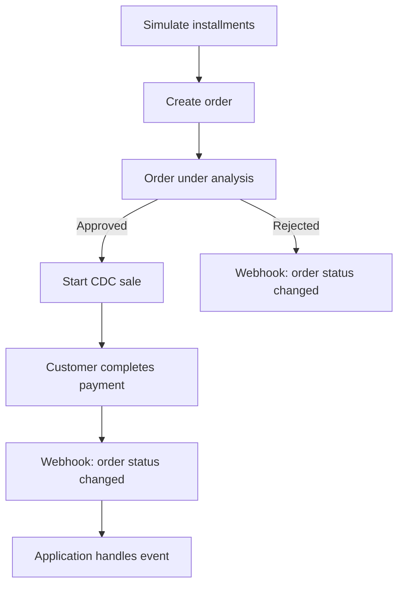
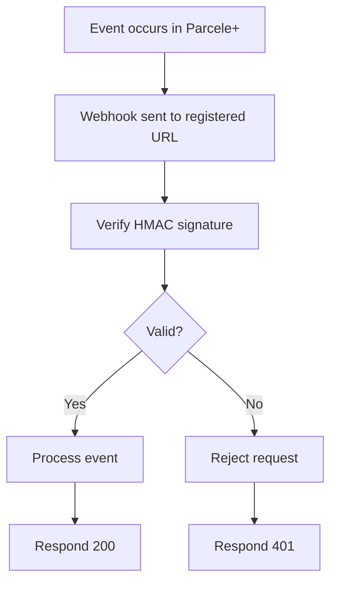

## When to use

Use this skill in two modes:

### 1. Integration Mode
When the user wants to **write code** to integrate Parcele+ into an application (.NET, Java, Node.js, Python, PHP, Go). Use the rules, examples, and best practices below.

### 2. Agent Mode (Direct API)
When the user wants to **perform actions directly** — create an order, simulate installments, list customers, register a webhook, etc. Execute the API via `curl` in the terminal. See [SKILL-AGENT.md](SKILL-AGENT.md) / [rules/agent.md](rules/agent.md) for all endpoints and templates.

## How to use

For **direct API usage** (agent mode), see:
- [rules/agent.md](rules/agent.md) — execute API calls directly via curl (create orders, list customers, simulate installments, manage establishments and webhooks, etc.)

For **code integration**, read the rule file for the module and language you're using:

- **Orders** (create, get, list, start CDC sale, import invoice): [dotnet](rules/dotnet/orders.md) / [java](rules/java/orders.md) / [node](rules/node/orders.md) / [python](rules/python/orders.md) / [php](rules/php/orders.md) / [go](rules/go/orders.md)
- **Simulations** (installments, values): [dotnet](rules/dotnet/simulations.md) / [java](rules/java/simulations.md) / [node](rules/node/simulations.md) / [python](rules/python/simulations.md) / [php](rules/php/simulations.md) / [go](rules/go/simulations.md)
- **Customers** (get, list): [dotnet](rules/dotnet/customers.md) / [java](rules/java/customers.md) / [node](rules/node/customers.md) / [python](rules/python/customers.md) / [php](rules/php/customers.md) / [go](rules/go/customers.md)
- **Establishments** (create, get, list, update, bank account, activate, deactivate): [dotnet](rules/dotnet/establishments.md) / [java](rules/java/establishments.md) / [node](rules/node/establishments.md) / [python](rules/python/establishments.md) / [php](rules/php/establishments.md) / [go](rules/go/establishments.md)
- **Webhooks** (create, list, update, delete, signature verification, delivery audit): [dotnet](rules/dotnet/webhooks.md) / [java](rules/java/webhooks.md) / [node](rules/node/webhooks.md) / [python](rules/python/webhooks.md) / [php](rules/php/webhooks.md) / [go](rules/go/webhooks.md)
- **Security** (credential handling, fraud prevention, secure defaults): [dotnet](rules/dotnet/security.md) / [java](rules/java/security.md) / [node](rules/node/security.md) / [python](rules/python/security.md) / [php](rules/php/security.md) / [go](rules/go/security.md)

Use development tools for enhanced integration experience:
- [tools/auth.md](tools/auth.md) — OAuth2 client credentials flow and API key management.
- [tools/environments.md](tools/environments.md) — staging vs. production base URLs.
- [tools/production.md](tools/production.md) — best practices before going live.
- [tools/ecosystem.md](tools/ecosystem.md) — official SDKs, documentation, and this repository.
- [tools/sdks/dotnet.md](tools/sdks/dotnet.md) / [java.md](tools/sdks/java.md) / [node.md](tools/sdks/node.md) / [python.md](tools/sdks/python.md) / [php.md](tools/sdks/php.md) / [go.md](tools/sdks/go.md) — install instructions per SDK.

---

## Rules: Agent Mode — Direct API Usage


Quando o usuário pedir pra **executar** uma ação (listar, criar, consultar, simular) em vez de **escrever código** de integração, chame a API do Parcele+ diretamente via `curl`.

#### Autenticação

A API usa OAuth2 client credentials. Gere um token de acesso antes de qualquer outra chamada:

```bash
curl -s -X POST "$PARCELEMAIS_BASE_URL/v1/authentication/accesstoken" \
  -H "Content-Type: application/json" \
  -d '{
    "clientId": "'"$PARCELEMAIS_CLIENT_ID"'",
    "clientSecret": "'"$PARCELEMAIS_CLIENT_SECRET"'"
  }' | jq
```

Resposta:
```json
{
  "token_de_acesso": "eyJhbGciOi...",
  "expira_em_segundos": 3600,
  "tipo_de_token": "Bearer"
}
```

Use o token nas chamadas seguintes:
```bash
curl -s -H "Authorization: Bearer $TOKEN" "$PARCELEMAIS_BASE_URL/v1/ENDPOINT"
```

- Sempre pergunte por `PARCELEMAIS_CLIENT_ID`/`PARCELEMAIS_CLIENT_SECRET` se não fornecidos e não encontrados em variáveis de ambiente ou `.env`.
- O token expira (`expira_em_segundos`) — gere um novo quando expirar, não assuma validade indefinida.
- **Nunca** logue ou exiba o `clientSecret`/token completo em texto solto num terminal compartilhado.

#### Base URL

```
Staging:    https://api.staging.parcelemais.com.br/integration/
Produção:   https://api.parcelemais.com.br/integration/
```

Use sempre staging a menos que o usuário peça explicitamente produção — staging não movimenta dinheiro real.

#### Formato de resposta e erros

Erros seguem o formato Problem Details (RFC 7807-like):
```json
{
  "tipo": "https://.../validation-error",
  "titulo": "Um ou mais erros de validação ocorreram.",
  "status": 400,
  "detalhe": "...",
  "instancia": "...",
  "erros": { "campo": ["mensagem"] },
  "correlationId": "..."
}
```

Valores monetários são `float` em reais (não em centavos, diferente de outras APIs de pagamento).

---

#### Endpoints

##### Pedidos (Orders)

**Criar pedido**
```bash
curl -s -X POST "$PARCELEMAIS_BASE_URL/v1/order" \
  -H "Authorization: Bearer $TOKEN" -H "Content-Type: application/json" \
  -d '{
    "cpf": "12345678900",
    "celular": "11999999999",
    "documentoEstabelecimento": "12345678000199",
    "valorSolicitado": 1500.00,
    "nome": "João Silva",
    "email": "joao@email.com",
    "dataDeNascimento": "1990-01-01",
    "endereco": {
      "logradouro": "Rua Exemplo",
      "numero": "100",
      "bairro": "Centro",
      "cidade": "São Paulo",
      "estado": "SP",
      "cep": "01310-100"
    }
  }' | jq
```
Resposta: `{"pedidoId": "..."}`.

**Buscar pedido por ID**
```bash
curl -s -H "Authorization: Bearer $TOKEN" "$PARCELEMAIS_BASE_URL/v1/order/ORDER_ID" | jq
```

**Listar pedidos (paginado)**
```bash
curl -s -H "Authorization: Bearer $TOKEN" \
  "$PARCELEMAIS_BASE_URL/v1/order/paged?pagina=1&tamanhoPagina=10&documentoCliente=12345678900" | jq
```
Query params opcionais: `status` (int, ver tabela de status abaixo), `documentoCliente`, `dataInicio`, `dataFim`, `numero`, `documentoLoja`, `descricao`.

**Iniciar venda CDC (gera link de pagamento)**
```bash
curl -s -X POST "$PARCELEMAIS_BASE_URL/v1/order/start-cdc-sale" \
  -H "Authorization: Bearer $TOKEN" -H "Content-Type: application/json" \
  -d '{"pedidoId": "ORDER_ID"}' | jq
```
Resposta: `{"linkPagamento": "https://..."}`.

**Anexar nota fiscal (base64)**
```bash
curl -s -X POST "$PARCELEMAIS_BASE_URL/v1/order/invoice" \
  -H "Authorization: Bearer $TOKEN" -H "Content-Type: application/json" \
  -d '{"pedidoId": "ORDER_ID", "arquivoBase64": "'"$(base64 -w0 nota.pdf)"'", "nomeArquivo": "nota.pdf"}' | jq
```

###### Status de pedido (`status.valor`)
| Valor | Significado |
| --- | --- |
| 0 | Indefinido |
| 1 | Em análise |
| 2 | Aprovado |
| 3 | Saldo indisponível |
| 4 | Análise expirada |
| 5 | Pagamento pendente |
| 6 | Biometria recusada |
| 7 | Biometria aprovada |
| 8 | Pagamento recusado |
| 9 | Comprado |
| 10 | Não autorizado |
| 11 | Autorização pendente |
| 12 | Aguardando cadastro |
| 13 | Venda não iniciada |
| 14 | Cancelado |
| 15 | Faturando |
| 16 | Concluído |
| 17 | Congelado |
| 18 | Aguardando confirmação de pagamento |
| 19 | Desembolsado |

---

##### Simulações (Simulations)

**Simular parcelas por valor solicitado**
```bash
curl -s -H "Authorization: Bearer $TOKEN" \
  "$PARCELEMAIS_BASE_URL/v1/order/simulate-installments?valorSolicitado=1500&tipoValorCalculo=1" | jq
```
`tipoValorCalculo`: `1` = valor bruto, `2` = valor líquido.

**Simular valores por prazo**
```bash
curl -s -H "Authorization: Bearer $TOKEN" \
  "$PARCELEMAIS_BASE_URL/v1/order/simulate-values?valor=1500&prazo=12&modeloJuros=1&tipoValorCalculo=1" | jq
```

---

##### Clientes (Customers)

**Buscar cliente por ID**
```bash
curl -s -H "Authorization: Bearer $TOKEN" "$PARCELEMAIS_BASE_URL/v1/customer/CUSTOMER_ID" | jq
```

**Listar clientes (paginado)**
```bash
curl -s -H "Authorization: Bearer $TOKEN" \
  "$PARCELEMAIS_BASE_URL/v1/customer/paged?pagina=1&tamanhoPagina=10&documento=12345678900" | jq
```

---

##### Lojas (Establishments)

A loja (`loja`) é o estabelecimento que origina os pedidos. Toda loja cadastrada aqui entra na rede do parceiro do token e já fica vinculada a ele.

**Cadastrar loja**
```bash
curl -s -X POST "$PARCELEMAIS_BASE_URL/v1/establishment" \
  -H "Authorization: Bearer $TOKEN" -H "Content-Type: application/json" \
  -d '{
    "documento": "12345678000199",
    "razaoSocial": "Loja Centro LTDA",
    "nomeFantasia": "Loja Centro",
    "modeloDesembolso": 1,
    "responsavel": {
      "nome": "Maria Souza",
      "email": "maria@loja.com.br",
      "celular": "+5511999999999"
    },
    "contaBancaria": {
      "banco": "341",
      "agencia": "1234",
      "digitoAgencia": "",
      "conta": "56789",
      "digitoConta": "0",
      "tipoConta": 1
    },
    "endereco": {
      "rua": "Rua Exemplo",
      "numero": "100",
      "bairro": "Centro",
      "cidade": "São Paulo",
      "estado": "SP",
      "cep": "01310100"
    }
  }' | jq
```
`modeloDesembolso`: `1` = a rede recebe, `2` = a própria loja recebe (exige conta bancária da loja), `3` = conta de terceiro (exige `nomeTitular` e `documentoTitular` na conta). `tipoConta`: `1` = corrente, `2` = poupança, `3` = pagamento. `endereco` é obrigatório no cadastro — só `complemento` e `pais` (padrão Brasil) são opcionais; sem endereço a API devolve `400`.
Resposta: `{"estabelecimentoId": "..."}` — guarde, é o que permite editar e mudar a situação da loja depois.

**Buscar loja**
```bash
curl -s -H "Authorization: Bearer $TOKEN" \
  "$PARCELEMAIS_BASE_URL/v1/establishment/ESTABELECIMENTO_ID" | jq
```
Devolve a loja inteira: `documento`, `razaoSocial`, `nomeFantasia`, `ativa`, `modeloDesembolso`, `responsavel`, `contaBancaria` e `endereco`.

**Listar lojas**
```bash
curl -s -H "Authorization: Bearer $TOKEN" \
  "$PARCELEMAIS_BASE_URL/v1/establishment/list?nomeFantasia=Centro&ativa=true" | jq
```
Traz as lojas da rede do parceiro do token. `nomeFantasia` filtra por busca parcial, sem diferenciar maiúsculas de minúsculas; `ativa` filtra pela situação. Sem filtros, devolve todas — ativas e inativas.

**Editar loja**
```bash
curl -s -X PUT "$PARCELEMAIS_BASE_URL/v1/establishment/ESTABELECIMENTO_ID" \
  -H "Authorization: Bearer $TOKEN" -H "Content-Type: application/json" \
  -d '{
    "nomeFantasia": "Loja Centro Matriz"
  }' | jq
```
`nomeFantasia` é obrigatório. `modeloDesembolso` e `endereco` são opcionais — quando omitidos, mantêm o valor atual. A **razão social não pode ser alterada** pela API: é definida no cadastro e só muda via BackOffice. A conta bancária tem endpoint próprio.

**Trocar a conta bancária**
```bash
curl -s -X PUT "$PARCELEMAIS_BASE_URL/v1/establishment/ESTABELECIMENTO_ID/bank-account" \
  -H "Authorization: Bearer $TOKEN" -H "Content-Type: application/json" \
  -d '{
    "banco": "341",
    "agencia": "1234",
    "digitoAgencia": "",
    "conta": "56789",
    "digitoConta": "0",
    "tipoConta": 1
  }' | jq
```
A conta é substituída por inteiro — mande todos os campos, não só os que mudaram. Quando o `modeloDesembolso` da loja é `3`, `nomeTitular` e `documentoTitular` continuam obrigatórios.

**Inativar / reativar loja**
```bash
curl -s -X PUT "$PARCELEMAIS_BASE_URL/v1/establishment/ESTABELECIMENTO_ID/status" \
  -H "Authorization: Bearer $TOKEN" -H "Content-Type: application/json" \
  -d '{"ativa": false}' | jq
```
Loja inativa não aceita novos pedidos (os em andamento seguem normalmente) e não aceita edição. Para reativar, envie `{"ativa": true}`.

---

##### Webhooks

**Cadastrar webhook**
```bash
curl -s -X POST "$PARCELEMAIS_BASE_URL/v1/webhooks" \
  -H "Authorization: Bearer $TOKEN" -H "Content-Type: application/json" \
  -d '{"tipo": 3, "url": "https://meusite.com/webhooks/parcelemais", "tipoAutenticacao": 1}' | jq
```
`tipo`: `1` = Cliente, `2` = Simulação, `3` = Pedido. `tipoAutenticacao`: `1` = Nenhuma, `2` = Basic, `3` = JWT (use `credencial` se `2`/`3`).
Resposta inclui `chaveAssinatura` — guarde-a, é usada pra validar a assinatura HMAC dos eventos recebidos.

**Listar webhooks cadastrados**
```bash
curl -s -H "Authorization: Bearer $TOKEN" "$PARCELEMAIS_BASE_URL/v1/webhooks" | jq
```

**Atualizar webhook**
```bash
curl -s -X PUT "$PARCELEMAIS_BASE_URL/v1/webhooks/3" \
  -H "Authorization: Bearer $TOKEN" -H "Content-Type: application/json" \
  -d '{"url": "https://meusite.com/novo-endpoint", "tipoAutenticacao": 1}' | jq
```

**Remover webhook**
```bash
curl -s -X DELETE "$PARCELEMAIS_BASE_URL/v1/webhooks/3" -H "Authorization: Bearer $TOKEN" | jq
```

**Auditoria de envios (paginado)**
```bash
curl -s -H "Authorization: Bearer $TOKEN" \
  "$PARCELEMAIS_BASE_URL/v1/webhooks/auditoria?statusCode=500&pagina=1&tamanhoPagina=10" | jq
```
Histórico dos envios de webhook feitos ao seu endpoint, do mais recente para o mais antigo — uma linha por tentativa (`id`, `tipo`, `requisicao`, `resposta`, `statusCode`, `dataCriacao`). Filtros opcionais: `dataInicio`, `dataFim` (ISO-8601), `pedidoId`, `numeroPedido`, `statusCode` (100–599). Paginação por `pagina` (padrão 1) e `tamanhoPagina` (padrão 10, máx. 100); a resposta traz `itens` e `pagina` (`tem_proximo`, `total`...). Use `statusCode` pra achar envios que falharam — endpoint fora do ar também aparece como `500`. `dataInicio` depois de `dataFim` devolve `400`.

---

#### Diretrizes do Agent Mode

1. Sempre confirme antes de criar, atualizar ou remover recursos (pedidos, lojas, webhooks) — são ações com efeito colateral real.
2. Prefira o ambiente de staging pra qualquer teste/exploração, a menos que o usuário peça produção explicitamente.
3. Formate valores monetários como `R$ X,XX` ao apresentar resultados ao usuário.
4. Use `jq` pra formatar e filtrar respostas JSON.
5. Em erro, mostre `titulo`/`detalhe`/`erros` do Problem Details e sugira a correção (ex.: campo obrigatório faltando).
6. Nunca invente `pedidoId`/`CUSTOMER_ID`/`ESTABELECIMENTO_ID` — sempre obtenha via `create`/`list` antes de usar em outra chamada.

---

## Rules: .NET

### Orders

Orders (`Pedidos`) are credit/installment requests. `IOrdersClient` (available as `client.Orders` on `IParceleMaisClient`) exposes the full lifecycle.

### Models

```csharp
public sealed record Address(
    string Street, string Number, string Neighborhood, string City, string State,
    string PostalCode, string? Complement = null);

public sealed record CreateOrderRequest(
    string Cpf, string PhoneNumber, string EstablishmentDocument, decimal RequestedAmount,
    string Name, string Email, DateTimeOffset DateOfBirth, Address Address);

public sealed record Order(
    Guid Id, long Number, OrderStatus Status, string StatusDescription,
    string CustomerDocument, string EstablishmentLegalName, string EstablishmentDocument,
    DateTimeOffset CreatedAt, decimal? Total = null, string? CustomerName = null,
    int? Term = null, string? Description = null, decimal? ApprovedAmount = null,
    bool? Disbursed = null, DateTimeOffset? DisbursedAt = null, decimal? RequestedAmount = null);

public sealed record ListOrdersRequest(
    OrderStatus? Status = null, string? CustomerDocument = null, DateTimeOffset? StartDate = null,
    DateTimeOffset? EndDate = null, long? Number = null, string? EstablishmentDocument = null,
    string? Description = null, int Page = 1, int PageSize = 10);

public sealed record CheckoutLink(string? Url);

public enum OrderStatus
{
    Undefined = 0, Analysing = 1, Approved = 2, UnavailableBalance = 3, AnalysisExpired = 4,
    PendingPayment = 5, BiometryRefused = 6, BiometryApproved = 7, PaymentRefused = 8,
    Purchased = 9, Unauthorized = 10, PendingAuthorization = 11, AwaitingRegistration = 12,
    SaleNotStarted = 13, Canceled = 14, Billing = 15, Completed = 16, Frozen = 17,
    PendingPaymentConfirmation = 18, Disbursed = 19,
    [UnknownValue] Unknown = -1 // any value the API adds later that this SDK version doesn't know yet
}
```

### Interface

```csharp
public interface IOrdersClient
{
    Task<Guid> CreateAsync(CreateOrderRequest request, CancellationToken cancellationToken = default);
    Task<Order> GetAsync(Guid orderId, CancellationToken cancellationToken = default);
    Task<PagedResult<Order>> ListAsync(ListOrdersRequest? request = null, CancellationToken cancellationToken = default);
    Task<CheckoutLink> StartCdcSaleAsync(Guid orderId, CancellationToken cancellationToken = default);
    Task ImportInvoiceAsync(Guid orderId, InvoiceFile file, CancellationToken cancellationToken = default);
}
```

### Features

- **Create**: submits a credit request for a customer at an establishment; returns the new order's `Guid`.
- **Get**: fetch a single order by id, including its current `Status`.
- **List**: paginated, filterable by status, customer/establishment document, date range, order number, description.
- **StartCdcSale**: generates a hosted payment link (`CheckoutLink.Url`) once an order is `Approved`.
- **ImportInvoice**: attaches an invoice file (`InvoiceFile.FromBytes/FromStream/FromFile`) to an order — encodes to base64 internally.

### Example

(Source: `examples/dotnet/orders.cs`)

```csharp
var orderId = await client.Orders.CreateAsync(new CreateOrderRequest(
    Cpf: "12345678900", PhoneNumber: "11999999999", EstablishmentDocument: "12345678000199",
    RequestedAmount: 1500.00m, Name: "João Silva", Email: "joao@email.com",
    DateOfBirth: new DateTimeOffset(1990, 1, 1, 0, 0, 0, TimeSpan.Zero),
    Address: new Address("Rua Exemplo", "100", "Centro", "São Paulo", "SP", "01310-100")));

var order = await client.Orders.GetAsync(orderId);
```

### Error Handling and Edge Cases

- `ParceleMaisValidationException` (400) — missing/invalid fields; check `.Errors` (per-field messages).
- `ParceleMaisApiException` — any other API error (404 order not found, 409 conflict, 5xx); check `.StatusCode`/`.ErrorCode`/`.CorrelationId`.
- `ParceleMaisRateLimitException` (429) — back off using `.RetryAfter` before retrying (the SDK's built-in retry policy already handles this automatically in most cases).
- `ParceleMaisTimeoutException` — attempt/total timeout or open circuit breaker; safe to retry after a delay.
- `Order.Status` uses `OrderStatus.Unknown = -1` as a forward-compatible fallback if the API introduces a new status value this SDK version doesn't know about yet — always handle the `Unknown` case rather than assuming an exhaustive switch.
- `Order.Total`, `.CustomerName`, `.Term`, `.ApprovedAmount`, etc. are nullable — not every field is populated at every order stage (e.g. `ApprovedAmount` is only set after approval).
### Simulations

Simulations let you preview installments/values **without** creating an order. `ISimulationsClient` is available as `client.Simulations`.

### Models

```csharp
public enum CalculationValueType
{
    GrossAmount = 1, LiquidAmount = 2,
    [UnknownValue] Unknown = -1
}

public sealed record SimulateInstallmentsRequest(
    decimal RequestedAmount, CalculationValueType CalculationValueType = CalculationValueType.GrossAmount);

public sealed record SimulateValuesRequest(
    decimal Amount, int Term, CalculationValueType CalculationValueType = CalculationValueType.GrossAmount);

public sealed record InstallmentSimulation(decimal TotalAmount, int Term, decimal InstallmentAmount);

public sealed record ValuesSimulation(decimal SaleAmount, decimal DisbursementAmount, decimal InstallmentAmount);
```

### Interface

```csharp
public interface ISimulationsClient
{
    Task<IReadOnlyList<InstallmentSimulation>> SimulateInstallmentsAsync(SimulateInstallmentsRequest request, CancellationToken cancellationToken = default);
    Task<ValuesSimulation> SimulateValuesAsync(SimulateValuesRequest request, CancellationToken cancellationToken = default);
}
```

### Features

- **SimulateInstallments**: given a requested amount, returns every available installment plan (term × total × per-installment amount).
- **SimulateValues**: given an amount and a specific term, returns the establishment's sale/disbursement amount and the customer's installment amount.
- **CalculationValueType.GrossAmount vs. LiquidAmount**: gross is the amount before MDR/anticipation deductions; liquid is what the establishment actually nets. Defaults to `GrossAmount` if omitted.

### Example

(Source: `examples/dotnet/simulations.cs`)

```csharp
var installments = await client.Simulations.SimulateInstallmentsAsync(
    new SimulateInstallmentsRequest(RequestedAmount: 1500.00m));

foreach (var installment in installments)
    Console.WriteLine($"{installment.Term}x de {installment.InstallmentAmount:C} (total {installment.TotalAmount:C})");
```

### Error Handling and Edge Cases

- `ParceleMaisValidationException` — e.g. `RequestedAmount`/`Amount` <= 0, or `Term` outside the accepted range.
- Simulations create no server-side record — safe to call repeatedly (e.g. as the user adjusts an amount slider in a UI) without side effects or idempotency concerns.
- `CalculationValueType.Unknown` only appears if a future API value isn't recognized by this SDK version — not expected in requests you construct yourself.
### Customers

`ICustomersClient` (available as `client.Customers`) manages the people who request credit.

### Models

```csharp
public sealed record Address(
    string? Street = null, string? Number = null, string? Neighborhood = null, string? City = null,
    string? State = null, string? PostalCode = null, string? Country = null, string? Complement = null);

public sealed record Customer(
    Guid Id, string Name, string Document, DateTimeOffset DateOfBirth,
    Address? Address = null, string? Email = null, string? PhoneNumber = null);

public sealed record ListCustomersRequest(
    string? Name = null, string? Document = null, int Page = 1, int PageSize = 10);
```

### Interface

```csharp
public interface ICustomersClient
{
    Task<Customer> GetAsync(Guid customerId, CancellationToken cancellationToken = default);
    Task<PagedResult<Customer>> ListAsync(ListCustomersRequest? request = null, CancellationToken cancellationToken = default);
}
```

### Features

- **Get**: fetch a single customer by id.
- **List**: paginated, filterable by name (partial match) or document (CPF, exact match).
- Customers are created implicitly as part of `Orders.CreateAsync` — there's no standalone `Customers.CreateAsync`; look them up after an order references them.

### Example

(Source: `examples/dotnet/customers.cs`)

```csharp
var page = await client.Customers.ListAsync(new ListCustomersRequest(Document: "12345678900"));
foreach (var customer in page.Items)
    Console.WriteLine($"{customer.Name} ({customer.Document})");
```

### Error Handling and Edge Cases

- `ParceleMaisApiException` (404) — customer id not found.
- `ParceleMaisValidationException` — invalid document format.
- `Address`, `Email`, `PhoneNumber` are all nullable — a customer created via an order may not have every field populated depending on what was collected.
- `PagedResult<Customer>` — check `HasNext`/`TotalCount` before assuming a single page is the full result set.
### Establishments

An **establishment** (`loja`) is the merchant location that originates orders. Establishments created through the API are registered inside the partner's establishment chain and automatically linked to the partner authenticated by the access token.

### Types

```csharp
public enum DisbursementModel
{
    EstablishmentChain = 1, // the chain receives the disbursement
    Establishment = 2,      // the establishment itself receives it (requires the establishment's bank account)
    External = 3            // a third-party account receives it (requires HolderName + HolderDocument)
}

public enum BankAccountType { Current = 1, Savings = 2, Payment = 3 }

public sealed record EstablishmentOwner(string Name, string Email, string Phone); // Phone: E.164, e.g. "+5511999998888"

public sealed record EstablishmentBankAccount(
    string BankNumber,
    string AgencyNumber,
    string AccountNumber,
    string AccountDigit,
    BankAccountType AccountType,
    string? AgencyDigit = null,
    string? HolderName = null,      // required when DisbursementModel is External
    string? HolderDocument = null); // required when DisbursementModel is External

public sealed record EstablishmentAddress(
    string Street, string Number, string District, string City, string State, string ZipCode,
    string? Complement = null, string? Country = null);

public sealed record CreateEstablishmentRequest(
    string Document, // CNPJ, digits only
    string LegalName,
    string TradeName,
    DisbursementModel DisbursementModel,
    EstablishmentOwner Owner,
    EstablishmentBankAccount BankAccount,
    EstablishmentAddress Address);                // required on create

public sealed record Establishment(
    Guid EstablishmentId,
    string Document,
    string LegalName,
    string TradeName,
    bool IsActive,
    EstablishmentOwner Owner,
    DisbursementModel? DisbursementModel = null,
    EstablishmentBankAccount? BankAccount = null, // null when the establishment has no bank account yet
    EstablishmentAddress? Address = null);        // null when the establishment has no address yet

public sealed record UpdateEstablishmentRequest(
    string TradeName,
    DisbursementModel? DisbursementModel = null, // null keeps the current one
    EstablishmentAddress? Address = null);       // null keeps the current one

public sealed record ListEstablishmentsRequest(
    string? TradeName = null, // partial, case-insensitive match
    bool? IsActive = null);   // null returns active and inactive
```

`client.Establishments` exposes: `CreateAsync(request, ct)`, `GetAsync(establishmentId, ct)`, `ListAsync(request, ct)`, `UpdateAsync(establishmentId, request, ct)`, `UpdateBankAccountAsync(establishmentId, bankAccount, ct)`, `ActivateAsync(establishmentId, ct)`, `DeactivateAsync(establishmentId, ct)`.

### Usage

```csharp
var created = await client.Establishments.CreateAsync(new CreateEstablishmentRequest(
    Document: "12345678000199",
    LegalName: "Loja Centro LTDA",
    TradeName: "Loja Centro",
    DisbursementModel: DisbursementModel.EstablishmentChain,
    Owner: new EstablishmentOwner("Maria Souza", "maria@loja.com.br", "+5511999998888"),
    BankAccount: new EstablishmentBankAccount("341", "1234", "56789", "0", BankAccountType.Current)), cancellationToken);

var establishment = await client.Establishments.GetAsync(created.EstablishmentId, cancellationToken);

var active = await client.Establishments.ListAsync(new ListEstablishmentsRequest(TradeName: "Centro", IsActive: true), cancellationToken);

await client.Establishments.UpdateAsync(created.EstablishmentId, new UpdateEstablishmentRequest("Loja Centro Matriz"), cancellationToken);

await client.Establishments.UpdateBankAccountAsync(created.EstablishmentId,
    new EstablishmentBankAccount("237", "4321", "98765", "1", BankAccountType.Savings), cancellationToken);

await client.Establishments.DeactivateAsync(created.EstablishmentId, cancellationToken);
```

Keep the returned `EstablishmentId` — it's the only way to read, edit or change the status of the establishment later. The establishment's CNPJ is what `CreateOrderAsync` takes as `EstablishmentDocument`.

### Error Handling and Edge Cases
- `Document` (CNPJ) and `LegalName` must be unique across all establishments — a duplicate on `CreateAsync` throws `ParceleMaisApiException` with status `409`.
- The legal name can't be changed through the API — `UpdateAsync` only replaces `TradeName` (always required); `DisbursementModel` and `Address` are only touched when not null.
- The bank account has its own endpoint: `UpdateBankAccountAsync` replaces it as a whole, so send every field, not just the ones that changed.
- An inactive establishment rejects edits — call `ActivateAsync` first. An establishment whose chain is inactive can't be created, edited or reactivated at all.
- `DisbursementModel.Establishment` requires the establishment to already have a bank account; switching to it without one returns `400`.
- A deactivated establishment stops accepting new orders; orders already in progress are unaffected.
- `ListAsync` only returns establishments in the authenticated partner's chain, and `GetAsync` on any other establishment returns `404` — same for editing and deactivating.
### Webhooks

Webhooks let your application react to events (order status changes) in real time. `IWebhooksClient` (as `client.Webhooks`) manages registrations; `ParceleMaisWebhookEvent` parses and verifies incoming payloads.

### Models

```csharp
public enum WebHookType { Customer = 1, Simulation = 2, Order = 3, [UnknownValue] Unknown = -1 }
public enum WebHookAuthenticationType { None = 1, Basic = 2, Jwt = 3, [UnknownValue] Unknown = -1 }

public sealed record Webhook(WebHookType Type, string Url, WebHookAuthenticationType AuthenticationType);
public sealed record CreateWebhookRequest(WebHookType Type, string Url, WebHookAuthenticationType AuthenticationType, string? Credential = null);
public sealed record CreateWebhookResult(string SigningSecret);
public sealed record UpdateWebhookRequest(string Url, WebHookAuthenticationType AuthenticationType, string? Credential = null);
public sealed record OrderWebhookEvent(Guid OrderId, OrderStatus Status, int StatusRaw, string StatusName);
public sealed record ListWebhookAuditRequest(DateTimeOffset? StartDate = null, DateTimeOffset? EndDate = null, Guid? OrderId = null, long? OrderNumber = null, int? StatusCode = null, int Page = 1, int PageSize = 10);
public sealed record WebhookAudit(Guid Id, WebHookType Type, string Request, string Response, int StatusCode, DateTimeOffset CreatedAt);
```

### Interface

```csharp
public interface IWebhooksClient
{
    Task<CreateWebhookResult> CreateAsync(CreateWebhookRequest request, CancellationToken cancellationToken = default);
    Task<IReadOnlyList<Webhook>> ListAsync(CancellationToken cancellationToken = default);
    Task<PagedResult<WebhookAudit>> ListAuditAsync(ListWebhookAuditRequest? request = null, CancellationToken cancellationToken = default);
    Task UpdateAsync(WebHookType type, UpdateWebhookRequest request, CancellationToken cancellationToken = default);
    Task DeleteAsync(WebHookType type, CancellationToken cancellationToken = default);
}
```

### Setup

1. Register a webhook via `client.Webhooks.CreateAsync(...)` with `WebHookType.Order` for order status changes.
2. Save `CreateWebhookResult.SigningSecret` — it's returned **only once**, at creation, and is required to verify incoming payloads.
3. Point `Url` at an HTTPS endpoint that returns `200` promptly (process asynchronously if the handler does heavy work).

### Signature Verification

`ParceleMaisWebhookEvent.Parse(rawJson, signatureHeader, signingSecret)` verifies the signature and parses the event in one call:

```csharp
public static class ParceleMaisWebhookEvent
{
    public static OrderWebhookEvent Parse(string rawJson);
    public static OrderWebhookEvent Parse(string rawJson, string signatureHeader, string signingSecret);
}
```

Internally: HMAC-SHA256 over `"{unixTimestamp}.{rawJson}"` using the signing secret; header format is `t=<timestamp>,v1=<hex signature>`; comparison uses fixed-time equality (`CryptoUtility.FixedTimeEquals`) to avoid timing attacks; rejects if the timestamp is more than 5 minutes old (replay protection).

### Example

(Source: `examples/dotnet/webhooks.cs`)

```csharp
var result = await client.Webhooks.CreateAsync(new CreateWebhookRequest(
    Type: WebHookType.Order, Url: "https://myapp.com/webhooks/parcelemais", AuthenticationType: WebHookAuthenticationType.None));

// In your webhook endpoint:
var evt = ParceleMaisWebhookEvent.Parse(rawBody, signatureHeader, storedSigningSecret);
```

### Delivery audit

`ListAuditAsync` (`GET /v1/webhooks/auditoria`) returns one `WebhookAudit` per delivery attempt — including failed attempts and ones where your endpoint was unreachable — newest first. Every filter is optional: date range (`StartDate`/`EndDate`), `OrderId`, `OrderNumber`, and `StatusCode` (the HTTP status your endpoint returned). Paging works like Orders/Customers: `Page` defaults to 1, `PageSize` to 10, no auto-pagination — check `HasNext`/`TotalCount` on the returned `PagedResult<WebhookAudit>`.

```csharp
var failures = await client.Webhooks.ListAuditAsync(new ListWebhookAuditRequest(
    StartDate: DateTimeOffset.UtcNow.AddDays(-1), StatusCode: 500));

foreach (var attempt in failures.Items)
    Console.WriteLine($"{attempt.CreatedAt:u} {attempt.StatusCode}: {attempt.Response}");
```

- Filter by `StatusCode` (e.g. `500`) to find failed deliveries.
- `Request`/`Response` are the raw text bodies sent to and received from your endpoint — not parsed JSON.

### Error Handling and Edge Cases

- `ParceleMaisWebhookSignatureException` — signature mismatch, malformed `t=/v1=` header, or timestamp outside the 5-minute replay window. Always return `401` (not `200`) when this is thrown, so Parcele+ can retry/alert.
- Always call the signature-checking overload of `Parse` in production; the unauthenticated overload exists mainly for local testing with a captured payload.
- `OrderWebhookEvent.Status` uses `OrderStatus.Unknown` as a forward-compatible fallback; `StatusRaw`/`StatusName` preserve the original API values regardless.
- Process webhook handlers idempotently — the same event can be delivered more than once.
### Security

This document outlines security practices for integrating with the Parcele+ API in .NET.

### Secure Credential Storage

- Store `ClientId`/`ClientSecret` via `IConfiguration`/`IOptions` bound from environment variables, User Secrets (dev), or Azure Key Vault/AWS Secrets Manager (production) — never hardcode them.
- Never commit credentials to version control.
- `ClientSecret` is **server-side only** — never ship it in a mobile app, SPA/Blazor WebAssembly, or any code that runs on the end-user's device.
- Use different credentials for staging and production; rotate them periodically.
- Register `IParceleMaisClient` via `AddParceleMais(...)` as a singleton (the default `services.AddSingleton<IParceleMaisClient, ParceleMaisClient>()`) — it caches the access token and holds circuit-breaker state; don't construct it per-request.

### Robust HMAC Webhook Validation

- Always use the signature-checking overload: `ParceleMaisWebhookEvent.Parse(rawJson, signatureHeader, signingSecret)`.
- The SDK already does fixed-time comparison (`CryptoUtility.FixedTimeEquals`) to prevent timing attacks — don't reimplement comparison with `==`/`string.Equals`.
- The SDK already enforces a 5-minute replay tolerance on the signed timestamp — don't disable or bypass this check.
- Store the `SigningSecret` (returned once, at webhook creation) the same way you store `ClientSecret`.

### LGPD Compliance for Customer Data

Parcele+ operates in Brazil, so integrations handling `Customer`/`Order` data should:
- Obtain explicit consent for collecting CPF, name, address, and other personal data.
- Minimize what you store locally — the API is the source of truth for order/customer state.
- Implement a data retention policy and honor access/rectification/deletion requests.
- Encrypt any locally cached customer data at rest and in transit.

### Performance and Resilience

- The client already retries transient failures and opens a circuit breaker under sustained failure (see `ParceleMaisResilienceOptions`) — avoid adding a second layer of ad hoc retries around SDK calls, which can compound backoff delays.
- Catch `ParceleMaisRateLimitException` and respect `.RetryAfter` if you do add custom retry logic on top.
- Reuse `IOrdersClient`/`ISimulationsClient`/etc. as scoped/singleton services (DI already does this via `AddParceleMais`) rather than creating new `HttpClient` instances per call.

---

## Rules: Java

### Orders

Orders (`twila.parcelemais.orders`) são o núcleo do crédito direto ao consumidor (CDC) — criação, consulta, listagem paginada, início da venda CDC e anexo de nota fiscal.

### Models

```java
public interface OrdersClient {
    UUID create(CreateOrderRequest request);
    Order get(UUID orderId);
    PagedResult<Order> list(ListOrdersRequest request);
    CheckoutLink startCdcSale(UUID orderId);
    void importInvoice(UUID orderId, InvoiceFile file);
}

@Value @Builder
public class CreateOrderRequest {
    String cpf;
    String phoneNumber;
    String establishmentDocument; // CNPJ
    BigDecimal requestedAmount;
    String name;
    String email;
    OffsetDateTime dateOfBirth;
    Address address; // street, number, neighborhood, city, state, postalCode, complement
}

@Value @Builder
public class Order {
    UUID id;
    long number;
    OrderStatus status;
    String statusDescription;
    String customerDocument;
    String establishmentLegalName;
    String establishmentDocument;
    OffsetDateTime createdAt;
    BigDecimal total;
    String customerName;
    Integer term;
    String description;
    BigDecimal approvedAmount;
    Boolean disbursed;
    OffsetDateTime disbursedAt;
    BigDecimal requestedAmount;
}

@Value @Builder
public class ListOrdersRequest {
    OrderStatus status;
    String customerDocument;
    OffsetDateTime startDate;
    OffsetDateTime endDate;
    Long number;
    String establishmentDocument;
    String description;
    int page;     // default 1
    int pageSize; // default 10
}
```

`OrderStatus` is an enum: `UNDEFINED`, `ANALYSING`, `APPROVED`, `UNAVAILABLE_BALANCE`, `ANALYSIS_EXPIRED`, `PENDING_PAYMENT`, `BIOMETRY_REFUSED`, `BIOMETRY_APPROVED`, `PAYMENT_REFUSED`, `PURCHASED`, `UNAUTHORIZED`, `PENDING_AUTHORIZATION`, `AWAITING_REGISTRATION`, `SALE_NOT_STARTED`, `CANCELED`, `BILLING`, `COMPLETED`, `FROZEN`, `PENDING_PAYMENT_CONFIRMATION`, `DISBURSED`, and `UNKNOWN` (fallback for any value the API returns that the SDK doesn't recognize yet — never assume the set is closed).

### Features

- `create` returns only the order's `UUID` — the API doesn't return the full order on creation; call `get(orderId)` right after if you need it.
- `list` returns `PagedResult<Order>` — no auto-pagination, you control page advancement explicitly (`ListOrdersRequest.builder().page(2).build()`).
- `startCdcSale` generates a hosted checkout link (`CheckoutLink.getUrl()`) for the customer to complete the CDC purchase.
- `importInvoice` attaches an invoice file — build it via `InvoiceFile.fromBytes(...)`, `.fromStream(...)`, or `.fromFile(path)` (all base64-encode internally).

### Example

(Source: `examples/java/orders.java`)

```java
UUID orderId = client.orders().create(CreateOrderRequest.builder()
        .cpf("12345678900")
        .phoneNumber("11999999999")
        .establishmentDocument("12345678000199")
        .requestedAmount(new BigDecimal("1500.00"))
        .name("João Silva")
        .email("joao@email.com")
        .dateOfBirth(OffsetDateTime.parse("1990-01-01T00:00:00-03:00"))
        .address(Address.builder()
                .street("Rua Exemplo").number("100").neighborhood("Centro")
                .city("São Paulo").state("SP").postalCode("01310-100")
                .build())
        .build());

Order order = client.orders().get(orderId);
```

### Error Handling and Edge Cases

- `ParceleMaisValidationException` (400) — field-level validation errors via `getErrors()` (`Map<String, String[]>`).
- `ParceleMaisApiException` (404/409/5xx) — check `getStatusCode()`/`getErrorCode()`/`getCorrelationId()` before retrying or surfacing to the user.
- `ParceleMaisRateLimitException` (429) — respect `getRetryAfter()` before retrying manually; the SDK's built-in retry policy already handles transient 429s/5xx automatically.
- `ParceleMaisTimeoutException` — attempt/total timeout exceeded, or circuit breaker open; back off, don't retry in a tight loop.
- Reuse `ParceleMaisClient` as a singleton (`try-with-resources` only at application shutdown) — creating one per request discards the token cache and circuit breaker state.
### Simulations

Simulations (`twila.parcelemais.simulations`) let you calculate installments or values **without creating an order** — no record is persisted.

### Models

```java
public interface SimulationsClient {
    List<InstallmentSimulation> simulateInstallments(SimulateInstallmentsRequest request);
    ValuesSimulation simulateValues(SimulateValuesRequest request);
}

@Value @Builder
public class SimulateInstallmentsRequest {
    BigDecimal requestedAmount;
    CalculationValueType calculationValueType; // default GROSS_AMOUNT
}

@Value @Builder
public class SimulateValuesRequest {
    BigDecimal amount;
    int term;
    CalculationValueType calculationValueType; // default GROSS_AMOUNT
}

@Value
public class InstallmentSimulation {
    BigDecimal totalAmount;
    int term;
    BigDecimal installmentAmount;
}

@Value
public class ValuesSimulation {
    BigDecimal saleAmount;
    BigDecimal disbursementAmount;
    BigDecimal installmentAmount;
}
```

`CalculationValueType`: `GROSS_AMOUNT` (before MDR/anticipation discounts) or `LIQUID_AMOUNT` (net amount the establishment actually receives).

### Features

- `simulateInstallments` returns every available installment plan for a requested amount — present all options to the end user, don't hardcode a single term.
- `simulateValues` calculates sale/disbursement/installment amounts for a specific term.
- Neither call creates a record — safe to call repeatedly as the user adjusts inputs (e.g. a live calculator UI).

### Example

(Source: `examples/java/simulations.java`)

```java
List<InstallmentSimulation> parcelas = client.simulations().simulateInstallments(
        SimulateInstallmentsRequest.builder()
                .requestedAmount(new BigDecimal("1500.00"))
                .build());

for (InstallmentSimulation parcela : parcelas)
    System.out.printf("%dx de %s (total %s)%n", parcela.getTerm(), parcela.getInstallmentAmount(), parcela.getTotalAmount());
```

### Error Handling and Edge Cases

- `ParceleMaisValidationException` — invalid `requestedAmount`/`term` (e.g. negative or zero); validate client-side before calling to give faster feedback.
- Values are `BigDecimal` in BRL, not cents — never multiply/divide by 100.
- `simulateValues` requires `term` — if the user hasn't chosen one yet, call `simulateInstallments` first to list the valid terms.
### Customers

Customers (`twila.parcelemais.customers`) represent the individual (CPF) requesting credit.

### Models

```java
public interface CustomersClient {
    Customer get(UUID customerId);
    PagedResult<Customer> list(ListCustomersRequest request);
}

@Value @Builder
public class Customer {
    UUID id;
    String name;
    String document; // CPF
    OffsetDateTime dateOfBirth;
    Address address; // street, number, neighborhood, city, state, postalCode, country, complement
    String email;
    String phoneNumber;
}

@Value @Builder
public class ListCustomersRequest {
    String name;
    String document;
    int page;     // default 1
    int pageSize; // default 10
}
```

### Features

- `list` supports filtering by partial `name` or exact `document` (CPF).
- Customers are created implicitly by `OrdersClient.create(...)` — there's no standalone `create` on `CustomersClient`; look a customer up by the CPF you used when creating their first order.
- `list` returns `PagedResult<Customer>` — same pagination model as Orders (no auto-pagination).

### Example

(Source: `examples/java/customers.java`)

```java
PagedResult<Customer> page = client.customers().list(
        ListCustomersRequest.builder().document("12345678900").pageSize(10).build());

for (Customer customer : page.getItems())
    System.out.println(customer.getName() + " - " + customer.getDocument());
```

### Error Handling and Edge Cases

- `ParceleMaisApiException` (404) when `get(customerId)` doesn't match any known customer — don't assume every CPF used in a simulation has a corresponding `Customer` record (simulations never create one).
- `address`/`email`/`phoneNumber` can be `null` — a customer created via a minimal order payload may not have all fields populated.
### Establishments

An **establishment** (`loja`) is the merchant location that originates orders. Establishments created through the API are registered inside the partner's establishment chain and automatically linked to the partner authenticated by the access token.

### Types

```java
public enum DisbursementModel {
    ESTABLISHMENT_CHAIN, // 1 — the chain receives the disbursement
    ESTABLISHMENT,       // 2 — the establishment itself receives it (requires the establishment's bank account)
    EXTERNAL             // 3 — a third-party account receives it (requires holderName + holderDocument)
}

public enum BankAccountType { CURRENT, SAVINGS, PAYMENT }

// All models are Lombok @Value @Builder
EstablishmentOwner.builder().name("...").email("...").phone("+5511999998888").build(); // phone: E.164

EstablishmentBankAccount.builder()
    .bankNumber("341").agencyNumber("1234").agencyDigit("")
    .accountNumber("56789").accountDigit("0")
    .accountType(BankAccountType.CURRENT)
    .holderName(null)     // required when disbursementModel is EXTERNAL
    .holderDocument(null) // required when disbursementModel is EXTERNAL
    .build();

EstablishmentAddress.builder()
    .street("...").number("100").complement(null).district("...")
    .city("...").state("SP").zipCode("01310100").country(null)
    .build();

CreateEstablishmentRequest.builder()
    .document("12345678000199") // CNPJ, digits only
    .legalName("...").tradeName("...")
    .disbursementModel(DisbursementModel.ESTABLISHMENT_CHAIN)
    .owner(owner).bankAccount(bankAccount).address(address) // required (@NonNull — build() throws NullPointerException without it)
    .build();

// Establishment — returned by get() and list():
//   getEstablishmentId(), getDocument(), getLegalName(), getTradeName(), isActive(), getOwner()
//   getDisbursementModel(), getBankAccount() and getAddress() are null while the establishment doesn't have them

UpdateEstablishmentRequest.builder()
    .tradeName("...")
    .disbursementModel(null) // null keeps the current one
    .address(null)           // null keeps the current one
    .build();

ListEstablishmentsRequest.builder()
    .tradeName("Centro") // partial, case-insensitive match
    .isActive(true)      // null returns active and inactive
    .build();
```

`client.establishments()` exposes: `create(request)` (returns the establishment `UUID`), `get(establishmentId)`, `list(request)`, `update(establishmentId, request)`, `updateBankAccount(establishmentId, bankAccount)`, `activate(establishmentId)`, `deactivate(establishmentId)`.

### Usage

```java
UUID establishmentId = client.establishments().create(CreateEstablishmentRequest.builder()
        .document("12345678000199")
        .legalName("Loja Centro LTDA")
        .tradeName("Loja Centro")
        .disbursementModel(DisbursementModel.ESTABLISHMENT_CHAIN)
        .owner(EstablishmentOwner.builder().name("Maria Souza").email("maria@loja.com.br").phone("+5511999998888").build())
        .bankAccount(EstablishmentBankAccount.builder()
                .bankNumber("341").agencyNumber("1234").accountNumber("56789").accountDigit("0")
                .accountType(BankAccountType.CURRENT).build())
        .build());

Establishment establishment = client.establishments().get(establishmentId);

List<Establishment> active = client.establishments()
        .list(ListEstablishmentsRequest.builder().tradeName("Centro").isActive(true).build());

client.establishments().update(establishmentId, UpdateEstablishmentRequest.builder().tradeName("Loja Centro Matriz").build());

client.establishments().updateBankAccount(establishmentId, EstablishmentBankAccount.builder()
        .bankNumber("237").agencyNumber("4321").accountNumber("98765").accountDigit("1")
        .accountType(BankAccountType.SAVINGS).build());

client.establishments().deactivate(establishmentId);
```

Keep the returned `UUID` — it's the only way to read, edit or change the status of the establishment later. The establishment's CNPJ is what `orders().create` takes as `establishmentDocument`.

### Error Handling and Edge Cases
- `document` (CNPJ) and `legalName` must be unique across all establishments — a duplicate on `create` throws `ParceleMaisApiException` with status `409`.
- The legal name can't be changed through the API — `update` only replaces `tradeName` (always required); `disbursementModel` and `address` are only touched when not null.
- The bank account has its own endpoint: `updateBankAccount` replaces it as a whole, so send every field, not just the ones that changed.
- An inactive establishment rejects edits — call `activate(establishmentId)` first. An establishment whose chain is inactive can't be created, edited or reactivated at all.
- `DisbursementModel.ESTABLISHMENT` requires the establishment to already have a bank account; switching to it without one returns `400`.
- A deactivated establishment stops accepting new orders; orders already in progress are unaffected.
- `list` only returns establishments in the authenticated partner's chain, and `get` on any other establishment returns `404` — same for editing and deactivating.
### Webhooks

Webhooks (`twila.parcelemais.webhooks`) notify your application of asynchronous events (currently: order status changes).

### Models

```java
public interface WebhooksClient {
    CreateWebhookResult create(CreateWebhookRequest request);
    List<Webhook> list();
    void update(WebHookType type, UpdateWebhookRequest request);
    void delete(WebHookType type);
    PagedResult<WebhookAudit> listAudit(); // default: page 1, pageSize 10, no filters
    PagedResult<WebhookAudit> listAudit(ListWebhookAuditRequest request);
}

@Value @Builder
public class CreateWebhookRequest {
    WebHookType type;
    String url;
    WebHookAuthenticationType authenticationType;
    String credential; // required if authenticationType is BASIC or JWT
}

@Value
public class CreateWebhookResult {
    String signingSecret; // save this — used to verify incoming event signatures
}

@Value
public class OrderWebhookEvent {
    UUID orderId;
    OrderStatus status;
    int statusRaw;
    String statusName;
}

@Value @Builder
public class ListWebhookAuditRequest {
    OffsetDateTime startDate;
    OffsetDateTime endDate;
    UUID orderId;
    Long orderNumber;
    Integer statusCode;
    @Builder.Default int page = 1;
    @Builder.Default int pageSize = 10;
}

@Value @Builder
public class WebhookAudit {
    UUID id;
    WebHookType type;
    String request;  // raw body sent to your endpoint
    String response; // raw body your endpoint returned
    int statusCode;
    OffsetDateTime createdAt;
}
```

`WebHookType`: `CUSTOMER(1)`, `SIMULATION(2)`, `ORDER(3)`, `UNKNOWN(-1)`. `WebHookAuthenticationType`: `NONE(1)`, `BASIC(2)`, `JWT(3)`, `UNKNOWN(-1)`.

### Setup

1. Register a webhook with `client.webhooks().create(...)` for the event type you care about (usually `WebHookType.ORDER`).
2. Store the returned `signingSecret` securely (env var / secret manager) — it's shown only once, at creation time.
3. Your endpoint must respond `2xx` quickly; do heavy processing asynchronously after verifying the signature.

### Verifying the signature

```java
import twila.parcelemais.webhooks.ParceleMaisWebhookEvent;
import twila.parcelemais.webhooks.model.OrderWebhookEvent;

OrderWebhookEvent event = ParceleMaisWebhookEvent.parse(rawJsonBody, signatureHeader, signingSecret);
```

`parse(rawJson, signatureHeader, signingSecret)` verifies an HMAC-SHA256 signature over `"{timestamp}.{rawJson}"` (header format `t=<unix_ts>,v1=<hex_signature>`), using constant-time comparison (`MessageDigest.isEqual`), and rejects events with a timestamp more than 5 minutes old (replay protection) — throws `ParceleMaisWebhookSignatureException` on any failure. There's also a signature-less `parse(rawJson)` overload — only use it if you've already verified the signature yourself upstream.

### Example

(Source: `examples/java/webhooks.java`)

```java
CreateWebhookResult result = client.webhooks().create(CreateWebhookRequest.builder()
        .type(WebHookType.ORDER)
        .url("https://yourapp.com/webhooks/parcelemais")
        .authenticationType(WebHookAuthenticationType.NONE)
        .build());

// persist result.getSigningSecret() securely
```

### Delivery audit

`listAudit(...)` (`GET /v1/webhooks/auditoria`) returns one `WebhookAudit` per delivery attempt — including failed attempts and ones where your endpoint was unreachable — newest first. Every filter is optional: date range (`startDate`/`endDate`), `orderId`, `orderNumber`, and `statusCode` (the HTTP status your endpoint returned). Paging works like Orders/Customers: `page` defaults to 1, `pageSize` to 10, no auto-pagination — check `isHasNext()`/`getTotalCount()` on the returned `PagedResult<WebhookAudit>`.

```java
PagedResult<WebhookAudit> failures = client.webhooks().listAudit(ListWebhookAuditRequest.builder()
        .startDate(OffsetDateTime.now().minusDays(1))
        .statusCode(500)
        .build());

for (WebhookAudit attempt : failures.getItems()) {
    System.out.println(attempt.getCreatedAt() + " " + attempt.getStatusCode() + ": " + attempt.getResponse());
}
```

- Filter by `statusCode` (e.g. `500`) to find failed deliveries.
- `request`/`response` are the raw text bodies sent to and received from your endpoint — not parsed JSON.

### Error Handling and Edge Cases

- `ParceleMaisWebhookSignatureException` — malformed header, signature mismatch, or replay window exceeded. Always respond `401` in this case, never `200`.
- Idempotency: use `orderId` + `status` to detect and ignore duplicate deliveries — Parcele+ may redeliver on transient failures.
- `credential` is required when `authenticationType` is `BASIC` or `JWT` — omitting it with those types is a configuration error, not caught until the webhook actually fires.
- Only one webhook per `WebHookType` at a time — calling `create` again for a type you already registered replaces it (confirm with `list()` before assuming you need to `create` vs. `update`).
### Security

### Secure Credential Storage

- Store `clientId`/`clientSecret` in environment variables or a secret manager (AWS Secrets Manager, HashiCorp Vault, Google Secret Manager) — never hardcode them or commit to version control.
- `clientSecret` is **server-side only** — never embed it in an Android app, applet, or any code running on the end user's device.
- Use separate credentials for staging and production; never reuse a production secret in a test environment.
- Rotate credentials periodically and revoke any that may have leaked.

### Robust HMAC Webhook Validation

- Always call the signature-verifying overload — `ParceleMaisWebhookEvent.parse(rawJson, signatureHeader, signingSecret)` — never the signature-less one on a public-facing endpoint.
- The SDK already uses constant-time comparison (`MessageDigest.isEqual`) internally — don't add your own naive `String.equals` comparison on top.
- The 5-minute replay tolerance is enforced automatically; don't disable or widen it without a specific reason.
- Store `signingSecret` with the same rigor as `clientSecret`.

### LGPD Compliance (Brazilian data protection law)

Parcele+ handles CPF, address, and financial data — treat it accordingly:
- Obtain explicit consent before collecting customer data for credit analysis.
- Minimize retained data to what's necessary for the order lifecycle.
- Define a retention/deletion policy for `Customer`/`Order` data you cache locally.
- Encrypt sensitive data at rest and in transit (the SDK already uses HTTPS for all API calls).

### Performance and Reliability

- Reuse `ParceleMaisClient` as a singleton (built once at application startup, closed only at shutdown) — it holds the OkHttp connection pool, the access token cache, and the circuit breaker state. Building one per request throws all of that away and adds latency.
- Let the SDK's built-in retry/circuit breaker policy handle transient failures (429/5xx/timeouts) — don't wrap every call in your own ad-hoc retry loop on top of it.
- Process webhooks asynchronously after signature verification — respond `200` fast, do heavy work (DB writes, notifications) in a background job/queue.

---

## Rules: Node.js

### Orders

Orders (`pedidos`) are credit/installment requests. Creating one starts the analysis flow; once approved, a CDC sale can be started to generate a payment link.

### Types

```typescript
interface Address {
  street: string;
  number: string;
  neighborhood: string;
  city: string;
  state: string;
  postalCode: string;
  complement?: string;
}

interface CreateOrderRequest {
  cpf: string;
  phoneNumber: string;
  establishmentDocument: string;
  requestedAmount: number;
  name: string;
  email: string;
  dateOfBirth: string | Date;
  address: Address;
}

interface Order {
  id: string;
  number: number;
  status: OrderStatus; // enum: Undefined, Analysing, Approved, UnavailableBalance, AnalysisExpired,
                        // PendingPayment, BiometryRefused, BiometryApproved, PaymentRefused, Purchased,
                        // Unauthorized, PendingAuthorization, AwaitingRegistration, SaleNotStarted,
                        // Canceled, Billing, Completed, Frozen, PendingPaymentConfirmation, Disbursed
  statusDescription: string;
  customerDocument: string;
  establishmentLegalName: string;
  establishmentDocument: string;
  createdAt: string;
  total?: number;
  customerName?: string;
  term?: number;
  description?: string;
  approvedAmount?: number;
  disbursed?: boolean;
  disbursedAt?: string;
  requestedAmount?: number;
}

interface ListOrdersRequest {
  status?: OrderStatus;
  customerDocument?: string;
  startDate?: string | Date;
  endDate?: string | Date;
  number?: number;
  establishmentDocument?: string;
  description?: string;
  page?: number;    // default 1
  pageSize?: number; // default 10
}

interface CheckoutLink {
  url?: string;
}

interface InvoiceFile {
  fileName: string;
  base64Content: string;
}
```

`client.orders` exposes: `create(request)`, `get(orderId)`, `list(request?)`, `startCdcSale(orderId)`, `importInvoice(orderId, file)`. `list` returns a `PagedResult<Order>` (`items`, `hasNext`, `hasPrevious`, `pageNumber`, `pageSize`, `totalCount`) — no auto-pagination, advance pages explicitly.

### Features
- Amounts are floats in BRL (`1500.00`), not cents.
- `invoiceFileFromBuffer(content, fileName)` helper encodes a `Buffer`/`Uint8Array` to the base64 shape `importInvoice` expects.
- `startCdcSale` returns the hosted payment link the customer completes the purchase on.

### Example
(Source: `examples/node/orders.ts`)

```typescript
const orderId = await client.orders.create({
  cpf: '12345678900',
  phoneNumber: '11999999999',
  establishmentDocument: '12345678000199',
  requestedAmount: 1500.0,
  name: 'João Silva',
  email: 'joao@email.com',
  dateOfBirth: '1990-01-01',
  address: { street: 'Rua Exemplo', number: '100', neighborhood: 'Centro', city: 'São Paulo', state: 'SP', postalCode: '01310-100' },
});

const order = await client.orders.get(orderId);
if (order.status === OrderStatus.Approved) {
  const link = await client.orders.startCdcSale(orderId);
  console.log(link.url);
}
```

### Error Handling and Edge Cases
- `create`/`get`/`list`/`startCdcSale`/`importInvoice` reject with `ParceleMaisValidationError` (400, has `fieldErrors`), `ParceleMaisApiError` (other status codes, has `errorCode`/`correlationId`), `ParceleMaisRateLimitError` (429, has `retryAfterMs`), or `ParceleMaisTimeoutError`/`ParceleMaisAuthenticationError` for transport/auth failures.
- `startCdcSale` only makes sense once `status` is `Approved` — calling it earlier returns an API error, don't assume it always succeeds.
- `importInvoice` uploads can be larger — the SDK uses a longer attempt timeout for this call specifically; don't wrap it in your own shorter timeout.
- Always check `error instanceof ParceleMaisValidationError` before reading `fieldErrors` — a generic `ParceleMaisApiError` won't have it populated the same way.
### Simulations

Simulate installments or values without creating any order — useful for showing the customer terms before checkout.

### Types

```typescript
enum CalculationValueType {
  GrossAmount = 1,
  LiquidAmount = 2,
}

interface SimulateInstallmentsRequest {
  requestedAmount: number;
  calculationValueType?: CalculationValueType; // defaults to GrossAmount
}

interface SimulateValuesRequest {
  amount: number;
  term: number;
  calculationValueType?: CalculationValueType;
}

interface InstallmentSimulation {
  totalAmount: number;
  term: number;
  installmentAmount: number;
}

interface ValuesSimulation {
  saleAmount: number;
  disbursementAmount: number;
  installmentAmount: number;
}
```

`client.simulations` exposes: `simulateInstallments(request)` (returns `InstallmentSimulation[]`, one entry per possible term) and `simulateValues(request)` (returns a single `ValuesSimulation` for a specific term).

### Features
- `GrossAmount` (bruto) is the value before MDR/anticipation deductions; `LiquidAmount` (líquido) already nets those out — pick based on whether you want the customer-facing amount or the establishment's net.
- No side effects — safe to call as often as needed while the customer adjusts the amount/term in a UI.

### Example
(Source: `examples/node/simulations.ts`)

```typescript
const installments = await client.simulations.simulateInstallments({ requestedAmount: 1500.0 });
for (const parcela of installments) {
  console.log(`${parcela.term}x de R$ ${parcela.installmentAmount.toFixed(2)} (total R$ ${parcela.totalAmount.toFixed(2)})`);
}
```

### Error Handling and Edge Cases
- `requestedAmount`/`amount` of zero or negative returns a `ParceleMaisValidationError` — validate on the client side first for a snappier UX.
- `simulateInstallments` can return an empty array if no installment plan is available for that amount — handle that case in the UI instead of assuming at least one entry.
### Customers

Read-only access to customers (`clientes`) that have gone through an order at least once.

### Types

```typescript
interface Address {
  street?: string;
  number?: string;
  neighborhood?: string;
  city?: string;
  state?: string;
  postalCode?: string;
  country?: string;
  complement?: string;
}

interface Customer {
  id: string;
  name: string;
  document: string; // CPF
  dateOfBirth: string;
  address?: Address;
  email?: string;
  phoneNumber?: string;
}

interface ListCustomersRequest {
  name?: string;
  document?: string;
  page?: number;    // default 1
  pageSize?: number; // default 10
}
```

`client.customers` exposes: `get(customerId)` and `list(request?)` — the latter returns a `PagedResult<Customer>`.

### Features
- There is no create/update/delete for customers — records are created as a side effect of `orders.create`.
- Filter by `document` (CPF) when you already know the customer and just need their Parcele+ `id`.

### Example
(Source: `examples/node/customers.ts`)

```typescript
const page = await client.customers.list({ document: '12345678900' });
for (const customer of page.items) {
  console.log(`${customer.name} (${customer.document})`);
}
```

### Error Handling and Edge Cases
- `get` with an unknown `customerId` rejects with a `ParceleMaisApiError` (404) — don't assume the customer exists just because you have an ID cached locally.
- `list` with no filters returns every customer for your establishment, paginated — always pass `pageSize` explicitly if you expect a large base, don't rely on the default.
### Establishments

An **establishment** (`loja`) is the merchant location that originates orders. Establishments created through the API are registered inside the partner's establishment chain and automatically linked to the partner authenticated by the access token.

### Types

```typescript
enum DisbursementModel {
  EstablishmentChain = 1, // the chain receives the disbursement
  Establishment = 2,      // the establishment itself receives it (requires the establishment's bank account)
  External = 3,           // a third-party account receives it (requires holderName + holderDocument)
}

enum BankAccountType {
  Current = 1,
  Savings = 2,
  Payment = 3,
}

interface EstablishmentOwner {
  name: string;
  email: string;
  phone: string; // E.164, e.g. '+5511999998888'
}

interface EstablishmentBankAccount {
  bankNumber: string;
  agencyNumber: string;
  agencyDigit?: string;
  accountNumber: string;
  accountDigit: string;
  accountType: BankAccountType;
  holderName?: string;     // required when disbursementModel is External
  holderDocument?: string; // required when disbursementModel is External
}

interface EstablishmentAddress {
  street: string;
  number: string;
  complement?: string;
  district: string;
  city: string;
  state: string;
  zipCode: string;
  country?: string;
}

interface CreateEstablishmentRequest {
  document: string; // CNPJ, digits only
  legalName: string;
  tradeName: string;
  disbursementModel: DisbursementModel;
  owner: EstablishmentOwner;
  bankAccount: EstablishmentBankAccount;
  address: EstablishmentAddress;          // required on create
}

interface Establishment {
  establishmentId: string;
  document: string;
  legalName: string;
  tradeName: string;
  isActive: boolean;
  owner: EstablishmentOwner;
  disbursementModel?: DisbursementModel;
  bankAccount?: EstablishmentBankAccount; // absent when the establishment has no bank account yet
  address?: EstablishmentAddress;         // absent when the establishment has no address yet
}

interface UpdateEstablishmentRequest {
  tradeName: string;
  disbursementModel?: DisbursementModel; // omit to keep the current one
  address?: EstablishmentAddress;        // omit to keep the current one
}

interface ListEstablishmentsRequest {
  tradeName?: string; // partial, case-insensitive match
  isActive?: boolean; // omit to get active and inactive
}
```

`client.establishments` exposes: `create(request)`, `get(establishmentId)`, `list(request)`, `update(establishmentId, request)`, `updateBankAccount(establishmentId, bankAccount)`, `activate(establishmentId)`, `deactivate(establishmentId)`.

### Usage

```typescript
const { establishmentId } = await client.establishments.create({
  document: '12345678000199',
  legalName: 'Loja Centro LTDA',
  tradeName: 'Loja Centro',
  disbursementModel: DisbursementModel.EstablishmentChain,
  owner: { name: 'Maria Souza', email: 'maria@loja.com.br', phone: '+5511999998888' },
  bankAccount: {
    bankNumber: '341',
    agencyNumber: '1234',
    accountNumber: '56789',
    accountDigit: '0',
    accountType: BankAccountType.Current,
  },
});

const establishment = await client.establishments.get(establishmentId);

const active = await client.establishments.list({ tradeName: 'Centro', isActive: true });

await client.establishments.update(establishmentId, { tradeName: 'Loja Centro Matriz' });

await client.establishments.updateBankAccount(establishmentId, {
  bankNumber: '237',
  agencyNumber: '4321',
  accountNumber: '98765',
  accountDigit: '1',
  accountType: BankAccountType.Savings,
});

await client.establishments.deactivate(establishmentId);
```

Keep the returned `establishmentId` — it's the only way to read, edit or change the status of the establishment later. The establishment's CNPJ is what `createOrder` takes as `establishmentDocument`.

### Error Handling and Edge Cases
- `document` (CNPJ) and `legalName` must be unique across all establishments — a duplicate on `create` returns `409 Conflict`.
- The legal name can't be changed through the API — `update` only replaces `tradeName` (always required); `disbursementModel` and `address` are only touched when present.
- The bank account has its own endpoint: `updateBankAccount` replaces it as a whole, so send every field, not just the ones that changed.
- An inactive establishment rejects edits — call `activate(establishmentId)` first. An establishment whose chain is inactive can't be created, edited or reactivated at all.
- `disbursementModel: Establishment` requires the establishment to already have a bank account; switching to it without one returns `400`.
- A deactivated establishment stops accepting new orders; orders already in progress are unaffected.
- `list` only returns establishments in the authenticated partner's chain, and `get` on any other establishment returns `404` — same for editing and deactivating.
### Webhooks

Webhooks let your application react to real-time events (e.g. an order changing status).

### Types

```typescript
enum WebHookType {
  Customer = 1,
  Simulation = 2,
  Order = 3,
}

enum WebHookAuthenticationType {
  None = 1,
  Basic = 2,
  Jwt = 3,
}

interface CreateWebhookRequest {
  type: WebHookType;
  url: string;
  authenticationType: WebHookAuthenticationType;
  credential?: string; // required if authenticationType is Basic or Jwt
}

interface CreateWebhookResult {
  signingSecret: string;
}

interface OrderWebhookEvent {
  orderId: string;
  status: OrderStatus;
  statusRaw: number;
  statusName: string;
}

interface ListWebhookAuditRequest {
  startDate?: string | Date;
  endDate?: string | Date;
  orderId?: string;
  orderNumber?: number;
  statusCode?: number;
  page?: number;     // default 1
  pageSize?: number; // default 10
}

interface WebhookAudit {
  id: string;
  type: WebHookType;
  request: string;  // raw body sent to your endpoint
  response: string; // raw body your endpoint returned
  statusCode: number;
  createdAt: string;
}
```

`client.webhooks` exposes: `create(request)`, `list()`, `update(type, request)`, `delete(type)`, `listAudit(request?)` (returns `Promise<PagedResult<WebhookAudit>>`). There's exactly one webhook per `WebHookType` — `create`/`update` target it by type, not by an opaque webhook ID.

### Setup

1. Call `client.webhooks.create({ type: WebHookType.Order, url: 'https://yourapp.com/webhooks/parcelemais', authenticationType: WebHookAuthenticationType.None })`.
2. Save the returned `signingSecret` — it's shown once and used to validate every event's signature.
3. Parcele+ will `POST` to your `url` whenever a matching event occurs.

### Security — verifying the signature

Always verify the signature before trusting a webhook body — never process an unverified payload.

```typescript
import { parseWebhookEvent } from '@twila/parcelemais';

app.post('/webhooks/parcelemais', express.text({ type: '*/*' }), (req, res) => {
  try {
    const event = parseWebhookEvent(req.body, req.header('X-ParceleMais-Signature'), process.env.PARCELEMAIS_WEBHOOK_SECRET!);
    // handle event.status / event.orderId
    res.sendStatus(200);
  } catch {
    res.sendStatus(401);
  }
});
```

`parseWebhookEvent` computes `HMAC-SHA256("{timestamp}.{rawBody}", signingSecret)`, compares it to the `v1=` field of the signature header using a constant-time comparison, and rejects timestamps older than 5 minutes (replay protection) — all of that is handled for you; just pass the **raw, unparsed** request body (not `req.body` already JSON-parsed by a body-parser middleware) and the signature header.

### Delivery audit

`listAudit(request?)` (`GET /v1/webhooks/auditoria`) returns one `WebhookAudit` per delivery attempt — including failed attempts and ones where your endpoint was unreachable — newest first. Every filter is optional: date range (`startDate`/`endDate`), `orderId`, `orderNumber`, and `statusCode` (the HTTP status your endpoint returned). Paging works like Orders/Customers: `page` defaults to 1, `pageSize` to 10, no auto-pagination — check `hasNext`/`totalCount` on the returned `PagedResult<WebhookAudit>`.

```typescript
const failures = await client.webhooks.listAudit({
  startDate: new Date(Date.now() - 24 * 60 * 60 * 1000),
  statusCode: 500,
});

for (const attempt of failures.items) {
  console.log(attempt.createdAt, attempt.statusCode, attempt.response);
}
```

- Filter by `statusCode` (e.g. `500`) to find failed deliveries.
- `request`/`response` are the raw text bodies sent to and received from your endpoint — not parsed JSON.

### Error Handling and Edge Cases
- `parseWebhookEvent` throws `ParceleMaisWebhookSignatureError` for: malformed signature header, signature mismatch, and stale timestamp (possible replay) — catch it specifically and respond `401`, not `500`.
- Respond `200` only after successfully processing the event; a non-2xx response causes Parcele+ to retry with backoff — make your handler idempotent using `event.orderId` + `event.status` (an old status re-delivered shouldn't redo work already done).
- Register the webhook against a publicly reachable HTTPS URL — no `localhost` in production; use a tunnel (ngrok, etc.) for local testing against staging.
### Security

This document outlines security best practices for integrating with Parcele+.

### Secure Credential Storage

- Use environment variables (`PARCELEMAIS_CLIENT_ID`, `PARCELEMAIS_CLIENT_SECRET`) instead of hardcoding.
- Never commit `clientSecret` to version control.
- `clientSecret` is **server-side only** — never embed it in a browser bundle, mobile app, or any code that ships to the end user's device.
- Use separate credentials per environment (staging vs. production) and rotate them if a leak is suspected.

### Robust HMAC Validation for Webhooks

- Always verify the signature with `parseWebhookEvent` (see [webhooks.md](webhooks.md)) — never trust an unverified payload.
- It already uses constant-time comparison (`timingSafeEqual`) and rejects timestamps older than 5 minutes to mitigate replay attacks.
- Store the `signingSecret` with the same care as `clientSecret`.

### LGPD Compliance for Customer Data

Parcele+ operates in Brazil — customer data (CPF, name, address, phone, email) is subject to LGPD:
- Collect only what's necessary for the order/simulation you're performing.
- Don't log full CPF/customer PII in plaintext application logs.
- Implement data retention and deletion policies consistent with your own privacy policy.
- Encrypt sensitive data at rest if you cache any customer records locally.

### Performance & Reliability

- Reuse a single `ParceleMaisClient` instance (module-level singleton) — it caches the access token and holds circuit breaker state; creating one per request defeats both.
- Respect the SDK's built-in retry/circuit breaker — don't wrap calls in your own unconditional retry loop on top of it, or you risk retry storms during an incident.
- Handle `ParceleMaisRateLimitError.retryAfterMs` if present instead of retrying immediately.

---

## Rules: Python

### Orders

Orders (`pedidos`) represent a CDC (Crédito Direto ao Consumidor) credit request. Access via `client.orders`.

### Types

```python
from twila_parcelemais import (
    Address,
    CreateOrderRequest,
    Order,
    OrderStatus,
    ListOrdersRequest,
    CheckoutLink,
    InvoiceFile,
)

# Address: street, number, neighborhood, city, state, postal_code, complement (optional)
# CreateOrderRequest: cpf, phone_number, establishment_document, requested_amount, name, email, date_of_birth, address
# Order: id, number, status (OrderStatus), status_description, customer_document, establishment_legal_name,
#        establishment_document, created_at, total, customer_name, term, description, approved_amount,
#        disbursed, disbursed_at, requested_amount (all fields after created_at are Optional)
```

`OrderStatus` is an `IntEnum` (`UNDEFINED=0` ... `DISBURSED=19`, plus `UNKNOWN=-1` for values the SDK doesn't recognize yet — reached via `OrderStatus.from_wire_value(raw_int)`).

### Features

- `client.orders.create(request: CreateOrderRequest) -> str` — returns the new order id.
- `client.orders.get(order_id: str) -> Order`
- `client.orders.list(request: ListOrdersRequest | None = None) -> PagedResult[Order]` — filter by `status`, `customer_document`, `start_date`/`end_date`, `number`, `establishment_document`, `description`; paginate with `page`/`page_size` (defaults `1`/`10`).
- `client.orders.start_cdc_sale(order_id: str) -> CheckoutLink` — generates the hosted payment link.
- `client.orders.import_invoice(order_id: str, file: InvoiceFile) -> None` — attaches an invoice; build `file` with `InvoiceFile.from_bytes(content, file_name)`.

### Example

(Source: `examples/python/orders.py`)

```python
order_id = client.orders.create(
    CreateOrderRequest(
        cpf="12345678900",
        phone_number="11999999999",
        establishment_document="12345678000199",
        requested_amount=1500.00,
        name="João Silva",
        email="joao@email.com",
        date_of_birth="1990-01-01",
        address=Address(street="Rua Exemplo", number="100", neighborhood="Centro", city="São Paulo", state="SP", postal_code="01310-100"),
    )
)

order = client.orders.get(order_id)
if order.status == OrderStatus.APPROVED:
    link = client.orders.start_cdc_sale(order_id)
    print(link.url)
```

### Error Handling and Edge Cases

- `client.orders.create(...)` raises `ParceleMaisValidationError` (subclass of `ParceleMaisApiError`) on a `400` with `.problem_details.errors` populated per field — surface those messages, don't just retry blindly.
- `start_cdc_sale` on an order that isn't `APPROVED` yet returns an API error — check `order.status` first.
- `import_invoice` uses a longer per-attempt timeout (`resilience.invoice_upload_attempt_timeout_ms`) since file uploads take longer than typical calls — don't lower it below the expected upload time for large files.
- Treat `total`/`approved_amount`/`term`/etc. as possibly `None` until the order reaches a status where they're populated by the API.
- A persistent network failure while calling any of these methods propagates as the underlying `httpx` exception, not a `ParceleMais*Error` — only API responses and auth failures get wrapped.
### Simulations

Simulate installments or values without creating any real order. Access via `client.simulations`.

### Types

```python
from twila_parcelemais import (
    CalculationValueType,
    SimulateInstallmentsRequest,
    SimulateValuesRequest,
    InstallmentSimulation,
    ValuesSimulation,
)

# CalculationValueType: GROSS_AMOUNT=1, LIQUID_AMOUNT=2 (defaults to GROSS_AMOUNT when omitted)
# SimulateInstallmentsRequest: requested_amount, calculation_value_type (optional)
# SimulateValuesRequest: amount, term, calculation_value_type (optional)
# InstallmentSimulation: total_amount, term, installment_amount
# ValuesSimulation: sale_amount, disbursement_amount, installment_amount
```

### Features

- `client.simulations.simulate_installments(request) -> list[InstallmentSimulation]` — returns every available term/installment combination for a requested amount.
- `client.simulations.simulate_values(request) -> ValuesSimulation` — returns sale/disbursement/installment amounts for a fixed term.
- Neither call creates any record — safe to call as often as needed while building a quote UI.

### Example

(Source: `examples/python/simulations.py`)

```python
options = client.simulations.simulate_installments(
    SimulateInstallmentsRequest(requested_amount=1500.00)
)
for option in options:
    print(f"{option.term}x de R$ {option.installment_amount:.2f} (total R$ {option.total_amount:.2f})")

values = client.simulations.simulate_values(SimulateValuesRequest(amount=1500.00, term=12))
print(values.installment_amount)
```

### Error Handling and Edge Cases

- `requested_amount`/`amount` below the API's minimum threshold returns a `ParceleMaisValidationError` — validate on the client side too before calling, to give faster feedback.
- Gross vs. liquid (`calculation_value_type`) changes which side (establishment vs. customer) absorbs MDR/anticipation fees — pick deliberately, don't leave the default assuming it's always correct for your use case.
- `simulate_installments` can return an empty list for amounts outside the supported range — handle that, don't assume at least one option always comes back.
### Customers

Read-only access to customers (`clientes`) already known to Parcele+. Access via `client.customers`.

### Types

```python
from twila_parcelemais import Address, Customer, ListCustomersRequest

# Address (customer variant): street, number, neighborhood, city, state, postal_code, country, complement — all Optional
# Customer: id, name, document, date_of_birth, address (Optional), email (Optional), phone_number (Optional)
# ListCustomersRequest: name (Optional), document (Optional), page=1, page_size=10
```

### Features

- `client.customers.get(customer_id: str) -> Customer`
- `client.customers.list(request: ListCustomersRequest | None = None) -> PagedResult[Customer]` — filter by `name`/`document`, paginate with `page`/`page_size`.
- There is no create/update/delete for customers via this API — customer records are created as a side effect of `orders.create`.

### Example

(Source: `examples/python/customers.py`)

```python
customer = client.customers.get(customer_id)

page = client.customers.list(ListCustomersRequest(document="12345678900", page=1, page_size=10))
for c in page.items:
    print(c.name, c.document)
if page.has_next:
    next_page = client.customers.list(ListCustomersRequest(document="12345678900", page=2, page_size=10))
```

### Error Handling and Edge Cases

- `get` on a non-existent `customer_id` raises `ParceleMaisApiError` with `status_code == 404` — don't assume the customer exists just because you have an id string.
- `address`/`email`/`phone_number` may be `None` even for an existing customer — don't assume they're always populated.
- Use `PagedResult.has_next`/`has_previous` to drive pagination — don't loop by incrementing `page` until an empty page (that wastes a request).
### Establishments

An **establishment** (`loja`) is the merchant location that originates orders. Establishments created through the API are registered inside the partner's establishment chain and automatically linked to the partner authenticated by the access token.

### Types

```python
class DisbursementModel(IntEnum):
    ESTABLISHMENT_CHAIN = 1  # the chain receives the disbursement
    ESTABLISHMENT = 2        # the establishment itself receives it (requires the establishment's bank account)
    EXTERNAL = 3             # a third-party account receives it (requires holder_name + holder_document)

class BankAccountType(IntEnum):
    CURRENT = 1
    SAVINGS = 2
    PAYMENT = 3

@dataclass(frozen=True)
class EstablishmentOwner:
    name: str
    email: str
    phone: str  # E.164, e.g. "+5511999998888"

@dataclass(frozen=True)
class EstablishmentBankAccount:
    bank_number: str
    agency_number: str
    account_number: str
    account_digit: str
    account_type: BankAccountType
    agency_digit: Optional[str] = None
    holder_name: Optional[str] = None      # required when disbursement_model is EXTERNAL
    holder_document: Optional[str] = None  # required when disbursement_model is EXTERNAL

@dataclass(frozen=True)
class EstablishmentAddress:
    street: str
    number: str
    district: str
    city: str
    state: str
    zip_code: str
    complement: Optional[str] = None
    country: Optional[str] = None

@dataclass(frozen=True)
class CreateEstablishmentRequest:
    document: str  # CNPJ, digits only
    legal_name: str
    trade_name: str
    disbursement_model: DisbursementModel
    owner: EstablishmentOwner
    bank_account: EstablishmentBankAccount
    address: EstablishmentAddress                            # required on create

@dataclass(frozen=True)
class Establishment:
    establishment_id: str
    document: str
    legal_name: str
    trade_name: str
    is_active: bool
    owner: EstablishmentOwner
    disbursement_model: Optional[DisbursementModel] = None
    bank_account: Optional[EstablishmentBankAccount] = None  # None when there's no bank account yet
    address: Optional[EstablishmentAddress] = None           # None when there's no address yet

@dataclass(frozen=True)
class UpdateEstablishmentRequest:
    trade_name: str
    disbursement_model: Optional[DisbursementModel] = None  # None keeps the current one
    address: Optional[EstablishmentAddress] = None          # None keeps the current one

@dataclass(frozen=True)
class ListEstablishmentsRequest:
    trade_name: Optional[str] = None  # partial, case-insensitive match
    is_active: Optional[bool] = None  # None returns active and inactive
```

`client.establishments` exposes: `create(request)`, `get(establishment_id)`, `list(request)`, `update(establishment_id, request)`, `update_bank_account(establishment_id, bank_account)`, `activate(establishment_id)`, `deactivate(establishment_id)`.

### Usage

```python
result = client.establishments.create(CreateEstablishmentRequest(
    document="12345678000199",
    legal_name="Loja Centro LTDA",
    trade_name="Loja Centro",
    disbursement_model=DisbursementModel.ESTABLISHMENT_CHAIN,
    owner=EstablishmentOwner(name="Maria Souza", email="maria@loja.com.br", phone="+5511999998888"),
    bank_account=EstablishmentBankAccount(
        bank_number="341",
        agency_number="1234",
        account_number="56789",
        account_digit="0",
        account_type=BankAccountType.CURRENT,
    ),
))

establishment = client.establishments.get(result.establishment_id)

active = client.establishments.list(ListEstablishmentsRequest(trade_name="Centro", is_active=True))

client.establishments.update(result.establishment_id, UpdateEstablishmentRequest(trade_name="Loja Centro Matriz"))

client.establishments.update_bank_account(result.establishment_id, EstablishmentBankAccount(
    bank_number="237",
    agency_number="4321",
    account_number="98765",
    account_digit="1",
    account_type=BankAccountType.SAVINGS,
))

client.establishments.deactivate(result.establishment_id)
```

Keep the returned `establishment_id` — it's the only way to read, edit or change the status of the establishment later. The establishment's CNPJ is what `create` (orders) takes as `establishment_document`.

### Error Handling and Edge Cases
- `document` (CNPJ) and `legal_name` must be unique across all establishments — a duplicate on `create` raises `ParceleMaisApiError` with status `409`.
- The legal name can't be changed through the API — `update` only replaces `trade_name` (always required); `disbursement_model` and `address` are only touched when not `None`.
- The bank account has its own endpoint: `update_bank_account` replaces it as a whole, so send every field, not just the ones that changed.
- An inactive establishment rejects edits — call `activate(establishment_id)` first. An establishment whose chain is inactive can't be created, edited or reactivated at all.
- `DisbursementModel.ESTABLISHMENT` requires the establishment to already have a bank account; switching to it without one returns `400`.
- A deactivated establishment stops accepting new orders; orders already in progress are unaffected.
- `list` only returns establishments in the authenticated partner's chain, and `get` on any other establishment returns `404` — same for editing and deactivating.
### Webhooks

Webhooks push order/customer/simulation events to your own endpoint. Access via `client.webhooks`; verify incoming events with `parse_webhook_event`.

### Types

```python
from twila_parcelemais import (
    WebHookType,          # CUSTOMER=1, SIMULATION=2, ORDER=3
    WebHookAuthenticationType,  # NONE=1, BASIC=2, JWT=3
    Webhook,
    CreateWebhookRequest,
    CreateWebhookResult,
    UpdateWebhookRequest,
    OrderWebhookEvent,     # order_id, status (OrderStatus), status_raw (int), status_name (str)
    ListWebhookAuditRequest,  # start_date/end_date (str | date | datetime), order_id (str), order_number (int), status_code (int), page=1, page_size=10 — all optional
    WebhookAudit,          # id (str), type (WebHookType), request (str), response (str), status_code (int), created_at (str)
)
from twila_parcelemais import parse_webhook_event, compute_webhook_signature
```

### Features

- `client.webhooks.create(request: CreateWebhookRequest) -> CreateWebhookResult` — returns `signing_secret`; store it, it's shown only once.
- `client.webhooks.list() -> list[Webhook]`
- `client.webhooks.list_audit(request: ListWebhookAuditRequest | None = None) -> PagedResult[WebhookAudit]` — delivery audit (see below).
- `client.webhooks.update(type: WebHookType, request: UpdateWebhookRequest) -> None`
- `client.webhooks.delete(type: WebHookType) -> None`
- `parse_webhook_event(raw_json, signature_header, signing_secret) -> OrderWebhookEvent` — verifies the HMAC signature (when `signature_header`/`signing_secret` are given) and decodes the event in one call.

### Setup

Register the endpoint once via `client.webhooks.create(...)` (there is no dashboard step for this API — it's all programmatic). Store the returned `signing_secret` next to `client_secret`, with the same security posture.

### Example

(Source: `examples/python/webhooks.py`)

```python
result = client.webhooks.create(
    CreateWebhookRequest(type=WebHookType.ORDER, url="https://yourapp.com/webhooks/parcelemais", authentication_type=WebHookAuthenticationType.NONE)
)
signing_secret = result.signing_secret  # store this

# In your webhook endpoint handler:
event = parse_webhook_event(request.body, request.headers.get("X-Signature"), signing_secret)
if event.status == OrderStatus.PURCHASED:
    ...
```

### Security

- Always pass `signature_header`/`signing_secret` to `parse_webhook_event` in production — skipping them (both `None`) disables verification entirely, only ever do that in local manual testing.
- The signature format is `t=<unix_timestamp>,v1=<hex_hmac_sha256>` over `"{timestamp}.{raw_body}"`; verification uses `hmac.compare_digest` (constant-time) and rejects events more than 5 minutes old (replay protection) — both happen automatically inside `parse_webhook_event`.
- `parse_webhook_event` raises `ParceleMaisWebhookSignatureError` on a bad signature, malformed header, or expired timestamp, and on invalid/empty JSON — always wrap the call in a `try/except` and respond `401`, never `200`, on failure.
- Respond `200` promptly after verifying and enqueuing processing — don't do slow synchronous work in the handler, or Parcele+ may consider the delivery failed and retry.

### Delivery audit

`list_audit` (`GET /v1/webhooks/auditoria`) returns one `WebhookAudit` per delivery attempt — including failed attempts and ones where your endpoint was unreachable — newest first. Every filter is optional: date range (`start_date`/`end_date`), `order_id`, `order_number`, and `status_code` (the HTTP status your endpoint returned). Paging works like Orders/Customers: `page` defaults to 1, `page_size` to 10, no auto-pagination — check `has_next`/`total_count` on the returned `PagedResult[WebhookAudit]`.

```python
from datetime import datetime, timedelta, timezone

failures = client.webhooks.list_audit(
    ListWebhookAuditRequest(start_date=datetime.now(timezone.utc) - timedelta(days=1), status_code=500)
)
for attempt in failures.items:
    print(attempt.created_at, attempt.status_code, attempt.response)
```

- Filter by `status_code` (e.g. `500`) to find failed deliveries.
- `request`/`response` are the raw text bodies sent to and received from your endpoint — not parsed JSON.

### Error Handling and Edge Cases

- `create` on a `type` that already has a webhook registered returns a conflict error — `list()` first if you're not sure one exists.
- `update`/`delete` take the `WebHookType` (not an id) since there's one webhook per type — get the type right, there's no separate identifier to look up.
- Treat `OrderWebhookEvent.status` as `OrderStatus.UNKNOWN` gracefully if the API ever adds a new status value your SDK version doesn't know yet — don't crash on an unrecognized value, log and continue.
### Security

### Secure Credential Storage

- Store `client_id`/`client_secret` in environment variables or a secrets manager — never hardcode or commit them.
- `client_secret` is **server-side only** — never ship it in a mobile app, SPA, or any code that runs on the end user's device.
- Use different credentials for staging and production; rotate them periodically.

### Robust HMAC Webhook Validation

- Always pass `signature_header`/`signing_secret` to `parse_webhook_event` (see [webhooks.md](webhooks.md)) — verification uses `hmac.compare_digest` (constant-time, avoids timing attacks) and a 5-minute replay window automatically.
- Store the webhook `signing_secret` with the same care as `client_secret`.
- Reject (`401`) on any `ParceleMaisWebhookSignatureError`, never fall back to processing an unverified payload.

### LGPD (Lei Geral de Proteção de Dados)

Parcele+ operates in Brazil — customer data (CPF, name, address) flowing through this SDK is personal data under LGPD:
- Collect only the fields required for the order/simulation you're performing.
- Don't log full CPF/address/phone in plaintext application logs — mask or omit.
- Define a retention policy for locally-cached `Order`/`Customer` data; Parcele+ remains the source of truth.

### Performance & Resilience

- Reuse `ParceleMaisClient` as a singleton (or use it as a context manager for the app's lifetime, e.g. `with ParceleMaisClient(options) as client:`) — it caches the access token and the circuit breaker state; creating one per request throws both away.
- Don't disable the built-in retry/circuit breaker (`resilience` options) without a specific reason — it already handles transient network failures and `401` token refresh.
- Call `client.close()` (or exit the `with` block) on shutdown to release the underlying `httpx` connection pool cleanly.

---

## Rules: PHP

### Orders

Orders (`pedidos`) represent a credit/installment request. This module lets you create an order, look it up, list orders with filters, generate the CDC payment link, and attach an invoice.

### Classes & Types

```php
use Twila\ParceleMais\Orders\Address;
use Twila\ParceleMais\Orders\CreateOrderRequest;
use Twila\ParceleMais\Orders\Order;
use Twila\ParceleMais\Orders\OrderStatus;
use Twila\ParceleMais\Orders\ListOrdersRequest;
use Twila\ParceleMais\Orders\CheckoutLink;
use Twila\ParceleMais\Orders\InvoiceFile;

final class Address {
    public string $street; public string $number; public string $neighborhood;
    public string $city; public string $state; public string $postalCode;
    public ?string $complement;
}

final class CreateOrderRequest {
    public string $cpf; public string $phoneNumber; public string $establishmentDocument;
    public float $requestedAmount; public string $name; public string $email;
    public string $dateOfBirth; public Address $address;
}

final class Order {
    public string $id; public int $number; public int $status; // OrderStatus::*
    public string $statusDescription; public string $customerDocument;
    public string $establishmentLegalName; public string $establishmentDocument;
    public string $createdAt;
    public ?float $total; public ?string $customerName; public ?int $term;
    public ?string $description; public ?float $approvedAmount;
    public ?bool $disbursed; public ?string $disbursedAt; public ?float $requestedAmount;
}

final class ListOrdersRequest {
    public ?int $status; public ?string $customerDocument;
    public ?string $startDate; public ?string $endDate; public ?int $number;
    public ?string $establishmentDocument; public ?string $description;
    public int $page = 1; public int $pageSize = 10;
}
```

`OrderStatus` is a pseudo-enum (`final class` with `public const` ints, not a native `enum` — the SDK supports PHP 7.4+, and `enum` only exists since 8.1): `UNDEFINED=0`, `ANALYSING=1`, `APPROVED=2`, `UNAVAILABLE_BALANCE=3`, `ANALYSIS_EXPIRED=4`, `PENDING_PAYMENT=5`, `BIOMETRY_REFUSED=6`, `BIOMETRY_APPROVED=7`, `PAYMENT_REFUSED=8`, `PURCHASED=9`, `UNAUTHORIZED=10`, `PENDING_AUTHORIZATION=11`, `AWAITING_REGISTRATION=12`, `SALE_NOT_STARTED=13`, `CANCELED=14`, `BILLING=15`, `COMPLETED=16`, `FROZEN=17`, `PENDING_PAYMENT_CONFIRMATION=18`, `DISBURSED=19`, `UNKNOWN=-1` (any value the API returns that isn't in this list — never trust an unbounded `int` blindly).

### Features

- `$client->orders->create(CreateOrderRequest $request): string` — returns the new order's ID.
- `$client->orders->get(string $orderId): Order`
- `$client->orders->list(?ListOrdersRequest $request = null): PagedResult` — filter by status, customer document, date range, order number, establishment document, description.
- `$client->orders->startCdcSale(string $orderId): CheckoutLink` — generates the hosted payment link (`$link->url`).
- `$client->orders->importInvoice(string $orderId, InvoiceFile $file): void` — attach an invoice as base64 (`InvoiceFile::fromString($content, $fileName)` encodes it for you).

### Example

(Source: `examples/php/orders.php`)

```php
$orderId = $client->orders->create(new CreateOrderRequest(
    '12345678900', '11999999999', '12345678000199', 1500.00,
    'João Silva', 'joao@email.com', '1990-01-01',
    new Address('Rua Exemplo', '100', 'Centro', 'São Paulo', 'SP', '01310-100')
));

$order = $client->orders->get($orderId);
if ($order->status === OrderStatus::APPROVED) {
    $link = $client->orders->startCdcSale($orderId);
    // redirect the customer to $link->url
}
```

### Error Handling and Edge Cases

- `create()`/`get()`/`list()`/`startCdcSale()`/`importInvoice()` throw `Twila\ParceleMais\Errors\ParceleMaisValidationException` (HTTP 400, has `getFieldErrors(): ?array` per-field messages) or the base `Twila\ParceleMais\Errors\ParceleMaisApiException` (any other non-2xx — `getStatusCode()`, `getErrorCode()`, `getCorrelationId()`) for API errors, `ParceleMaisRateLimitException` (429, `getRetryAfterMs()`) for rate limiting, and `ParceleMaisAuthenticationException`/`ParceleMaisTimeoutException` for auth/network failures.
- Always check `$order->status` against `OrderStatus::*` constants before calling `startCdcSale()` — only `APPROVED` orders should generate a payment link.
- `Order::$total`, `$customerName`, `$term`, `$description`, `$approvedAmount`, `$disbursed`, `$disbursedAt`, `$requestedAmount` are all nullable — the API only fills them in at certain points in the order lifecycle (e.g. `$approvedAmount` is `null` until the order is approved).
- `importInvoice()` uses a longer HTTP timeout internally (configurable via `ResilienceOptions`) since file uploads take longer than typical requests — don't wrap it in your own aggressive timeout.
### Simulations

Simulate installments or values without creating an order — no record is created on the API side.

### Classes & Types

```php
use Twila\ParceleMais\Simulations\CalculationValueType;
use Twila\ParceleMais\Simulations\SimulateInstallmentsRequest;
use Twila\ParceleMais\Simulations\SimulateValuesRequest;
use Twila\ParceleMais\Simulations\InstallmentSimulation;
use Twila\ParceleMais\Simulations\ValuesSimulation;

final class SimulateInstallmentsRequest {
    public float $requestedAmount;
    public ?int $calculationValueType; // CalculationValueType::*, null = GROSS_AMOUNT
}

final class SimulateValuesRequest {
    public float $amount; public int $term;
    public ?int $calculationValueType;
}

final class InstallmentSimulation {
    public float $totalAmount; public int $term; public float $installmentAmount;
}

final class ValuesSimulation {
    public float $saleAmount; public float $disbursementAmount; public float $installmentAmount;
}
```

`CalculationValueType`: `GROSS_AMOUNT = 1` (default when `null`), `LIQUID_AMOUNT = 2`, `UNKNOWN = -1`.

### Features

- `$client->simulations->simulateInstallments(SimulateInstallmentsRequest $request): InstallmentSimulation[]` — one result per available term.
- `$client->simulations->simulateValues(SimulateValuesRequest $request): ValuesSimulation` — for a specific term.

### Example

(Source: `examples/php/simulations.php`)

```php
$installments = $client->simulations->simulateInstallments(
    new SimulateInstallmentsRequest(1500.00, CalculationValueType::GROSS_AMOUNT)
);
foreach ($installments as $installment) {
    printf("%dx de %.2f (total %.2f)\n", $installment->term, $installment->installmentAmount, $installment->totalAmount);
}
```

### Error Handling and Edge Cases

- Same exception hierarchy as Orders (`ParceleMaisValidationException`/`ParceleMaisApiException`) — a `requestedAmount`/`amount` of zero or negative typically returns a 400 with field errors.
- `calculationValueType` defaults to gross (`1`) when omitted — be explicit if your business logic depends on liquid values (post MDR/anticipation fees), don't rely on the default silently.
- These calls have no side effects — safe to call repeatedly (e.g. while a user adjusts a slider in a UI) without idempotency concerns.
### Customers

Look up and list customers (the end consumer requesting credit) — read-only in this SDK; customers are created implicitly by `orders->create()`.

### Classes & Types

```php
use Twila\ParceleMais\Customers\Address;
use Twila\ParceleMais\Customers\Customer;
use Twila\ParceleMais\Customers\ListCustomersRequest;

final class Address {
    public ?string $street; public ?string $number; public ?string $neighborhood;
    public ?string $city; public ?string $state; public ?string $postalCode;
    public ?string $country; public ?string $complement;
}

final class Customer {
    public string $id; public string $name; public string $document; public string $dateOfBirth;
    public ?Address $address; public ?string $email; public ?string $phoneNumber;
}

final class ListCustomersRequest {
    public ?string $name; public ?string $document;
    public int $page = 1; public int $pageSize = 10;
}
```

### Features

- `$client->customers->get(string $customerId): Customer`
- `$client->customers->list(?ListCustomersRequest $request = null): PagedResult` — filter by name and/or document (CPF).

### Example

(Source: `examples/php/customers.php`)

```php
$page = $client->customers->list(new ListCustomersRequest(null, '12345678900'));
foreach ($page->items as $customer) {
    echo $customer->name . ' — ' . $customer->document . "\n";
}
echo $page->hasNext ? "há mais páginas\n" : "última página\n";
```

### Error Handling and Edge Cases

- `get()` throws `ParceleMaisApiException` with status 404 for an unknown `customerId` — check `getStatusCode() === 404` before treating it as an unexpected error.
- `Customer::$address`, `$email`, `$phoneNumber` are all nullable — not every customer record has complete contact data.
- `PagedResult` (`$page->items`, `$page->hasNext`, `$page->hasPrevious`, `$page->pageNumber`, `$page->pageSize`, `$page->totalCount`) has no auto-pagination — advance `page` yourself in a loop while `$page->hasNext` is true.
### Establishments

An **establishment** (`loja`) is the merchant location that originates orders. Establishments created through the API are registered inside the partner's establishment chain and automatically linked to the partner authenticated by the access token.

### Types

```php
use Twila\ParceleMais\Establishments\BankAccountType;
use Twila\ParceleMais\Establishments\CreateEstablishmentRequest;
use Twila\ParceleMais\Establishments\DisbursementModel;
use Twila\ParceleMais\Establishments\Establishment;
use Twila\ParceleMais\Establishments\EstablishmentAddress;
use Twila\ParceleMais\Establishments\EstablishmentBankAccount;
use Twila\ParceleMais\Establishments\EstablishmentOwner;
use Twila\ParceleMais\Establishments\ListEstablishmentsRequest;
use Twila\ParceleMais\Establishments\UpdateEstablishmentRequest;

// DisbursementModel::ESTABLISHMENT_CHAIN (1) — the chain receives the disbursement
// DisbursementModel::ESTABLISHMENT (2)       — the establishment itself receives it (requires the establishment's bank account)
// DisbursementModel::EXTERNAL (3)            — a third-party account (requires holderName + holderDocument)

// BankAccountType::CURRENT (1), ::SAVINGS (2), ::PAYMENT (3)

new EstablishmentOwner(string $name, string $email, string $phone); // phone: E.164, e.g. '+5511999998888'

new EstablishmentBankAccount(
    string $bankNumber,
    string $agencyNumber,
    string $accountNumber,
    string $accountDigit,
    int $accountType,
    ?string $agencyDigit = null,
    ?string $holderName = null,     // required when the disbursement model is EXTERNAL
    ?string $holderDocument = null  // required when the disbursement model is EXTERNAL
);

new EstablishmentAddress(
    string $street, string $number, string $district, string $city, string $state, string $zipCode,
    ?string $complement = null, ?string $country = null
);

new CreateEstablishmentRequest(
    string $document, // CNPJ, digits only
    string $legalName,
    string $tradeName,
    int $disbursementModel,
    EstablishmentOwner $owner,
    EstablishmentBankAccount $bankAccount,
    EstablishmentAddress $address          // required on create
);

// Establishment — returned by get() and list():
//   $establishment->establishmentId, ->document, ->legalName, ->tradeName, ->isActive, ->owner
//   ->disbursementModel, ->bankAccount and ->address are null while the establishment doesn't have them

new UpdateEstablishmentRequest(
    string $tradeName,
    ?int $disbursementModel = null,      // null keeps the current one
    ?EstablishmentAddress $address = null // null keeps the current one
);

new ListEstablishmentsRequest(
    ?string $tradeName = null, // partial, case-insensitive match
    ?bool $isActive = null     // null returns active and inactive
);
```

`$client->establishments` exposes: `create($request)`, `get($establishmentId)`, `list($request)`, `update($establishmentId, $request)`, `updateBankAccount($establishmentId, $bankAccount)`, `activate($establishmentId)`, `deactivate($establishmentId)`.

### Usage

```php
$result = $client->establishments->create(new CreateEstablishmentRequest(
    '12345678000199',
    'Loja Centro LTDA',
    'Loja Centro',
    DisbursementModel::ESTABLISHMENT_CHAIN,
    new EstablishmentOwner('Maria Souza', 'maria@loja.com.br', '+5511999998888'),
    new EstablishmentBankAccount('341', '1234', '56789', '0', BankAccountType::CURRENT)
));

$establishment = $client->establishments->get($result->establishmentId);

$active = $client->establishments->list(new ListEstablishmentsRequest('Centro', true));

$client->establishments->update($result->establishmentId, new UpdateEstablishmentRequest('Loja Centro Matriz'));

$client->establishments->updateBankAccount(
    $result->establishmentId,
    new EstablishmentBankAccount('237', '4321', '98765', '1', BankAccountType::SAVINGS)
);

$client->establishments->deactivate($result->establishmentId);
```

Keep the returned `establishmentId` — it's the only way to read, edit or change the status of the establishment later. The establishment's CNPJ is what the order creation takes as `establishmentDocument`.

### Error Handling and Edge Cases
- `$document` (CNPJ) and `$legalName` must be unique across all establishments — a duplicate on `create` throws `ParceleMaisApiException` with status `409`.
- The legal name can't be changed through the API — `update` only replaces `tradeName` (always required); `disbursementModel` and `address` are only touched when not null.
- The bank account has its own endpoint: `updateBankAccount` replaces it as a whole, so send every field, not just the ones that changed.
- An inactive establishment rejects edits — call `activate($establishmentId)` first. An establishment whose chain is inactive can't be created, edited or reactivated at all.
- `DisbursementModel::ESTABLISHMENT` requires the establishment to already have a bank account; switching to it without one returns `400`.
- A deactivated establishment stops accepting new orders; orders already in progress are unaffected.
- `list` only returns establishments in the authenticated partner's chain, and `get` on any other establishment returns `404` — same for editing and deactivating.
### Webhooks

Webhooks let your application react to order status changes in real time instead of polling `orders->get()`.

### Classes & Types

```php
use Twila\ParceleMais\Webhooks\WebHookType;
use Twila\ParceleMais\Webhooks\WebHookAuthenticationType;
use Twila\ParceleMais\Webhooks\Webhook;
use Twila\ParceleMais\Webhooks\CreateWebhookRequest;
use Twila\ParceleMais\Webhooks\CreateWebhookResult;
use Twila\ParceleMais\Webhooks\UpdateWebhookRequest;
use Twila\ParceleMais\Webhooks\WebhookEvent;
use Twila\ParceleMais\Webhooks\OrderWebhookEvent;
use Twila\ParceleMais\Webhooks\ListWebhookAuditRequest;
use Twila\ParceleMais\Webhooks\WebhookAudit;

final class CreateWebhookRequest {
    public int $type; // WebHookType::*
    public string $url;
    public int $authenticationType; // WebHookAuthenticationType::*
    public ?string $credential; // required if authenticationType is BASIC or JWT
}

final class CreateWebhookResult { public string $signingSecret; }

final class Webhook { public int $type; public string $url; public int $authenticationType; }

final class OrderWebhookEvent {
    public string $orderId; public int $status; // OrderStatus::*, already normalized
    public int $statusRaw; public string $statusName;
}

final class ListWebhookAuditRequest { // constructor args in this order, all optional
    public ?string $startDate; public ?string $endDate; // ISO-8601 date-time strings
    public ?string $orderId; public ?int $orderNumber;
    public ?int $statusCode; // HTTP status your endpoint returned
    public int $page = 1; public int $pageSize = 10;
}

final class WebhookAudit {
    public string $id; public int $type; // WebHookType::*
    public string $request; public string $response; // raw bodies sent / received
    public int $statusCode; public string $createdAt;
}
```

`WebHookType`: `CUSTOMER = 1`, `SIMULATION = 2`, `ORDER = 3`. `WebHookAuthenticationType`: `NONE = 1`, `BASIC = 2`, `JWT = 3`.

### Features

- `$client->webhooks->create(CreateWebhookRequest $request): CreateWebhookResult` — returns `signingSecret`, used to verify incoming events. **Save it** — it isn't retrievable again later.
- `$client->webhooks->list(): Webhook[]`
- `$client->webhooks->listAudit(?ListWebhookAuditRequest $request = null): PagedResult` — delivery audit; `items` are `WebhookAudit` (see below).
- `$client->webhooks->update(int $type, UpdateWebhookRequest $request): void`
- `$client->webhooks->delete(int $type): void`
- `WebhookEvent::parse(string $rawJson, ?string $signatureHeader = null, ?string $signingSecret = null): OrderWebhookEvent` — decodes and, when both `$signatureHeader` and `$signingSecret` are given, verifies the HMAC-SHA256 signature and replay window before returning.

### Example

(Source: `examples/php/webhooks.php`)

```php
$result = $client->webhooks->create(new CreateWebhookRequest(
    WebHookType::ORDER, 'https://yourapp.com/webhooks/parcelemais', WebHookAuthenticationType::NONE
));
// persist $result->signingSecret securely — you'll need it in the endpoint below

// In your webhook endpoint:
$event = WebhookEvent::parse($rawBody, $request->header('X-ParceleMais-Signature'), $storedSigningSecret);
// $event->orderId, $event->status (OrderStatus::*), $event->statusName
```

### Security

Always verify the webhook signature to ensure the request really comes from Parcele+ — never process an unverified payload.

1. The signature header carries `t=<unix timestamp>,v1=<hex HMAC-SHA256 signature>`.
2. `WebhookEvent::parse()` recomputes `hash_hmac('sha256', "{$timestamp}.{$rawBody}", $signingSecret)` and compares it to `v1` using `hash_equals()` (constant-time, prevents timing attacks).
3. It also rejects events whose timestamp is more than 5 minutes old — mitigates replay attacks with a captured, still-valid-looking payload.
4. Store `signingSecret` the same way you store `clientSecret` — environment variable or secrets manager, never in version control.

### Delivery audit

`listAudit()` (`GET /v1/webhooks/auditoria`) returns one `WebhookAudit` per delivery attempt — including failed attempts and ones where your endpoint was unreachable — newest first. Every filter is optional: date range (`startDate`/`endDate`, ISO-8601 strings), `orderId`, `orderNumber`, and `statusCode` (the HTTP status your endpoint returned). Paging works like Orders/Customers: `page` defaults to 1, `pageSize` to 10, no auto-pagination — check `$page->hasNext`/`$page->totalCount`.

```php
$failures = $client->webhooks->listAudit(new ListWebhookAuditRequest(
    (new DateTimeImmutable('-1 day'))->format(DATE_ATOM), // startDate
    null, null, null,
    500 // statusCode
));

foreach ($failures->items as $attempt) { // WebhookAudit
    echo "{$attempt->createdAt} {$attempt->statusCode}: {$attempt->response}\n";
}
```

- Filter by `statusCode` (e.g. `500`) to find failed deliveries.
- `request`/`response` are the raw text bodies sent to and received from your endpoint — not parsed JSON.

### Error Handling and Edge Cases

- `WebhookEvent::parse()` throws `Twila\ParceleMais\Errors\ParceleMaisWebhookSignatureException` for: empty/invalid JSON body, signature mismatch, malformed signature header, or a timestamp outside the replay window — catch it specifically and respond `401`, don't let it bubble as a generic 500.
- `create()`/`update()`/`delete()` throw the same `ParceleMaisApiException` hierarchy as other modules — e.g. registering a second webhook for the same `type` typically returns a validation error (409/400 depending on the API version) since each `type` has exactly one webhook configuration.
- Respond `200` as soon as the event is durably queued for processing — don't do slow work synchronously in the handler, or Parcele+'s retry logic may re-deliver the same event before your first response completes.
### Security

This document outlines security practices for integrating with Parcele+ in PHP.

### Secure Credential Storage

- Store `clientId`/`clientSecret` in environment variables (`PARCELEMAIS_CLIENT_ID`/`PARCELEMAIS_CLIENT_SECRET`) or a secrets manager — never hardcode them or commit them to version control.
- `clientSecret` is **server-side only** — never embed it in a mobile app, SPA, or any code that runs on the end-user's device.
- Use different credentials for staging and production; never reuse a production secret in a test environment.
- Rotate credentials periodically and immediately if one is ever exposed (leaked log, committed by mistake, etc.).

### Robust HMAC Validation for Webhooks

- Always verify with `WebhookEvent::parse($rawJson, $signatureHeader, $signingSecret)` — never process a webhook body without passing both `$signatureHeader` and `$signingSecret`.
- The comparison uses `hash_equals()` (constant-time) internally — don't reimplement it with `===`/`==`, which leaks timing information an attacker could exploit to guess the signature byte by byte.
- The 5-minute replay window is enforced automatically — don't disable it by calling `WebhookEvent::parse()` without a signature just to "get it working faster."
- Store `signingSecret` with the same rigor as `clientSecret`.

### LGPD (Data Protection)

Parcele+ operates in Brazil, so customer data (CPF, address, phone, email) is subject to LGPD:
- Collect only the fields your integration actually needs.
- Don't log full `CreateOrderRequest`/`Customer` payloads in plaintext (CPF and address are sensitive) — redact before logging.
- Encrypt sensitive data at rest if you persist customer records locally.
- Honor data access/deletion requests from end users per your own data retention policy.

### Performance

- Reuse a single `ParceleMaisClient` instance as a singleton across your application (e.g. bound once in a DI container) — it caches the access token and holds circuit breaker state; creating one per request throws that away and re-authenticates unnecessarily.
- Handle webhook processing asynchronously (queue the event, respond `200` immediately) rather than doing slow downstream work synchronously in the HTTP handler.
- Respect the SDK's built-in retry/circuit breaker (`ResilienceOptions`) instead of layering your own naive retry loop on top — doubled-up retries can amplify load during an incident instead of backing off.

---

## Rules: Go

### Orders

Orders (pedidos) are how a customer requests CDC (Crédito Direto ao Consumidor) credit at the point of sale.

### Structs & Types

```go
type OrderStatus int // Undefined=0, Analysing=1, Approved=2, ..., Purchased=9, ..., Disbursed=19, Unknown=-1

type Address struct {
	Street       string
	Number       string
	Neighborhood string
	City         string
	State        string
	PostalCode   string
	Complement   string
}

type CreateOrderRequest struct {
	CPF                   string
	PhoneNumber           string
	EstablishmentDocument string
	RequestedAmount       float64
	Name                  string
	Email                 string
	DateOfBirth           string
	Address               Address
}

type Order struct {
	ID                     string
	Number                 int64
	Status                 OrderStatus
	StatusDescription      string
	CustomerDocument       string
	EstablishmentLegalName string
	EstablishmentDocument  string
	CreatedAt              string
	Total                  *float64
	CustomerName           *string
	Term                   *int64
	Description            *string
	ApprovedAmount         *float64
	Disbursed              *bool
	DisbursedAt            *string
	RequestedAmount        *float64
}

type ListOrdersRequest struct {
	Status                *OrderStatus
	CustomerDocument      string
	StartDate             string
	EndDate               string
	Number                *int64
	EstablishmentDocument string
	Description           string
	Page                  int
	PageSize              int
}

type CheckoutLink struct {
	URL string
}

type InvoiceFile struct {
	FileName      string
	Base64Content string
}
```

### Features

- `client.Orders.Create(ctx, CreateOrderRequest{...})` — creates an order, returns its ID (`string`).
- `client.Orders.Get(ctx, orderID)` — fetches a single order (`*Order`).
- `client.Orders.List(ctx, ListOrdersRequest{...})` — paginated listing, returns `*PagedResult[Order]` (generics — `Items`, `HasNext`, `HasPrevious`, `PageNumber`, `PageSize`, `TotalCount`). No auto-pagination — advance `Page` explicitly.
- `client.Orders.StartCdcSale(ctx, orderID)` — generates a hosted payment link (`*CheckoutLink`) for an approved order.
- `client.Orders.ImportInvoice(ctx, orderID, file)` — attaches an invoice (base64-encoded); use `parcelemais.NewInvoiceFileFromBytes(content, fileName)` to build `InvoiceFile` from raw bytes.
- `OrderStatus` is a plain `int` type — an unrecognized wire value is classified as `OrderStatusUnknown` (`-1`), but any `int` is otherwise directly usable (no special "unknown enum" wrapper needed, unlike SDKs in languages without a numeric fallback).

### Go Example

(Source: `examples/go/orders.go`)

```go
orderID, err := client.Orders.Create(ctx, parcelemais.CreateOrderRequest{
	CPF:                   "12345678900",
	PhoneNumber:           "11999999999",
	EstablishmentDocument: "12345678000199",
	RequestedAmount:       1500.00,
	Name:                  "João Silva",
	Email:                 "joao@email.com",
	DateOfBirth:           "1990-01-01",
	Address: parcelemais.Address{
		Street: "Rua Exemplo", Number: "100", Neighborhood: "Centro",
		City: "São Paulo", State: "SP", PostalCode: "01310-100",
	},
})
```

### Error Handling and Edge Cases

- Errors are **returned values**, not exceptions. Check the typed hierarchy via `errors.As`:
  ```go
  var apiErr *parcelemais.APIError
  if errors.As(err, &apiErr) {
      fmt.Println(apiErr.StatusCode, apiErr.ErrorCode(), apiErr.FieldErrors())
  }
  ```
- `*ValidationError` (embeds `*APIError`) — status 400, use `FieldErrors()` for per-field validation messages.
- `*RateLimitError` (embeds `*APIError`) — status 429, has `RetryAfterMs`.
- `*AuthenticationError` — token generation/renewal failed. A **persistent network error on a resource call** (e.g. `Orders.Get`) is **not** wrapped as `*AuthenticationError` — it propagates as the raw underlying transport error, matching the other SDKs in this family; only a network failure while fetching the token itself becomes `*AuthenticationError`.
- `*TimeoutError` — network timeout, total resilience-pipeline timeout, or an open circuit breaker.
- Always check `err != nil` before using a returned pointer — a failed call returns `(nil, err)`.
### Simulations

Simulations calculate installments/values without creating any order record — useful to show pricing before checkout.

### Structs & Types

```go
type CalculationValueType int // GrossAmount=1, LiquidAmount=2

type SimulateInstallmentsRequest struct {
	RequestedAmount      float64
	CalculationValueType CalculationValueType // zero-value treated as GrossAmount
}

type SimulateValuesRequest struct {
	Amount               float64
	Term                 int64
	CalculationValueType CalculationValueType
}

type InstallmentSimulation struct {
	TotalAmount       float64
	Term              int64
	InstallmentAmount float64
}

type ValuesSimulation struct {
	SaleAmount         float64
	DisbursementAmount float64
	InstallmentAmount  float64
}
```

### Features

- `client.Simulations.SimulateInstallments(ctx, req)` — returns `[]InstallmentSimulation`, one entry per available term.
- `client.Simulations.SimulateValues(ctx, req)` — returns `*ValuesSimulation` for a specific term.
- `CalculationValueType` distinguishes **gross** (`1`, before MDR/anticipation discounts) vs **liquid** (`2`, net amount) — leaving it as the zero value defaults to gross.
- No side effects — safe to call repeatedly while a user adjusts amount/term in a UI.

### Go Example

(Source: `examples/go/simulations.go`)

```go
installments, err := client.Simulations.SimulateInstallments(ctx, parcelemais.SimulateInstallmentsRequest{
	RequestedAmount: 1500.00,
})
for _, i := range installments {
	fmt.Printf("%dx de R$ %.2f (total R$ %.2f)\n", i.Term, i.InstallmentAmount, i.TotalAmount)
}
```

### Error Handling and Edge Cases

- Same typed error hierarchy as [orders.md](orders.md) — check `*parcelemais.ValidationError` for an invalid `RequestedAmount`/`Term` (e.g. below the minimum credit amount).
- `SimulateValues` requires a valid `Term` (installment count) — an out-of-range term returns a `*ValidationError` with field errors, not a panic.
- These endpoints are read-only (`GET` under the hood) — safe to retry automatically; the SDK's default resilience policy already does this.
### Customers

Customers are the individuals (CPF) who request credit — created implicitly when an order is created, then queryable on their own.

### Structs & Types

```go
type CustomerAddress struct {
	Street       *string
	Number       *string
	Neighborhood *string
	City         *string
	State        *string
	PostalCode   *string
	Country      *string
	Complement   *string
}

type Customer struct {
	ID          string
	Name        string
	Document    string // CPF
	DateOfBirth string
	Address     *CustomerAddress
	Email       *string
	PhoneNumber *string
}

type ListCustomersRequest struct {
	Name     string
	Document string
	Page     int
	PageSize int
}
```

### Features

- `client.Customers.Get(ctx, customerID)` — fetches a single customer (`*Customer`).
- `client.Customers.List(ctx, req)` — paginated listing, filterable by `Name`/`Document`, returns `*PagedResult[Customer]`.
- Address and contact fields are pointers (`*string`) — the API may omit them; always nil-check before dereferencing.

### Go Example

(Source: `examples/go/customers.go`)

```go
result, err := client.Customers.List(ctx, parcelemais.ListCustomersRequest{
	Document: "12345678900",
	Page:     1,
	PageSize: 10,
})
for _, c := range result.Items {
	fmt.Println(c.ID, c.Name)
}
```

### Error Handling and Edge Cases

- `Get` on a non-existent `customerID` returns a `*parcelemais.APIError` with `StatusCode == 404` — check via `errors.As` rather than assuming any error means "not found".
- Pagination follows the same shape as Orders — no auto-pagination, advance `Page` explicitly and check `result.HasNext`.
- Optional fields (`Email`, `PhoneNumber`, `Address`) are pointers — a missing value is `nil`, not a zero-value string.
### Establishments

An **establishment** (`loja`) is the merchant location that originates orders. Establishments created through the API are registered inside the partner's establishment chain and automatically linked to the partner authenticated by the access token.

### Types

```go
type DisbursementModel int

const (
    DisbursementModelEstablishmentChain DisbursementModel = 1 // the chain receives the disbursement
    DisbursementModelEstablishment      DisbursementModel = 2 // the establishment itself receives it (requires the establishment's bank account)
    DisbursementModelExternal           DisbursementModel = 3 // a third-party account (requires HolderName + HolderDocument)
)

type BankAccountType int

const (
    BankAccountTypeCurrent BankAccountType = 1
    BankAccountTypeSavings BankAccountType = 2
    BankAccountTypePayment BankAccountType = 3
)

type EstablishmentOwner struct {
    Name  string
    Email string
    Phone string // E.164, e.g. "+5511999998888"
}

type EstablishmentBankAccount struct {
    BankNumber     string
    AgencyNumber   string
    AgencyDigit    string
    AccountNumber  string
    AccountDigit   string
    AccountType    BankAccountType
    HolderName     string // required when the disbursement model is External
    HolderDocument string // required when the disbursement model is External
}

type EstablishmentAddress struct {
    Street, Number, Complement, District, City, State, ZipCode, Country string
}

type CreateEstablishmentRequest struct {
    Document          string // CNPJ, digits only
    LegalName         string
    TradeName         string
    DisbursementModel DisbursementModel
    Owner             EstablishmentOwner
    BankAccount       EstablishmentBankAccount
    Address           EstablishmentAddress  // required (value, not pointer) — a zero-value address is rejected with 400
}

type Establishment struct {
    EstablishmentID   string
    Document          string
    LegalName         string
    TradeName         string
    IsActive          bool
    Owner             EstablishmentOwner
    DisbursementModel *DisbursementModel
    BankAccount       *EstablishmentBankAccount // nil when there's no bank account yet
    Address           *EstablishmentAddress     // nil when there's no address yet
}

type UpdateEstablishmentRequest struct {
    TradeName         string
    DisbursementModel *DisbursementModel    // nil keeps the current one
    Address           *EstablishmentAddress // nil keeps the current one
}

type ListEstablishmentsRequest struct {
    TradeName string // partial, case-insensitive match
    IsActive  *bool  // nil returns active and inactive
}
```

`client.Establishments` exposes: `Create(ctx, req)`, `Get(ctx, establishmentID)`, `List(ctx, req)`, `Update(ctx, establishmentID, req)`, `UpdateBankAccount(ctx, establishmentID, bankAccount)`, `Activate(ctx, establishmentID)`, `Deactivate(ctx, establishmentID)`.

### Usage

```go
created, err := client.Establishments.Create(ctx, parcelemais.CreateEstablishmentRequest{
    Document:          "12345678000199",
    LegalName:         "Loja Centro LTDA",
    TradeName:         "Loja Centro",
    DisbursementModel: parcelemais.DisbursementModelEstablishmentChain,
    Owner:             parcelemais.EstablishmentOwner{Name: "Maria Souza", Email: "maria@loja.com.br", Phone: "+5511999998888"},
    BankAccount: parcelemais.EstablishmentBankAccount{
        BankNumber:    "341",
        AgencyNumber:  "1234",
        AccountNumber: "56789",
        AccountDigit:  "0",
        AccountType:   parcelemais.BankAccountTypeCurrent,
    },
})
if err != nil {
    return err
}

establishment, err := client.Establishments.Get(ctx, created.EstablishmentID)

isActive := true
active, err := client.Establishments.List(ctx, parcelemais.ListEstablishmentsRequest{TradeName: "Centro", IsActive: &isActive})

err = client.Establishments.Update(ctx, created.EstablishmentID, parcelemais.UpdateEstablishmentRequest{
    TradeName: "Loja Centro Matriz",
})

err = client.Establishments.UpdateBankAccount(ctx, created.EstablishmentID, parcelemais.EstablishmentBankAccount{
    BankNumber:    "237",
    AgencyNumber:  "4321",
    AccountNumber: "98765",
    AccountDigit:  "1",
    AccountType:   parcelemais.BankAccountTypeSavings,
})

err = client.Establishments.Deactivate(ctx, created.EstablishmentID)
```

Keep the returned `EstablishmentID` — it's the only way to read, edit or change the status of the establishment later. The establishment's CNPJ is what `Orders.Create` takes as `EstablishmentDocument`.

### Error Handling and Edge Cases
- `Document` (CNPJ) and `LegalName` must be unique across all establishments — a duplicate on `Create` returns a `*ParceleMaisAPIError` with status `409`.
- The legal name can't be changed through the API — `Update` only replaces `TradeName` (always required); `DisbursementModel` and `Address` are only touched when not nil.
- The bank account has its own endpoint: `UpdateBankAccount` replaces it as a whole, so send every field, not just the ones that changed.
- An inactive establishment rejects edits — call `Activate` first. An establishment whose chain is inactive can't be created, edited or reactivated at all.
- `DisbursementModelEstablishment` requires the establishment to already have a bank account; switching to it without one returns `400`.
- A deactivated establishment stops accepting new orders; orders already in progress are unaffected.
- `List` only returns establishments in the authenticated partner's chain, and `Get` on any other establishment returns `404` — same for editing and deactivating.
### Webhooks

Webhooks let your application react in real time to events (currently: order status changes).

### Structs & Types

```go
type WebHookType int // Customer=1, Simulation=2, Order=3
type WebHookAuthenticationType int // None=1, Basic=2, JWT=3

type Webhook struct {
	Type               WebHookType
	URL                string
	AuthenticationType WebHookAuthenticationType
}

type CreateWebhookRequest struct {
	Type               WebHookType
	URL                string
	AuthenticationType WebHookAuthenticationType
	Credential         string // required if AuthenticationType is Basic/JWT
}

type CreateWebhookResult struct {
	SigningSecret string // save this — used to verify HMAC signatures on incoming events
}

type OrderWebhookEvent struct {
	OrderID    string
	Status     OrderStatus
	StatusRaw  int
	StatusName string
}

type ListWebhookAuditRequest struct { // all filters optional — empty strings / nil pointers are omitted
	StartDate   string // ISO-8601 date-time
	EndDate     string // ISO-8601 date-time
	OrderID     string
	OrderNumber *int64
	StatusCode  *int // HTTP status your endpoint returned
	Page        int  // 0 → 1
	PageSize    int  // 0 → 10
}

type WebhookAudit struct {
	ID         string
	Type       WebHookType
	Request    string // raw body sent to your endpoint
	Response   string // raw body your endpoint returned
	StatusCode int
	CreatedAt  string
}
```

### Setup

1. `client.Webhooks.Create(ctx, CreateWebhookRequest{Type: parcelemais.WebHookTypeOrder, URL: "https://yourapp.com/webhooks/parcelemais", AuthenticationType: parcelemais.WebHookAuthenticationTypeNone})`.
2. Store the returned `SigningSecret` securely (env var/secret manager) — it's shown only once, at creation time.
3. `client.Webhooks.List(ctx)` / `.Update(ctx, webhookType, req)` / `.Delete(ctx, webhookType)` manage existing registrations, keyed by `WebHookType` (one webhook per type).
4. `client.Webhooks.ListAudit(ctx, ListWebhookAuditRequest{...})` returns `(*PagedResult[WebhookAudit], error)` — the delivery audit (see below).

### Security: Signature Verification

Always verify the signature before trusting a received payload — the SDK does this for you when you pass the signature header:

```go
event, err := parcelemais.ParseWebhookEvent(rawBody, signatureHeader, signingSecret)
if err != nil {
	var sigErr *parcelemais.WebhookSignatureError
	if errors.As(err, &sigErr) {
		// invalid signature, malformed header, or outside the 5-minute replay window — reject with 401
	}
}
```

- Signature header format: `t=<unix-timestamp>,v1=<hex-hmac>` (mirrors Stripe's convention).
- `ParseWebhookEvent` internally computes `HMAC-SHA256("{timestamp}.{rawBody}", signingSecret)` and compares it in constant time (`hmac.Equal`) against `v1`.
- It also rejects events whose timestamp is more than **5 minutes** off from now — mitigates replay attacks.
- To compute a signature yourself (e.g. for tests), use `parcelemais.ComputeWebhookSignature(signingSecret, timestampSeconds, payload)`.

### Go Example

(Source: `examples/go/webhooks.go`)

```go
func handleWebhook(w http.ResponseWriter, r *http.Request) {
	body, _ := io.ReadAll(r.Body)
	event, err := parcelemais.ParseWebhookEvent(body, r.Header.Get("X-ParceleMais-Signature"), signingSecret)
	if err != nil {
		w.WriteHeader(http.StatusUnauthorized)
		return
	}
	// event.OrderID, event.Status, event.StatusName
	w.WriteHeader(http.StatusOK)
}
```

### Delivery audit

`ListAudit` (`GET /v1/webhooks/auditoria`) returns one `WebhookAudit` per delivery attempt — including failed attempts and ones where your endpoint was unreachable — newest first. Every filter is optional: date range (`StartDate`/`EndDate`), `OrderID`, `OrderNumber`, and `StatusCode` (the HTTP status your endpoint returned). Paging works like Orders/Customers: `Page` defaults to 1, `PageSize` to 10, no auto-pagination — advance `Page` explicitly and check `result.HasNext`.

```go
status := 500
failures, err := client.Webhooks.ListAudit(ctx, parcelemais.ListWebhookAuditRequest{
	StartDate:  time.Now().Add(-24 * time.Hour).UTC().Format(time.RFC3339),
	StatusCode: &status,
})
if err != nil {
	return err
}
for _, attempt := range failures.Items {
	fmt.Println(attempt.CreatedAt, attempt.StatusCode, attempt.Response)
}
```

- Filter by `StatusCode` (e.g. `500`) to find failed deliveries.
- `Request`/`Response` are the raw text bodies sent to and received from your endpoint — not parsed JSON.

### Handling Failures and Edge Cases

- **Always respond `200`** once the event is durably queued/processed — a non-2xx response causes Parcele+ to retry delivery.
- **Idempotency**: use `event.OrderID` + `event.StatusRaw` to detect and skip duplicate deliveries (the same event may be sent more than once).
- **Malformed body**: `ParseWebhookEvent` returns `*parcelemais.WebhookSignatureError` if the body isn't valid JSON — treat it as a `401`, don't panic.
- **Logging**: log every received event (type, order ID, status, timestamp) for observability — don't log the raw `signingSecret`.
### Security

This document outlines security practices for integrating with the Parcele+ API in Go.

### Secure Credential Storage

- Store `ClientID`/`ClientSecret` in environment variables or a secret manager — never hardcode them.
- Never commit credentials to version control.
- `ClientSecret` is **server-side only** — never embed it in mobile, desktop, or any client-side code that ships to end users.
- Use different credentials per environment (`parcelemais.EnvironmentStaging` vs `parcelemais.EnvironmentProduction`) — never reuse staging credentials in production.
- Rotate credentials periodically and revoke ones no longer in use.

### Robust HMAC Validation for Webhooks

- Always verify the webhook signature via `parcelemais.ParseWebhookEvent(rawBody, signatureHeader, signingSecret)` — never process an unverified payload.
- The SDK already uses constant-time comparison (`hmac.Equal`) internally to prevent timing attacks — don't reimplement this comparison yourself with `==`.
- The SDK already enforces a 5-minute replay tolerance on the signature timestamp — don't disable this by passing an empty `signatureHeader`/`signingSecret` in production.
- Store the `SigningSecret` returned by `Webhooks.Create` the same way as `ClientSecret` — it's a credential, not a public value.

### LGPD-Conscious Data Handling

Parcele+ operates in Brazil — handle customer data (CPF, name, address, phone) in line with the LGPD (Lei Geral de Proteção de Dados):

- Collect and store only the customer fields actually required for the order/credit flow.
- Don't log full CPF/phone numbers in plaintext application logs — mask or redact.
- Encrypt customer data at rest if you persist it beyond what the Parcele+ API already stores.
- Honor data access/deletion requests from customers per your own data retention policy.

### Concurrency and Performance

- A `*parcelemais.Client` is **safe for concurrent use by multiple goroutines** — build it once (e.g. at application startup) and share it, don't construct a new one per request.
- The SDK has an internal retry/circuit-breaker pipeline (`ResilienceOptions`) — avoid layering your own blind retry loop on top of SDK calls, it can amplify load during an incident instead of shedding it.
- Prefer `context.Context` with a sensible deadline on every call (`ctx, cancel := context.WithTimeout(...)`) so a slow dependency doesn't block a request indefinitely — the SDK's own `AttemptTimeout`/`TotalTimeout` bound the HTTP call, but your caller-side context still governs cancellation.

---

## Examples: .NET

### Orders
```dotnet
using ParceleMais;
using ParceleMais.Orders.Models;

namespace ParceleMaisExamples;

public static class OrdersExample
{
    public static async Task<Order> CreateAndFetchOrderAsync(IParceleMaisClient client, CancellationToken ct = default)
    {
        var orderId = await client.Orders.CreateAsync(new CreateOrderRequest(
            Cpf: "12345678900",
            PhoneNumber: "11999999999",
            EstablishmentDocument: "12345678000199",
            RequestedAmount: 1500.00m,
            Name: "João Silva",
            Email: "joao@email.com",
            DateOfBirth: new DateTimeOffset(1990, 1, 1, 0, 0, 0, TimeSpan.Zero),
            Address: new Address(
                Street: "Rua Exemplo",
                Number: "100",
                Neighborhood: "Centro",
                City: "São Paulo",
                State: "SP",
                PostalCode: "01310-100")),
            ct);

        return await client.Orders.GetAsync(orderId, ct);
    }

    public static async Task<IReadOnlyList<Order>> ListPendingOrdersAsync(IParceleMaisClient client, CancellationToken ct = default)
    {
        var page = await client.Orders.ListAsync(
            new ListOrdersRequest(Status: OrderStatus.PendingPayment, Page: 1, PageSize: 20), ct);

        return page.Items;
    }

    public static async Task<string?> StartCdcSaleAsync(IParceleMaisClient client, Guid orderId, CancellationToken ct = default)
    {
        var checkoutLink = await client.Orders.StartCdcSaleAsync(orderId, ct);
        return checkoutLink.Url;
    }

    public static async Task ImportInvoiceAsync(IParceleMaisClient client, Guid orderId, string filePath, CancellationToken ct = default)
    {
        var file = InvoiceFile.FromFile(filePath);
        await client.Orders.ImportInvoiceAsync(orderId, file, ct);
    }
}
```

### Simulations
```dotnet
using ParceleMais;
using ParceleMais.Simulations.Models;

namespace ParceleMaisExamples;

public static class SimulationsExample
{
    public static async Task<IReadOnlyList<InstallmentSimulation>> SimulateInstallmentsAsync(
        IParceleMaisClient client, decimal requestedAmount, CancellationToken ct = default)
    {
        return await client.Simulations.SimulateInstallmentsAsync(
            new SimulateInstallmentsRequest(RequestedAmount: requestedAmount), ct);
    }

    public static async Task<ValuesSimulation> SimulateValuesAsync(
        IParceleMaisClient client, decimal amount, int term, CancellationToken ct = default)
    {
        return await client.Simulations.SimulateValuesAsync(
            new SimulateValuesRequest(Amount: amount, Term: term, CalculationValueType: CalculationValueType.LiquidAmount), ct);
    }
}
```

### Customers
```dotnet
using ParceleMais;
using ParceleMais.Customers.Models;

namespace ParceleMaisExamples;

public static class CustomersExample
{
    public static async Task<Customer> GetCustomerAsync(IParceleMaisClient client, Guid customerId, CancellationToken ct = default)
    {
        return await client.Customers.GetAsync(customerId, ct);
    }

    public static async Task<IReadOnlyList<Customer>> FindCustomersByDocumentAsync(
        IParceleMaisClient client, string document, CancellationToken ct = default)
    {
        var page = await client.Customers.ListAsync(new ListCustomersRequest(Document: document), ct);
        return page.Items;
    }
}
```

### Establishments
```dotnet
using System.Net;
using ParceleMais;
using ParceleMais.Errors;
using ParceleMais.Establishments.Models;

namespace ParceleMaisExamples;

public static class EstablishmentsExample
{
    public static async Task<Guid> CreateEstablishmentAsync(IParceleMaisClient client, CancellationToken ct = default)
    {
        var result = await client.Establishments.CreateAsync(new CreateEstablishmentRequest(
            Document: "12345678000199",
            LegalName: "Loja Centro LTDA",
            TradeName: "Loja Centro",
            DisbursementModel: DisbursementModel.EstablishmentChain,
            Owner: new EstablishmentOwner("Maria Souza", "maria@loja.com.br", "+5511999998888"),
            BankAccount: new EstablishmentBankAccount("341", "1234", "56789", "0", BankAccountType.Current),
            Address: new EstablishmentAddress("Rua Exemplo", "100", "Centro", "São Paulo", "SP", "01310100")), ct);

        // Persist EstablishmentId — it's required to read, edit or change the status of the establishment later.
        return result.EstablishmentId;
    }

    public static async Task<Establishment?> GetEstablishmentAsync(IParceleMaisClient client, Guid establishmentId, CancellationToken ct = default)
    {
        try
        {
            return await client.Establishments.GetAsync(establishmentId, ct);
        }
        catch (ParceleMaisApiException ex) when (ex.StatusCode == HttpStatusCode.NotFound)
        {
            Console.WriteLine($"Loja {establishmentId} não pertence a este parceiro.");
            return null;
        }
    }

    public static Task<IReadOnlyList<Establishment>> ListActiveEstablishmentsAsync(IParceleMaisClient client, string? tradeName = null, CancellationToken ct = default)
        => client.Establishments.ListAsync(new ListEstablishmentsRequest(TradeName: tradeName, IsActive: true), ct);

    public static Task RenameEstablishmentAsync(IParceleMaisClient client, Guid establishmentId, CancellationToken ct = default)
        => client.Establishments.UpdateAsync(establishmentId, new UpdateEstablishmentRequest("Loja Centro Matriz"), ct);

    public static async Task MoveDisbursementToEstablishmentAccountAsync(IParceleMaisClient client, Guid establishmentId, CancellationToken ct = default)
    {
        // The establishment needs its own bank account before it can receive the disbursement.
        await client.Establishments.UpdateBankAccountAsync(establishmentId,
            new EstablishmentBankAccount("341", "1234", "56789", "0", BankAccountType.Current), ct);

        await client.Establishments.UpdateAsync(establishmentId, new UpdateEstablishmentRequest(
            TradeName: "Loja Centro Matriz",
            DisbursementModel: DisbursementModel.Establishment), ct);
    }

    public static async Task CloseEstablishmentAsync(IParceleMaisClient client, Guid establishmentId, CancellationToken ct = default)
    {
        try
        {
            await client.Establishments.DeactivateAsync(establishmentId, ct);
        }
        catch (ParceleMaisApiException ex) when (ex.StatusCode == HttpStatusCode.NotFound)
        {
            Console.WriteLine($"Loja {establishmentId} não pertence a este parceiro.");
        }
    }

    public static Task ReopenEstablishmentAsync(IParceleMaisClient client, Guid establishmentId, CancellationToken ct = default)
        => client.Establishments.ActivateAsync(establishmentId, ct);
}
```

### Webhooks
```dotnet
using ParceleMais;
using ParceleMais.Errors;
using ParceleMais.Webhooks;
using ParceleMais.Webhooks.Models;

namespace ParceleMaisExamples;

public static class WebhooksExample
{
    public static async Task<string> RegisterOrderWebhookAsync(IParceleMaisClient client, string url, CancellationToken ct = default)
    {
        var result = await client.Webhooks.CreateAsync(
            new CreateWebhookRequest(Type: WebHookType.Order, Url: url, AuthenticationType: WebHookAuthenticationType.None), ct);

        // Persist result.SigningSecret securely — it is not returned again by ListAsync.
        return result.SigningSecret;
    }

    // Call from your webhook HTTP endpoint handler.
    public static OrderWebhookEvent? HandleIncomingWebhook(string rawBody, string signatureHeader, string signingSecret)
    {
        try
        {
            return ParceleMaisWebhookEvent.Parse(rawBody, signatureHeader, signingSecret);
        }
        catch (ParceleMaisWebhookSignatureException)
        {
            // Respond 401 to the caller — do not process the event.
            return null;
        }
    }

    // Delivery audit: failed attempts (HTTP 500 from your endpoint) in the last 24h, newest first.
    public static async Task<PagedResult<WebhookAudit>> ListFailedDeliveriesAsync(IParceleMaisClient client, CancellationToken ct = default)
    {
        var page = await client.Webhooks.ListAuditAsync(
            new ListWebhookAuditRequest(StartDate: DateTimeOffset.UtcNow.AddDays(-1), StatusCode: 500), ct);

        // No auto-pagination — request Page = 2, 3, ... while page.HasNext is true.
        return page;
    }
}
```

---

## Examples: Java

### Orders
```java
import twila.parcelemais.ParceleMaisClient;
import twila.parcelemais.PagedResult;
import twila.parcelemais.config.ParceleMaisEnvironment;
import twila.parcelemais.orders.model.Address;
import twila.parcelemais.orders.model.CreateOrderRequest;
import twila.parcelemais.orders.model.ListOrdersRequest;
import twila.parcelemais.orders.model.Order;
import twila.parcelemais.orders.model.CheckoutLink;

import java.math.BigDecimal;
import java.time.OffsetDateTime;
import java.util.UUID;

public final class OrdersExample {

    public static UUID createOrder(ParceleMaisClient client) {
        return client.orders().create(CreateOrderRequest.builder()
                .cpf("12345678900")
                .phoneNumber("11999999999")
                .establishmentDocument("12345678000199")
                .requestedAmount(new BigDecimal("1500.00"))
                .name("João Silva")
                .email("joao@email.com")
                .dateOfBirth(OffsetDateTime.parse("1990-01-01T00:00:00-03:00"))
                .address(Address.builder()
                        .street("Rua Exemplo")
                        .number("100")
                        .neighborhood("Centro")
                        .city("São Paulo")
                        .state("SP")
                        .postalCode("01310-100")
                        .build())
                .build());
    }

    public static Order getOrder(ParceleMaisClient client, UUID orderId) {
        return client.orders().get(orderId);
    }

    public static PagedResult<Order> listRecentOrders(ParceleMaisClient client) {
        return client.orders().list(ListOrdersRequest.builder()
                .page(1)
                .pageSize(20)
                .build());
    }

    public static CheckoutLink startCdcSale(ParceleMaisClient client, UUID orderId) {
        return client.orders().startCdcSale(orderId);
    }

    public static void main(String[] args) {
        try (ParceleMaisClient client = ParceleMaisClient.builder()
                .clientId(System.getenv("PARCELEMAIS_CLIENT_ID"))
                .clientSecret(System.getenv("PARCELEMAIS_CLIENT_SECRET"))
                .environment(ParceleMaisEnvironment.STAGING)
                .build()) {

            UUID orderId = createOrder(client);
            Order order = getOrder(client, orderId);
            System.out.println("Pedido " + order.getNumber() + " está " + order.getStatus());

            CheckoutLink link = startCdcSale(client, orderId);
            System.out.println("Link de pagamento: " + link.getUrl());
        }
    }
}
```

### Simulations
```java
import twila.parcelemais.ParceleMaisClient;
import twila.parcelemais.simulations.model.CalculationValueType;
import twila.parcelemais.simulations.model.InstallmentSimulation;
import twila.parcelemais.simulations.model.SimulateInstallmentsRequest;
import twila.parcelemais.simulations.model.SimulateValuesRequest;
import twila.parcelemais.simulations.model.ValuesSimulation;

import java.math.BigDecimal;
import java.util.List;

public final class SimulationsExample {

    public static List<InstallmentSimulation> simulateInstallments(ParceleMaisClient client, BigDecimal requestedAmount) {
        return client.simulations().simulateInstallments(SimulateInstallmentsRequest.builder()
                .requestedAmount(requestedAmount)
                .calculationValueType(CalculationValueType.GROSS_AMOUNT)
                .build());
    }

    public static ValuesSimulation simulateValues(ParceleMaisClient client, BigDecimal amount, int term) {
        return client.simulations().simulateValues(SimulateValuesRequest.builder()
                .amount(amount)
                .term(term)
                .calculationValueType(CalculationValueType.LIQUID_AMOUNT)
                .build());
    }

    public static void printInstallments(ParceleMaisClient client) {
        List<InstallmentSimulation> parcelas = simulateInstallments(client, new BigDecimal("1500.00"));

        for (InstallmentSimulation parcela : parcelas) {
            System.out.printf("%dx de %s (total %s)%n",
                    parcela.getTerm(), parcela.getInstallmentAmount(), parcela.getTotalAmount());
        }
    }
}
```

### Customers
```java
import twila.parcelemais.ParceleMaisClient;
import twila.parcelemais.PagedResult;
import twila.parcelemais.customers.model.Customer;
import twila.parcelemais.customers.model.ListCustomersRequest;

import java.util.UUID;

public final class CustomersExample {

    public static Customer getCustomer(ParceleMaisClient client, UUID customerId) {
        return client.customers().get(customerId);
    }

    public static PagedResult<Customer> findByDocument(ParceleMaisClient client, String cpf) {
        return client.customers().list(ListCustomersRequest.builder()
                .document(cpf)
                .page(1)
                .pageSize(10)
                .build());
    }

    public static void printCustomers(ParceleMaisClient client) {
        PagedResult<Customer> page = findByDocument(client, "12345678900");

        for (Customer customer : page.getItems()) {
            System.out.println(customer.getName() + " - " + customer.getDocument());
        }
    }
}
```

### Establishments
```java
import twila.parcelemais.ParceleMaisClient;
import twila.parcelemais.errors.ParceleMaisApiException;
import twila.parcelemais.establishments.model.BankAccountType;
import twila.parcelemais.establishments.model.CreateEstablishmentRequest;
import twila.parcelemais.establishments.model.DisbursementModel;
import twila.parcelemais.establishments.model.Establishment;
import twila.parcelemais.establishments.model.EstablishmentAddress;
import twila.parcelemais.establishments.model.EstablishmentBankAccount;
import twila.parcelemais.establishments.model.EstablishmentOwner;
import twila.parcelemais.establishments.model.ListEstablishmentsRequest;
import twila.parcelemais.establishments.model.UpdateEstablishmentRequest;

import java.util.List;
import java.util.UUID;

public final class EstablishmentsExample {

    public static UUID createEstablishment(ParceleMaisClient client) {
        UUID establishmentId = client.establishments().create(CreateEstablishmentRequest.builder()
                .document("12345678000199")
                .legalName("Loja Centro LTDA")
                .tradeName("Loja Centro")
                .disbursementModel(DisbursementModel.ESTABLISHMENT_CHAIN)
                .owner(EstablishmentOwner.builder()
                        .name("Maria Souza")
                        .email("maria@loja.com.br")
                        .phone("+5511999998888")
                        .build())
                .bankAccount(EstablishmentBankAccount.builder()
                        .bankNumber("341")
                        .agencyNumber("1234")
                        .accountNumber("56789")
                        .accountDigit("0")
                        .accountType(BankAccountType.CURRENT)
                        .build())
                .address(EstablishmentAddress.builder()
                        .street("Rua Exemplo")
                        .number("100")
                        .district("Centro")
                        .city("São Paulo")
                        .state("SP")
                        .zipCode("01310100")
                        .build())
                .build());

        // Persist establishmentId — it's required to read, edit or change the status of the establishment later.
        return establishmentId;
    }

    public static Establishment getEstablishment(ParceleMaisClient client, UUID establishmentId) {
        try {
            return client.establishments().get(establishmentId);
        } catch (ParceleMaisApiException e) {
            if (e.getStatusCode() == 404) {
                System.out.println("Loja " + establishmentId + " não pertence a este parceiro.");
                return null;
            }
            throw e;
        }
    }

    public static List<Establishment> listActiveEstablishments(ParceleMaisClient client, String tradeName) {
        return client.establishments().list(ListEstablishmentsRequest.builder()
                .tradeName(tradeName)
                .isActive(true)
                .build());
    }

    public static void renameEstablishment(ParceleMaisClient client, UUID establishmentId) {
        client.establishments().update(establishmentId, UpdateEstablishmentRequest.builder()
                .tradeName("Loja Centro Matriz")
                .build());
    }

    public static void moveDisbursementToEstablishmentAccount(ParceleMaisClient client, UUID establishmentId) {
        // The establishment needs its own bank account before it can receive the disbursement.
        client.establishments().updateBankAccount(establishmentId, EstablishmentBankAccount.builder()
                .bankNumber("341")
                .agencyNumber("1234")
                .accountNumber("56789")
                .accountDigit("0")
                .accountType(BankAccountType.CURRENT)
                .build());

        client.establishments().update(establishmentId, UpdateEstablishmentRequest.builder()
                .tradeName("Loja Centro Matriz")
                .disbursementModel(DisbursementModel.ESTABLISHMENT)
                .build());
    }

    public static void closeEstablishment(ParceleMaisClient client, UUID establishmentId) {
        try {
            client.establishments().deactivate(establishmentId);
        } catch (ParceleMaisApiException e) {
            if (e.getStatusCode() == 404) {
                System.out.println("Loja " + establishmentId + " não pertence a este parceiro.");
                return;
            }
            throw e;
        }
    }

    public static void reopenEstablishment(ParceleMaisClient client, UUID establishmentId) {
        client.establishments().activate(establishmentId);
    }
}
```

### Webhooks
```java
import java.time.OffsetDateTime;
import twila.parcelemais.PagedResult;
import twila.parcelemais.ParceleMaisClient;
import twila.parcelemais.errors.ParceleMaisWebhookSignatureException;
import twila.parcelemais.webhooks.ParceleMaisWebhookEvent;
import twila.parcelemais.webhooks.model.CreateWebhookRequest;
import twila.parcelemais.webhooks.model.CreateWebhookResult;
import twila.parcelemais.webhooks.model.ListWebhookAuditRequest;
import twila.parcelemais.webhooks.model.OrderWebhookEvent;
import twila.parcelemais.webhooks.model.WebHookAuthenticationType;
import twila.parcelemais.webhooks.model.WebHookType;
import twila.parcelemais.webhooks.model.WebhookAudit;

public final class WebhooksExample {

    public static String registerOrderWebhook(ParceleMaisClient client, String url) {
        CreateWebhookResult result = client.webhooks().create(CreateWebhookRequest.builder()
                .type(WebHookType.ORDER)
                .url(url)
                .authenticationType(WebHookAuthenticationType.NONE)
                .build());

        // Persist result.getSigningSecret() in your secret manager — shown only once.
        return result.getSigningSecret();
    }

    /** Call this from your HTTP handler after reading the raw request body. */
    public static int handleIncomingWebhook(String rawJsonBody, String signatureHeader, String signingSecret) {
        try {
            OrderWebhookEvent event = ParceleMaisWebhookEvent.parse(rawJsonBody, signatureHeader, signingSecret);
            System.out.println("Pedido " + event.getOrderId() + " -> " + event.getStatus());
            // ... process the event (idempotently, keyed by orderId + status) ...
            return 200;
        } catch (ParceleMaisWebhookSignatureException ex) {
            System.err.println("Assinatura de webhook inválida: " + ex.getMessage());
            return 401;
        }
    }

    /** Delivery audit: failed attempts (HTTP 500 from your endpoint) in the last 24h, newest first. */
    public static PagedResult<WebhookAudit> listFailedDeliveries(ParceleMaisClient client) {
        PagedResult<WebhookAudit> page = client.webhooks().listAudit(ListWebhookAuditRequest.builder()
                .startDate(OffsetDateTime.now().minusDays(1))
                .statusCode(500)
                .build());

        // No auto-pagination — request .page(2), .page(3), ... while page.isHasNext() is true.
        return page;
    }
}
```

---

## Examples: Node.js

### Orders
```ts
import { ParceleMaisClient, ParceleMaisEnvironment, OrderStatus, ParceleMaisApiError, ParceleMaisValidationError } from '@twila/parcelemais';

const client = new ParceleMaisClient({
  clientId: process.env.PARCELEMAIS_CLIENT_ID!,
  clientSecret: process.env.PARCELEMAIS_CLIENT_SECRET!,
  environment: ParceleMaisEnvironment.Staging,
});

export async function createOrder(): Promise<string> {
  try {
    const orderId = await client.orders.create({
      cpf: '12345678900',
      phoneNumber: '11999999999',
      establishmentDocument: '12345678000199',
      requestedAmount: 1500.0,
      name: 'João Silva',
      email: 'joao@email.com',
      dateOfBirth: '1990-01-01',
      address: {
        street: 'Rua Exemplo',
        number: '100',
        neighborhood: 'Centro',
        city: 'São Paulo',
        state: 'SP',
        postalCode: '01310-100',
      },
    });
    return orderId;
  } catch (error) {
    if (error instanceof ParceleMaisValidationError) {
      console.error('Validation failed:', error.fieldErrors);
    } else if (error instanceof ParceleMaisApiError) {
      console.error(`API error ${error.statusCode}: ${error.message} (correlationId: ${error.correlationId})`);
    }
    throw error;
  }
}

export async function getOrderAndStartSale(orderId: string): Promise<string | undefined> {
  const order = await client.orders.get(orderId);

  if (order.status !== OrderStatus.Approved) {
    console.log(`Order ${order.id} is not approved yet (status: ${order.statusDescription})`);
    return undefined;
  }

  const link = await client.orders.startCdcSale(orderId);
  return link.url;
}

export async function listRecentOrders() {
  const page = await client.orders.list({ status: OrderStatus.Purchased, pageSize: 20 });
  return page.items;
}
```

### Simulations
```ts
import { ParceleMaisClient, ParceleMaisEnvironment, CalculationValueType } from '@twila/parcelemais';

const client = new ParceleMaisClient({
  clientId: process.env.PARCELEMAIS_CLIENT_ID!,
  clientSecret: process.env.PARCELEMAIS_CLIENT_SECRET!,
  environment: ParceleMaisEnvironment.Staging,
});

export async function simulateInstallments(requestedAmount: number) {
  const installments = await client.simulations.simulateInstallments({
    requestedAmount,
    calculationValueType: CalculationValueType.GrossAmount,
  });

  return installments.map((parcela) => ({
    term: parcela.term,
    installment: `R$ ${parcela.installmentAmount.toFixed(2)}`,
    total: `R$ ${parcela.totalAmount.toFixed(2)}`,
  }));
}

export async function simulateValuesForTerm(amount: number, term: number) {
  const result = await client.simulations.simulateValues({
    amount,
    term,
    calculationValueType: CalculationValueType.LiquidAmount,
  });

  return result;
}
```

### Customers
```ts
import { ParceleMaisClient, ParceleMaisEnvironment } from '@twila/parcelemais';

const client = new ParceleMaisClient({
  clientId: process.env.PARCELEMAIS_CLIENT_ID!,
  clientSecret: process.env.PARCELEMAIS_CLIENT_SECRET!,
  environment: ParceleMaisEnvironment.Staging,
});

export async function findCustomerByDocument(document: string) {
  const page = await client.customers.list({ document, pageSize: 1 });
  return page.items[0];
}

export async function getCustomer(customerId: string) {
  return client.customers.get(customerId);
}
```

### Establishments
```ts
import {
  ParceleMaisClient,
  ParceleMaisEnvironment,
  BankAccountType,
  DisbursementModel,
  ParceleMaisApiError,
  type Establishment,
} from '@twila/parcelemais';

const client = new ParceleMaisClient({
  clientId: process.env.PARCELEMAIS_CLIENT_ID!,
  clientSecret: process.env.PARCELEMAIS_CLIENT_SECRET!,
  environment: ParceleMaisEnvironment.Staging,
});

export async function createEstablishment() {
  const { establishmentId } = await client.establishments.create({
    document: '12345678000199',
    legalName: 'Loja Centro LTDA',
    tradeName: 'Loja Centro',
    disbursementModel: DisbursementModel.EstablishmentChain,
    owner: {
      name: 'Maria Souza',
      email: 'maria@loja.com.br',
      phone: '+5511999998888',
    },
    bankAccount: {
      bankNumber: '341',
      agencyNumber: '1234',
      accountNumber: '56789',
      accountDigit: '0',
      accountType: BankAccountType.Current,
    },
    address: {
      street: 'Rua Exemplo',
      number: '100',
      district: 'Centro',
      city: 'São Paulo',
      state: 'SP',
      zipCode: '01310100',
    },
  });

  // Persist establishmentId — it's required to read, edit or change the status of the establishment later.
  return establishmentId;
}

export async function getEstablishment(establishmentId: string): Promise<Establishment | null> {
  try {
    return await client.establishments.get(establishmentId);
  } catch (error) {
    if (error instanceof ParceleMaisApiError && error.statusCode === 404) {
      console.warn(`Loja ${establishmentId} não pertence a este parceiro.`);
      return null;
    }
    throw error;
  }
}

export async function listActiveEstablishments(tradeName?: string) {
  return client.establishments.list({ tradeName, isActive: true });
}

export async function renameEstablishment(establishmentId: string) {
  await client.establishments.update(establishmentId, {
    tradeName: 'Loja Centro Matriz',
  });
}

export async function moveDisbursementToEstablishmentAccount(establishmentId: string) {
  // The establishment needs its own bank account before it can receive the disbursement.
  await client.establishments.updateBankAccount(establishmentId, {
    bankNumber: '341',
    agencyNumber: '1234',
    accountNumber: '56789',
    accountDigit: '0',
    accountType: BankAccountType.Current,
  });

  await client.establishments.update(establishmentId, {
    tradeName: 'Loja Centro Matriz',
    disbursementModel: DisbursementModel.Establishment,
  });
}

export async function closeEstablishment(establishmentId: string) {
  try {
    await client.establishments.deactivate(establishmentId);
  } catch (error) {
    if (error instanceof ParceleMaisApiError && error.statusCode === 404) {
      console.warn(`Loja ${establishmentId} não pertence a este parceiro.`);
      return;
    }
    throw error;
  }
}

export async function reopenEstablishment(establishmentId: string) {
  await client.establishments.activate(establishmentId);
}
```

### Webhooks
```ts
import express from 'express';
import {
  ParceleMaisClient,
  ParceleMaisEnvironment,
  WebHookType,
  WebHookAuthenticationType,
  parseWebhookEvent,
  ParceleMaisWebhookSignatureError,
  type PagedResult,
  type WebhookAudit,
} from '@twila/parcelemais';

const client = new ParceleMaisClient({
  clientId: process.env.PARCELEMAIS_CLIENT_ID!,
  clientSecret: process.env.PARCELEMAIS_CLIENT_SECRET!,
  environment: ParceleMaisEnvironment.Staging,
});

export async function registerOrderWebhook(url: string) {
  const result = await client.webhooks.create({
    type: WebHookType.Order,
    url,
    authenticationType: WebHookAuthenticationType.None,
  });

  // Store result.signingSecret securely (e.g. secrets manager) — shown only once.
  return result.signingSecret;
}

// Delivery audit: failed attempts (HTTP 500 from your endpoint) in the last 24h, newest first.
export async function listFailedDeliveries(): Promise<PagedResult<WebhookAudit>> {
  const page = await client.webhooks.listAudit({
    startDate: new Date(Date.now() - 24 * 60 * 60 * 1000),
    statusCode: 500,
  });

  // No auto-pagination — request page: 2, 3, ... while page.hasNext is true.
  return page;
}

const app = express();

app.post('/webhooks/parcelemais', express.text({ type: '*/*' }), (req, res) => {
  try {
    const event = parseWebhookEvent(
      req.body,
      req.header('X-ParceleMais-Signature'),
      process.env.PARCELEMAIS_WEBHOOK_SECRET!,
    );

    console.log(`Order ${event.orderId} is now ${event.statusName}`);
    res.sendStatus(200);
  } catch (error) {
    if (error instanceof ParceleMaisWebhookSignatureError) {
      res.sendStatus(401);
      return;
    }
    res.sendStatus(500);
  }
});
```

---

## Examples: Python

### Orders
```python
"""Order creation, lookup, listing, and CDC sale — see rules/python/orders.md."""

from twila_parcelemais import (
    Address,
    CheckoutLink,
    CreateOrderRequest,
    InvoiceFile,
    ListOrdersRequest,
    Order,
    OrderStatus,
    ParceleMaisApiError,
    ParceleMaisClient,
)


def create_order(client: ParceleMaisClient) -> str:
    request = CreateOrderRequest(
        cpf="12345678900",
        phone_number="11999999999",
        establishment_document="12345678000199",
        requested_amount=1500.00,
        name="João Silva",
        email="joao@email.com",
        date_of_birth="1990-01-01",
        address=Address(
            street="Rua Exemplo",
            number="100",
            neighborhood="Centro",
            city="São Paulo",
            state="SP",
            postal_code="01310-100",
        ),
    )
    return client.orders.create(request)


def get_order(client: ParceleMaisClient, order_id: str) -> Order:
    try:
        return client.orders.get(order_id)
    except ParceleMaisApiError as error:
        print(f"{error.status_code} {error.error_code}: {error}")
        raise


def list_pending_orders(client: ParceleMaisClient) -> None:
    page = client.orders.list(ListOrdersRequest(status=OrderStatus.PENDING_PAYMENT, page=1, page_size=10))
    for order in page.items:
        print(order.id, order.status.name, order.total)


def start_cdc_sale(client: ParceleMaisClient, order_id: str) -> CheckoutLink:
    return client.orders.start_cdc_sale(order_id)


def import_invoice(client: ParceleMaisClient, order_id: str, pdf_bytes: bytes) -> None:
    file = InvoiceFile.from_bytes(pdf_bytes, "nota-fiscal.pdf")
    client.orders.import_invoice(order_id, file)
```

### Simulations
```python
"""Installment and value simulations — see rules/python/simulations.md."""

from twila_parcelemais import (
    CalculationValueType,
    ParceleMaisClient,
    SimulateInstallmentsRequest,
    SimulateValuesRequest,
)


def simulate_installments(client: ParceleMaisClient, amount: float) -> None:
    options = client.simulations.simulate_installments(
        SimulateInstallmentsRequest(requested_amount=amount, calculation_value_type=CalculationValueType.GROSS_AMOUNT)
    )
    for option in options:
        print(f"{option.term}x de R$ {option.installment_amount:.2f} (total R$ {option.total_amount:.2f})")


def simulate_values(client: ParceleMaisClient, amount: float, term: int) -> None:
    values = client.simulations.simulate_values(SimulateValuesRequest(amount=amount, term=term))
    print(f"Valor de venda: R$ {values.sale_amount:.2f}")
    print(f"Valor de desembolso: R$ {values.disbursement_amount:.2f}")
    print(f"Valor da parcela: R$ {values.installment_amount:.2f}")
```

### Customers
```python
"""Customer lookup and listing — see rules/python/customers.md."""

from twila_parcelemais import Customer, ListCustomersRequest, ParceleMaisClient


def get_customer(client: ParceleMaisClient, customer_id: str) -> Customer:
    return client.customers.get(customer_id)


def list_customers_by_document(client: ParceleMaisClient, document: str) -> list[Customer]:
    all_customers: list[Customer] = []
    page_number = 1

    while True:
        page = client.customers.list(ListCustomersRequest(document=document, page=page_number, page_size=10))
        all_customers.extend(page.items)
        if not page.has_next:
            break
        page_number += 1

    return all_customers
```

### Establishments
```python
"""Establishment registration, reading, editing and deactivation — see rules/python/establishments.md."""

from typing import List, Optional

from twila_parcelemais import (
    BankAccountType,
    CreateEstablishmentRequest,
    DisbursementModel,
    Establishment,
    EstablishmentAddress,
    EstablishmentBankAccount,
    EstablishmentOwner,
    ListEstablishmentsRequest,
    ParceleMaisApiError,
    ParceleMaisClient,
    UpdateEstablishmentRequest,
)


def create_establishment(client: ParceleMaisClient) -> str:
    result = client.establishments.create(
        CreateEstablishmentRequest(
            document="12345678000199",
            legal_name="Loja Centro LTDA",
            trade_name="Loja Centro",
            disbursement_model=DisbursementModel.ESTABLISHMENT_CHAIN,
            owner=EstablishmentOwner(name="Maria Souza", email="maria@loja.com.br", phone="+5511999998888"),
            bank_account=EstablishmentBankAccount(
                bank_number="341",
                agency_number="1234",
                account_number="56789",
                account_digit="0",
                account_type=BankAccountType.CURRENT,
            ),
            address=EstablishmentAddress(
                street="Rua Exemplo",
                number="100",
                district="Centro",
                city="São Paulo",
                state="SP",
                zip_code="01310100",
            ),
        )
    )

    # Persist establishment_id — it's required to read, edit or change the status of the establishment later.
    return result.establishment_id


def get_establishment(client: ParceleMaisClient, establishment_id: str) -> Optional[Establishment]:
    try:
        return client.establishments.get(establishment_id)
    except ParceleMaisApiError as error:
        if error.status_code == 404:
            print(f"Loja {establishment_id} não pertence a este parceiro.")
            return None
        raise


def list_active_establishments(client: ParceleMaisClient, trade_name: Optional[str] = None) -> List[Establishment]:
    return client.establishments.list(ListEstablishmentsRequest(trade_name=trade_name, is_active=True))


def rename_establishment(client: ParceleMaisClient, establishment_id: str) -> None:
    client.establishments.update(
        establishment_id,
        UpdateEstablishmentRequest(trade_name="Loja Centro Matriz"),
    )


def move_disbursement_to_establishment_account(client: ParceleMaisClient, establishment_id: str) -> None:
    # The establishment needs its own bank account before it can receive the disbursement.
    client.establishments.update_bank_account(
        establishment_id,
        EstablishmentBankAccount(
            bank_number="341",
            agency_number="1234",
            account_number="56789",
            account_digit="0",
            account_type=BankAccountType.CURRENT,
        ),
    )

    client.establishments.update(
        establishment_id,
        UpdateEstablishmentRequest(
            trade_name="Loja Centro Matriz",
            disbursement_model=DisbursementModel.ESTABLISHMENT,
        ),
    )


def close_establishment(client: ParceleMaisClient, establishment_id: str) -> None:
    try:
        client.establishments.deactivate(establishment_id)
    except ParceleMaisApiError as error:
        if error.status_code == 404:
            print(f"Loja {establishment_id} não pertence a este parceiro.")
            return
        raise


def reopen_establishment(client: ParceleMaisClient, establishment_id: str) -> None:
    client.establishments.activate(establishment_id)
```

### Webhooks
```python
"""Webhook registration, signature verification and delivery audit — see rules/python/webhooks.md."""

from datetime import datetime, timedelta, timezone

from twila_parcelemais import (
    CreateWebhookRequest,
    ListWebhookAuditRequest,
    OrderStatus,
    PagedResult,
    ParceleMaisClient,
    ParceleMaisWebhookSignatureError,
    WebHookAuthenticationType,
    WebHookType,
    WebhookAudit,
    parse_webhook_event,
)


def register_order_webhook(client: ParceleMaisClient, url: str) -> str:
    result = client.webhooks.create(
        CreateWebhookRequest(type=WebHookType.ORDER, url=url, authentication_type=WebHookAuthenticationType.NONE)
    )
    return result.signing_secret  # persist this — needed to verify incoming events


def handle_incoming_webhook(raw_body: str, signature_header: str, signing_secret: str) -> None:
    try:
        event = parse_webhook_event(raw_body, signature_header, signing_secret)
    except ParceleMaisWebhookSignatureError as error:
        print(f"Assinatura inválida: {error}")
        raise

    if event.status == OrderStatus.PURCHASED:
        print(f"Pedido {event.order_id} comprado.")
    elif event.status == OrderStatus.DISBURSED:
        print(f"Pedido {event.order_id} desembolsado.")
    else:
        print(f"Pedido {event.order_id}: {event.status_name}")


def list_failed_deliveries(client: ParceleMaisClient) -> PagedResult[WebhookAudit]:
    """Delivery audit: failed attempts (HTTP 500 from your endpoint) in the last 24h, newest first."""
    page = client.webhooks.list_audit(
        ListWebhookAuditRequest(start_date=datetime.now(timezone.utc) - timedelta(days=1), status_code=500)
    )
    # No auto-pagination — request page=2, 3, ... while page.has_next is True.
    return page
```

---

## Examples: PHP

### Orders
```php
<?php

declare(strict_types=1);

use Twila\ParceleMais\Config\ClientOptions;
use Twila\ParceleMais\Config\Environment;
use Twila\ParceleMais\Orders\Address;
use Twila\ParceleMais\Orders\CreateOrderRequest;
use Twila\ParceleMais\Orders\ListOrdersRequest;
use Twila\ParceleMais\Orders\OrderStatus;
use Twila\ParceleMais\ParceleMaisClient;

$client = new ParceleMaisClient(new ClientOptions(
    getenv('PARCELEMAIS_CLIENT_ID'),
    getenv('PARCELEMAIS_CLIENT_SECRET'),
    Environment::STAGING
));

// Create an order
$orderId = $client->orders->create(new CreateOrderRequest(
    '12345678900',
    '11999999999',
    '12345678000199',
    1500.00,
    'João Silva',
    'joao@email.com',
    '1990-01-01',
    new Address('Rua Exemplo', '100', 'Centro', 'São Paulo', 'SP', '01310-100')
));
echo "Pedido criado: {$orderId}\n";

// Fetch it back
$order = $client->orders->get($orderId);
echo "Status: {$order->statusDescription}\n";

if ($order->status === OrderStatus::APPROVED) {
    $link = $client->orders->startCdcSale($orderId);
    echo "Link de pagamento: {$link->url}\n";
}

// List orders for a customer, paginated
$page = $client->orders->list(new ListOrdersRequest(null, '12345678900'));
foreach ($page->items as $item) {
    echo "#{$item->number} — {$item->statusDescription}\n";
}
```

### Simulations
```php
<?php

declare(strict_types=1);

use Twila\ParceleMais\Config\ClientOptions;
use Twila\ParceleMais\Config\Environment;
use Twila\ParceleMais\ParceleMaisClient;
use Twila\ParceleMais\Simulations\CalculationValueType;
use Twila\ParceleMais\Simulations\SimulateInstallmentsRequest;
use Twila\ParceleMais\Simulations\SimulateValuesRequest;

$client = new ParceleMaisClient(new ClientOptions(
    getenv('PARCELEMAIS_CLIENT_ID'),
    getenv('PARCELEMAIS_CLIENT_SECRET'),
    Environment::STAGING
));

// Simulate installments for a requested amount
$installments = $client->simulations->simulateInstallments(
    new SimulateInstallmentsRequest(1500.00, CalculationValueType::GROSS_AMOUNT)
);
foreach ($installments as $installment) {
    printf(
        "%dx de R$ %.2f (total R$ %.2f)\n",
        $installment->term,
        $installment->installmentAmount,
        $installment->totalAmount
    );
}

// Simulate values for a specific term
$values = $client->simulations->simulateValues(new SimulateValuesRequest(1500.00, 12));
printf(
    "Valor de venda: R$ %.2f | Desembolso: R$ %.2f | Parcela: R$ %.2f\n",
    $values->saleAmount,
    $values->disbursementAmount,
    $values->installmentAmount
);
```

### Customers
```php
<?php

declare(strict_types=1);

use Twila\ParceleMais\Config\ClientOptions;
use Twila\ParceleMais\Config\Environment;
use Twila\ParceleMais\Customers\ListCustomersRequest;
use Twila\ParceleMais\Errors\ParceleMaisApiException;
use Twila\ParceleMais\ParceleMaisClient;

$client = new ParceleMaisClient(new ClientOptions(
    getenv('PARCELEMAIS_CLIENT_ID'),
    getenv('PARCELEMAIS_CLIENT_SECRET'),
    Environment::STAGING
));

try {
    $customer = $client->customers->get('CUSTOMER_ID');
    echo "{$customer->name} — {$customer->document}\n";
} catch (ParceleMaisApiException $e) {
    if ($e->getStatusCode() === 404) {
        echo "Cliente não encontrado.\n";
    } else {
        throw $e;
    }
}

// List, paginated, filtering by document (CPF)
$page = $client->customers->list(new ListCustomersRequest(null, '12345678900'));
foreach ($page->items as $item) {
    echo "{$item->id}: {$item->name}\n";
}
echo $page->hasNext ? "há mais páginas\n" : "última página\n";
```

### Establishments
```php
<?php

declare(strict_types=1);

use Twila\ParceleMais\Config\ClientOptions;
use Twila\ParceleMais\Config\Environment;
use Twila\ParceleMais\Errors\ParceleMaisApiException;
use Twila\ParceleMais\ParceleMaisClient;
use Twila\ParceleMais\Establishments\BankAccountType;
use Twila\ParceleMais\Establishments\CreateEstablishmentRequest;
use Twila\ParceleMais\Establishments\DisbursementModel;
use Twila\ParceleMais\Establishments\EstablishmentAddress;
use Twila\ParceleMais\Establishments\EstablishmentBankAccount;
use Twila\ParceleMais\Establishments\EstablishmentOwner;
use Twila\ParceleMais\Establishments\ListEstablishmentsRequest;
use Twila\ParceleMais\Establishments\UpdateEstablishmentRequest;

$client = new ParceleMaisClient(new ClientOptions(
    getenv('PARCELEMAIS_CLIENT_ID'),
    getenv('PARCELEMAIS_CLIENT_SECRET'),
    Environment::STAGING
));

// Cadastrar loja
$result = $client->establishments->create(new CreateEstablishmentRequest(
    '12345678000199',
    'Loja Centro LTDA',
    'Loja Centro',
    DisbursementModel::ESTABLISHMENT_CHAIN,
    new EstablishmentOwner('Maria Souza', 'maria@loja.com.br', '+5511999998888'),
    new EstablishmentBankAccount('341', '1234', '56789', '0', BankAccountType::CURRENT),
    new EstablishmentAddress('Rua Exemplo', '100', 'Centro', 'São Paulo', 'SP', '01310100')
));

// Guarde o establishmentId — é ele que permite consultar, editar ou mudar a situação da loja depois.
$establishmentId = $result->establishmentId;
echo "Loja criada: {$establishmentId}\n";

// Buscar a loja
$establishment = $client->establishments->get($establishmentId);
echo "Loja {$establishment->tradeName}: " . ($establishment->isActive ? 'ativa' : 'inativa') . "\n";

// Listar as lojas ativas com "Centro" no nome fantasia
$active = $client->establishments->list(new ListEstablishmentsRequest('Centro', true));
echo count($active) . " loja(s) ativa(s)\n";

// Editar loja (o nome fantasia é sempre obrigatório; a razão social não muda)
$client->establishments->update($establishmentId, new UpdateEstablishmentRequest('Loja Centro Matriz'));

// Passar o desembolso para a conta da própria loja — a conta precisa existir antes
$client->establishments->updateBankAccount(
    $establishmentId,
    new EstablishmentBankAccount('341', '1234', '56789', '0', BankAccountType::CURRENT)
);

$client->establishments->update($establishmentId, new UpdateEstablishmentRequest(
    'Loja Centro Matriz',
    DisbursementModel::ESTABLISHMENT
));

// Inativar (a loja para de aceitar novos pedidos)
try {
    $client->establishments->deactivate($establishmentId);
} catch (ParceleMaisApiException $e) {
    if ($e->getStatusCode() === 404) {
        echo "Loja {$establishmentId} não pertence a este parceiro.\n";
    } else {
        throw $e;
    }
}

// Reativar
$client->establishments->activate($establishmentId);
```

### Webhooks
```php
<?php

declare(strict_types=1);

use Twila\ParceleMais\Config\ClientOptions;
use Twila\ParceleMais\Config\Environment;
use Twila\ParceleMais\Errors\ParceleMaisWebhookSignatureException;
use Twila\ParceleMais\ParceleMaisClient;
use Twila\ParceleMais\Webhooks\CreateWebhookRequest;
use Twila\ParceleMais\Webhooks\ListWebhookAuditRequest;
use Twila\ParceleMais\Webhooks\WebHookAuthenticationType;
use Twila\ParceleMais\Webhooks\WebHookType;
use Twila\ParceleMais\Webhooks\WebhookEvent;

$client = new ParceleMaisClient(new ClientOptions(
    getenv('PARCELEMAIS_CLIENT_ID'),
    getenv('PARCELEMAIS_CLIENT_SECRET'),
    Environment::STAGING
));

// Register a webhook for order status changes
$result = $client->webhooks->create(new CreateWebhookRequest(
    WebHookType::ORDER,
    'https://yourapp.com/webhooks/parcelemais',
    WebHookAuthenticationType::NONE
));
// Persist $result->signingSecret in your own secrets storage — it is not retrievable again.
$signingSecret = $result->signingSecret;

// Delivery audit: failed attempts (HTTP 500 from your endpoint) in the last 24h, newest first.
$failures = $client->webhooks->listAudit(new ListWebhookAuditRequest(
    (new DateTimeImmutable('-1 day'))->format(DATE_ATOM), // startDate
    null, null, null,
    500 // statusCode
));
foreach ($failures->items as $attempt) {
    echo "{$attempt->createdAt} {$attempt->statusCode}: {$attempt->response}\n";
}
// No auto-pagination — pass page 2, 3, ... while $failures->hasNext is true.

// --- In your webhook HTTP endpoint ---
function handleParceleMaisWebhook(string $rawBody, string $signatureHeader, string $signingSecret): void
{
    try {
        $event = WebhookEvent::parse($rawBody, $signatureHeader, $signingSecret);
    } catch (ParceleMaisWebhookSignatureException $e) {
        http_response_code(401);
        echo $e->getMessage();
        return;
    }

    // Queue for async processing and respond fast — don't do slow work here.
    // enqueue($event->orderId, $event->status, $event->statusName);
    http_response_code(200);
}
```

---

## Examples: Go

### Orders
```go
package main

import (
	"context"
	"fmt"
	"log"

	parcelemais "github.com/Twila-Digital/twila-parcelemais-go-sdk"
)

func createAndFetchOrder(ctx context.Context, client *parcelemais.Client) {
	orderID, err := client.Orders.Create(ctx, parcelemais.CreateOrderRequest{
		CPF:                   "12345678900",
		PhoneNumber:           "11999999999",
		EstablishmentDocument: "12345678000199",
		RequestedAmount:       1500.00,
		Name:                  "João Silva",
		Email:                 "joao@email.com",
		DateOfBirth:           "1990-01-01",
		Address: parcelemais.Address{
			Street:       "Rua Exemplo",
			Number:       "100",
			Neighborhood: "Centro",
			City:         "São Paulo",
			State:        "SP",
			PostalCode:   "01310-100",
		},
	})
	if err != nil {
		log.Fatalf("create order: %v", err)
	}

	order, err := client.Orders.Get(ctx, orderID)
	if err != nil {
		log.Fatalf("get order: %v", err)
	}
	fmt.Printf("Pedido %s — status: %s\n", order.ID, order.StatusDescription)

	if order.Status == parcelemais.OrderStatusApproved {
		link, err := client.Orders.StartCdcSale(ctx, orderID)
		if err != nil {
			log.Fatalf("start cdc sale: %v", err)
		}
		fmt.Printf("Link de pagamento: %s\n", link.URL)
	}
}

func listRecentOrders(ctx context.Context, client *parcelemais.Client, customerDocument string) {
	result, err := client.Orders.List(ctx, parcelemais.ListOrdersRequest{
		CustomerDocument: customerDocument,
		Page:             1,
		PageSize:         10,
	})
	if err != nil {
		log.Fatalf("list orders: %v", err)
	}
	for _, order := range result.Items {
		fmt.Printf("#%d %s (status %s)\n", order.Number, order.ID, order.StatusDescription)
	}
	if result.HasNext {
		fmt.Println("há mais páginas — repita com Page: 2")
	}
}
```

### Simulations
```go
package main

import (
	"context"
	"errors"
	"fmt"
	"log"

	parcelemais "github.com/Twila-Digital/twila-parcelemais-go-sdk"
)

func simulateInstallments(ctx context.Context, client *parcelemais.Client, amount float64) {
	installments, err := client.Simulations.SimulateInstallments(ctx, parcelemais.SimulateInstallmentsRequest{
		RequestedAmount: amount,
	})
	if err != nil {
		var validationErr *parcelemais.ValidationError
		if errors.As(err, &validationErr) {
			log.Fatalf("valor inválido: %v", validationErr.FieldErrors())
		}
		log.Fatalf("simulate installments: %v", err)
	}

	for _, installment := range installments {
		fmt.Printf("%dx de R$ %.2f (total R$ %.2f)\n",
			installment.Term, installment.InstallmentAmount, installment.TotalAmount)
	}
}

func simulateByTerm(ctx context.Context, client *parcelemais.Client, amount float64, term int64) {
	values, err := client.Simulations.SimulateValues(ctx, parcelemais.SimulateValuesRequest{
		Amount:               amount,
		Term:                 term,
		CalculationValueType: parcelemais.CalculationValueTypeLiquidAmount,
	})
	if err != nil {
		log.Fatalf("simulate values: %v", err)
	}

	fmt.Printf("Venda: R$ %.2f | Desembolso: R$ %.2f | Parcela: R$ %.2f\n",
		values.SaleAmount, values.DisbursementAmount, values.InstallmentAmount)
}
```

### Customers
```go
package main

import (
	"context"
	"errors"
	"fmt"
	"log"

	parcelemais "github.com/Twila-Digital/twila-parcelemais-go-sdk"
)

func getCustomer(ctx context.Context, client *parcelemais.Client, customerID string) {
	customer, err := client.Customers.Get(ctx, customerID)
	if err != nil {
		var apiErr *parcelemais.APIError
		if errors.As(err, &apiErr) && apiErr.StatusCode == 404 {
			log.Fatalf("cliente %s não encontrado", customerID)
		}
		log.Fatalf("get customer: %v", err)
	}

	fmt.Printf("%s (%s)\n", customer.Name, customer.Document)
	if customer.Email != nil {
		fmt.Printf("email: %s\n", *customer.Email)
	}
}

func listCustomersByDocument(ctx context.Context, client *parcelemais.Client, document string) {
	result, err := client.Customers.List(ctx, parcelemais.ListCustomersRequest{
		Document: document,
		Page:     1,
		PageSize: 10,
	})
	if err != nil {
		log.Fatalf("list customers: %v", err)
	}

	for _, customer := range result.Items {
		fmt.Println(customer.ID, customer.Name)
	}
}
```

### Establishments
```go
package main

import (
	"context"
	"errors"
	"fmt"
	"log"

	parcelemais "github.com/Twila-Digital/twila-parcelemais-go-sdk"
)

func createEstablishment(ctx context.Context, client *parcelemais.Client) string {
	created, err := client.Establishments.Create(ctx, parcelemais.CreateEstablishmentRequest{
		Document:          "12345678000199",
		LegalName:         "Loja Centro LTDA",
		TradeName:         "Loja Centro",
		DisbursementModel: parcelemais.DisbursementModelEstablishmentChain,
		Owner: parcelemais.EstablishmentOwner{
			Name:  "Maria Souza",
			Email: "maria@loja.com.br",
			Phone: "+5511999998888",
		},
		BankAccount: parcelemais.EstablishmentBankAccount{
			BankNumber:    "341",
			AgencyNumber:  "1234",
			AccountNumber: "56789",
			AccountDigit:  "0",
			AccountType:   parcelemais.BankAccountTypeCurrent,
		},
		Address: parcelemais.EstablishmentAddress{
			Street:   "Rua Exemplo",
			Number:   "100",
			District: "Centro",
			City:     "São Paulo",
			State:    "SP",
			ZipCode:  "01310100",
		},
	})
	if err != nil {
		log.Fatalf("create establishment: %v", err)
	}

	// Persist EstablishmentID — it's required to read, edit or change the status of the establishment later.
	fmt.Println("loja criada:", created.EstablishmentID)
	return created.EstablishmentID
}

func getEstablishment(ctx context.Context, client *parcelemais.Client, establishmentID string) *parcelemais.Establishment {
	establishment, err := client.Establishments.Get(ctx, establishmentID)
	if err == nil {
		return establishment
	}

	var apiErr *parcelemais.APIError
	if errors.As(err, &apiErr) && apiErr.StatusCode == 404 {
		log.Printf("loja %s não pertence a este parceiro", establishmentID)
		return nil
	}

	log.Fatalf("get establishment: %v", err)
	return nil
}

func listActiveEstablishments(ctx context.Context, client *parcelemais.Client, tradeName string) []parcelemais.Establishment {
	isActive := true

	establishments, err := client.Establishments.List(ctx, parcelemais.ListEstablishmentsRequest{
		TradeName: tradeName,
		IsActive:  &isActive,
	})
	if err != nil {
		log.Fatalf("list establishments: %v", err)
	}

	return establishments
}

func renameEstablishment(ctx context.Context, client *parcelemais.Client, establishmentID string) {
	if err := client.Establishments.Update(ctx, establishmentID, parcelemais.UpdateEstablishmentRequest{
		TradeName: "Loja Centro Matriz",
	}); err != nil {
		log.Fatalf("update establishment: %v", err)
	}
}

func moveDisbursementToEstablishmentAccount(ctx context.Context, client *parcelemais.Client, establishmentID string) {
	// The establishment needs its own bank account before it can receive the disbursement.
	if err := client.Establishments.UpdateBankAccount(ctx, establishmentID, parcelemais.EstablishmentBankAccount{
		BankNumber:    "341",
		AgencyNumber:  "1234",
		AccountNumber: "56789",
		AccountDigit:  "0",
		AccountType:   parcelemais.BankAccountTypeCurrent,
	}); err != nil {
		log.Fatalf("update establishment bank account: %v", err)
	}

	disbursementModel := parcelemais.DisbursementModelEstablishment

	if err := client.Establishments.Update(ctx, establishmentID, parcelemais.UpdateEstablishmentRequest{
		TradeName:         "Loja Centro Matriz",
		DisbursementModel: &disbursementModel,
	}); err != nil {
		log.Fatalf("update establishment: %v", err)
	}
}

func closeEstablishment(ctx context.Context, client *parcelemais.Client, establishmentID string) {
	err := client.Establishments.Deactivate(ctx, establishmentID)
	if err == nil {
		return
	}

	var apiErr *parcelemais.APIError
	if errors.As(err, &apiErr) && apiErr.StatusCode == 404 {
		log.Printf("loja %s não pertence a este parceiro", establishmentID)
		return
	}

	log.Fatalf("deactivate establishment: %v", err)
}

func reopenEstablishment(ctx context.Context, client *parcelemais.Client, establishmentID string) {
	if err := client.Establishments.Activate(ctx, establishmentID); err != nil {
		log.Fatalf("activate establishment: %v", err)
	}
}
```

### Webhooks
```go
package main

import (
	"context"
	"errors"
	"fmt"
	"io"
	"log"
	"net/http"
	"time"

	parcelemais "github.com/Twila-Digital/twila-parcelemais-go-sdk"
)

func registerOrderWebhook(ctx context.Context, client *parcelemais.Client, url string) string {
	result, err := client.Webhooks.Create(ctx, parcelemais.CreateWebhookRequest{
		Type:               parcelemais.WebHookTypeOrder,
		URL:                url,
		AuthenticationType: parcelemais.WebHookAuthenticationTypeNone,
	})
	if err != nil {
		log.Fatalf("create webhook: %v", err)
	}
	// Guarde result.SigningSecret com segurança — é usado pra validar eventos recebidos.
	return result.SigningSecret
}

// Auditoria de entregas: tentativas que falharam (HTTP 500 no seu endpoint) nas últimas 24h, mais recentes primeiro.
func listFailedDeliveries(ctx context.Context, client *parcelemais.Client) *parcelemais.PagedResult[parcelemais.WebhookAudit] {
	status := 500
	page, err := client.Webhooks.ListAudit(ctx, parcelemais.ListWebhookAuditRequest{
		StartDate:  time.Now().Add(-24 * time.Hour).UTC().Format(time.RFC3339),
		StatusCode: &status,
	})
	if err != nil {
		log.Fatalf("list webhook audit: %v", err)
	}
	// Sem auto-paginação — peça Page: 2, 3, ... enquanto page.HasNext for true.
	return page
}

func webhookHandler(signingSecret string) http.HandlerFunc {
	return func(w http.ResponseWriter, r *http.Request) {
		body, err := io.ReadAll(r.Body)
		if err != nil {
			w.WriteHeader(http.StatusBadRequest)
			return
		}

		event, err := parcelemais.ParseWebhookEvent(body, r.Header.Get("X-ParceleMais-Signature"), signingSecret)
		if err != nil {
			var sigErr *parcelemais.WebhookSignatureError
			if errors.As(err, &sigErr) {
				w.WriteHeader(http.StatusUnauthorized)
				return
			}
			w.WriteHeader(http.StatusBadRequest)
			return
		}

		fmt.Printf("pedido %s -> %s\n", event.OrderID, event.StatusName)
		w.WriteHeader(http.StatusOK)
	}
}
```

---

## Tools

### Autenticação

A API do Parcele+ usa OAuth2 client credentials. Toda integração precisa de um `ClientId` e `ClientSecret`, obtidos com o time comercial/técnico da Parcele+.

#### Fluxo

1. `POST /v1/authentication/accesstoken` com `{"clientId": "...", "clientSecret": "..."}`.
2. A resposta traz `token_de_acesso`, `expira_em_segundos` e `tipo_de_token` (sempre `"Bearer"`).
3. Envie `Authorization: Bearer <token_de_acesso>` em toda chamada subsequente.
4. Quando o token expirar (ou a API responder `401`), gere um novo — os 6 SDKs oficiais fazem isso automaticamente (cache do token + renovação transparente em caso de `401`).

#### Ambientes

| Ambiente | Base URL |
| --- | --- |
| Staging | `https://api.staging.parcelemais.com.br/integration/` |
| Produção | `https://api.parcelemais.com.br/integration/` |

Staging é o ambiente padrão de desenvolvimento — não movimenta dinheiro real. Use produção só quando o usuário pedir explicitamente.

#### Boas práticas de segurança

- **Nunca** commite `ClientSecret` em controle de versão.
- Use variáveis de ambiente (`PARCELEMAIS_CLIENT_ID`, `PARCELEMAIS_CLIENT_SECRET`) ou um cofre de segredos.
- `ClientSecret` é **restrito a server-side** — nunca embarque em app mobile, SPA ou qualquer código que rode no dispositivo do usuário final.
- Use credenciais diferentes para staging e produção.
### Ambientes (Staging vs Produção)

O Parcele+ tem dois ambientes, selecionados pela URL base (não por uma flag na credencial, diferente de outras APIs de pagamento):

| Ambiente | Base URL | Uso |
| --- | --- | --- |
| Staging | `https://api.staging.parcelemais.com.br/integration/` | Desenvolvimento e testes — nenhum valor é desembolsado de verdade |
| Produção | `https://api.parcelemais.com.br/integration/` | Ambiente real — pedidos aprovados geram desembolso |

Nos 6 SDKs oficiais, isso é configurado via `Environment`/`environment` (`staging`/`production`) na criação do client, com `BaseURL` custom como escape hatch:

- **.NET**: `ParceleMaisOptions.Environment`
- **Java**: equivalente em `ParceleMaisOptions`
- **Node.js**: `ParceleMaisClientOptions.environment`
- **Python**: `ParceleMaisEnvironment.STAGING`/`.PRODUCTION`
- **PHP**: constante equivalente em `ClientOptions`
- **Go**: `parcelemais.EnvironmentStaging`/`EnvironmentProduction`

Sempre desenvolva e valide contra staging antes de apontar pra produção. Staging usa as mesmas regras de negócio e formato de resposta — só não move dinheiro real.
### Indo pra produção

#### Checklist de segurança

- Reutilize o client (`ParceleMaisClient`/`IParceleMaisClient`/etc.) como singleton — ele mantém cache do token e estado do circuit breaker. Não crie uma instância por requisição.
- `ClientSecret` só em variável de ambiente/cofre — nunca em código-fonte, nunca em app cliente (mobile/SPA).
- Configure o endpoint de webhook com HTTPS e valide a assinatura HMAC em toda requisição recebida (ver [rules/*/webhooks.md](../rules)).
- Trate os erros tipados do SDK (`*ValidationError`, `*RateLimitError`, `*AuthenticationError`, etc.) — não capture só a exceção genérica e ignore o motivo.
- Monitore taxa de erro e latência das chamadas à API do Parcele+; alerta em taxa de erro elevada ou circuit breaker aberto.
- Use staging pra qualquer teste exploratório — nunca teste fluxo novo direto em produção.

#### Diferenças staging → produção

- Só a `Environment`/base URL muda (ver [environments.md](environments.md)) — regras de negócio e formato de resposta são os mesmos.
- Em produção, pedidos aprovados geram desembolso real — trate erros de criação de pedido com mais cautela (confirme antes de tentar novamente automaticamente).
- Credenciais (`ClientId`/`ClientSecret`) são diferentes por ambiente — nunca reutilize a de staging em produção.
### Ecossistema Parcele+

#### Documentação oficial
- [documentacao.parcelemais.com.br](https://documentacao.parcelemais.com.br) — guia completo da API, autenticação, webhooks e SDKs. Índice completo em [`/llms.txt`](https://documentacao.parcelemais.com.br/llms.txt); qualquer página pode ser lida como Markdown puro trocando a extensão da URL para `.md`.

#### SDKs oficiais

| Linguagem | Pacote | Repositório |
| --- | --- | --- |
| .NET | `Twila.ParceleMais` (NuGet — não confundir com o pacote órfão `ParceleMais`, sem o prefixo) | [twila-parcelemais-dotnet-sdk](https://github.com/Twila-Digital/twila-parcelemais-dotnet-sdk) |
| Java | `br.com.twila:parcelemais` (Maven Central) | [twila-parcelemais-java-sdk](https://github.com/Twila-Digital/twila-parcelemais-java-sdk) |
| Node.js | `@twila/parcelemais` (npm) | [twila-parcelemais-node-sdk](https://github.com/Twila-Digital/twila-parcelemais-node-sdk) |
| Python | `twila-parcelemais` (PyPI) | [twila-parcelemais-python-sdk](https://github.com/Twila-Digital/twila-parcelemais-python-sdk) |
| PHP | `twila/parcelemais` (Packagist) | [twila-parcelemais-php-sdk](https://github.com/Twila-Digital/twila-parcelemais-php-sdk) |
| Go | `github.com/Twila-Digital/twila-parcelemais-go-sdk` | [twila-parcelemais-go-sdk](https://github.com/Twila-Digital/twila-parcelemais-go-sdk) |

Todos os SDKs encapsulam: autenticação e renovação automática de token, política de retry/circuit breaker, serialização, e uma hierarquia de erros tipados por linguagem. Todos são open source (MIT) e aceitam PR de qualquer pessoa (merge exige aprovação de alguém do time Parcele+).

#### Este repositório

[twila-parcelemais-skills](https://github.com/Twila-Digital/twila-parcelemais-skills) — pacotes de contexto especializado (este repositório) pra ensinar agentes de IA a integrar com o Parcele+ nas 6 linguagens acima, e a operar a API diretamente via `curl` (Agent Mode).
### SDKs

#### SDK .NET

Repositório: [twila-parcelemais-dotnet-sdk](https://github.com/Twila-Digital/twila-parcelemais-dotnet-sdk)

```bash
dotnet add package Twila.ParceleMais
```

> Existe um pacote `ParceleMais` (sem o prefixo `Twila.`) publicado sob o nome antigo, anterior à padronização — **não o use**, ele está órfão e não recebe mais atualizações. O pacote correto é `Twila.ParceleMais`.

- Compatível com .NET Core/.NET 2.0+ e .NET Framework 4.6.2+ (`netstandard2.0` + `net8.0`).
- Autenticação, retry/circuit breaker via Polly.Core, e integração com `IServiceCollection`/`IHttpClientFactory` (`AddParceleMais(...)`).
- Namespace raiz: `ParceleMais` (`ParceleMais.Configuration`, `ParceleMais.Errors`, etc.).

Ver [rules/dotnet/](../../rules/dotnet) para regras de integração por recurso.
#### SDK Java

Repositório: [twila-parcelemais-java-sdk](https://github.com/Twila-Digital/twila-parcelemais-java-sdk)

```xml
<dependency>
    <groupId>br.com.twila</groupId>
    <artifactId>parcelemais</artifactId>
    <version>1.0.0</version>
</dependency>
```

- Compatível com JDK 8 ou superior.
- HTTP via OkHttp (o `HttpClient` nativo do JDK exigiria Java 11+, incompatível com o piso de Java 8).
- Builder fluente: `ParceleMaisClient.builder().clientId(...).clientSecret(...).environment(...).build()`.
- Pacote raiz: `twila.parcelemais` (`twila.parcelemais.config`, etc.).

Ver [rules/java/](../../rules/java) para regras de integração por recurso.
#### SDK Node.js

Repositório: [twila-parcelemais-node-sdk](https://github.com/Twila-Digital/twila-parcelemais-node-sdk)

```bash
npm install @twila/parcelemais
```

- Compatível com Node.js 14+, CommonJS e ES Modules.
- Totalmente tipado (TypeScript), cliente único reaproveitável como singleton.

Ver [rules/node/](../../rules/node) para regras de integração por recurso.
#### SDK Python

Repositório: [twila-parcelemais-python-sdk](https://github.com/Twila-Digital/twila-parcelemais-python-sdk)

```bash
pip install twila-parcelemais
```

- Compatível com Python 3.9+.
- Cliente síncrono baseado em [httpx](https://www.python-httpx.org/), totalmente tipado (`py.typed`, PEP 561).
- Módulo: `twila_parcelemais` (`ParceleMaisClient`, `ParceleMaisClientOptions`, `ParceleMaisEnvironment`).

Ver [rules/python/](../../rules/python) para regras de integração por recurso.
#### SDK PHP

Repositório: [twila-parcelemais-php-sdk](https://github.com/Twila-Digital/twila-parcelemais-php-sdk)

```bash
composer require twila/parcelemais
```

- Compatível com PHP 7.4+ (inclusive 8.0–8.5).
- HTTP via Guzzle (PSR-18), com seam de DI opcional pra plugar middlewares/mocks.
- Namespace: `Twila\ParceleMais`.

Ver [rules/php/](../../rules/php) para regras de integração por recurso.
#### SDK Go

Repositório: [twila-parcelemais-go-sdk](https://github.com/Twila-Digital/twila-parcelemais-go-sdk)

```bash
go get github.com/Twila-Digital/twila-parcelemais-go-sdk
```

- Compatível com Go 1.18+.
- Zero dependências externas — só a standard library.
- Pacote raiz: `parcelemais` (`parcelemais.NewClient(parcelemais.ClientOptions{...})`).
- Erros são valores de retorno tipados, verificáveis via `errors.As` (não exceções).

Ver [rules/go/](../../rules/go) para regras de integração por recurso.

---

## Utils

### FAQ

1. **Onde encontro a documentação completa da API?**
   [documentacao.parcelemais.com.br](https://documentacao.parcelemais.com.br) — inclui autenticação, todos os endpoints e guias de webhook.

2. **Qual ambiente devo usar durante o desenvolvimento?**
   Staging (`https://api.staging.parcelemais.com.br/integration/`) — nenhum valor é desembolsado de verdade.

3. **Os valores monetários são em centavos?**
   Não — diferente de outras APIs de pagamento, o Parcele+ usa `float` em reais (ex.: `1500.00`, não `150000`).

4. **Como sei se um pedido foi aprovado?**
   Consulte `status.valor` no objeto `Order` (ver tabela de status em [rules/agent.md](../rules/agent.md)) ou assine um webhook do tipo `Order` (tipo `3`).

5. **Posso simular parcelas sem criar um pedido?**
   Sim — os endpoints `simulate-installments`/`simulate-values` (ou `client.Simulations.*` nos SDKs) não criam nenhum registro.

6. **Como valido que um webhook recebido é de verdade do Parcele+?**
   Verificando a assinatura HMAC-SHA256 com o `chaveAssinatura` retornado na criação do webhook — ver [rules/*/webhooks.md](../rules) na linguagem do seu projeto.

7. **Onde reporto um bug ou peço uma feature num SDK?**
   Abra uma issue ou PR no repositório do SDK correspondente (ver [tools/ecosystem.md](../tools/ecosystem.md)) — todos são open source e aceitam contribuição externa.
### Glossário

#### Autenticação
- **Client ID / Client Secret**: credenciais OAuth2 client credentials, uma por ambiente (staging/produção).
- **Token de acesso**: JWT de curta duração (`expira_em_segundos`) usado como `Authorization: Bearer <token>`.

#### Domínio de negócio
- **CDC (Crédito Direto ao Consumidor)**: modalidade de crédito concedida diretamente ao cliente final no momento da compra.
- **Pedido (Order)**: uma solicitação de crédito/parcelamento — tem um ciclo de vida (`status`) desde análise até desembolso.
- **Estabelecimento**: a loja/parceiro que originou o pedido, identificado por `documentoEstabelecimento` (CNPJ).
- **Cliente (Customer)**: a pessoa física que solicita o crédito, identificada por `documento` (CPF).
- **Simulação**: cálculo de parcelas/valores sem criar um pedido de verdade.
- **Desembolso**: liberação do valor aprovado — pedido passa a `Disbursed` (status 19).
- **Valor bruto vs. líquido** (`tipoValorCalculo`): bruto (1) é o valor antes dos descontos de MDR/antecipação; líquido (2) é o valor efetivamente recebido pelo estabelecimento.

#### Webhooks
- **Webhook**: callback HTTP enviado pelo Parcele+ quando um evento ocorre (ex.: mudança de status de pedido).
- **Chave de assinatura**: segredo retornado ao cadastrar um webhook, usado pra validar a assinatura HMAC-SHA256 do payload recebido.
- **Replay**: reenvio malicioso de um webhook antigo — mitigado validando o timestamp da assinatura (janela de tolerância).

#### Operações
- **Circuit breaker**: interrompe temporariamente chamadas à API após uma taxa de falha alta, evitando sobrecarregar um serviço já instável.
- **Idempotência**: garantia de que repetir a mesma operação (ex.: retry automático) não duplica o efeito.
- **Correlation ID**: identificador devolvido em erros da API, útil pra rastrear um incidente junto ao suporte do Parcele+.

---

## Visual Documentation
### Order Flow



### Webhook Flow


