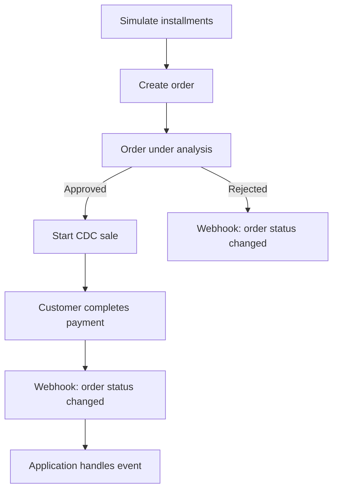
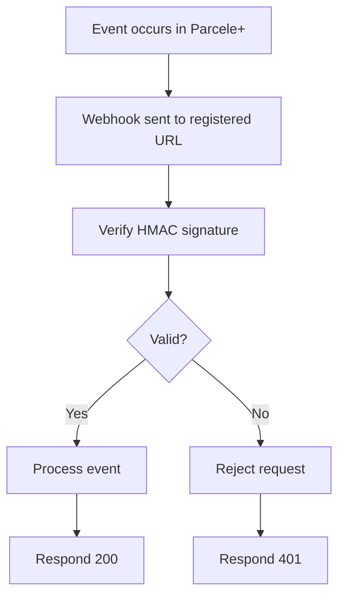

## When to use

Use this skill in two modes:

### 1. Integration Mode
When the user wants to **write code** to integrate Parcele+ into an application (.NET, Java, Node.js, Python, PHP, Go). Use the rules, examples, and best practices below.

### 2. Agent Mode (Direct API)
When the user wants to **perform actions directly** — create an order, simulate installments, list customers, register a webhook, etc. Execute the API via `curl` in the terminal. See [SKILL-AGENT.md](SKILL-AGENT.md) / [rules/agent.md](rules/agent.md) for all endpoints and templates.

## How to use

For **direct API usage** (agent mode), see:
- [rules/agent.md](rules/agent.md) — execute API calls directly via curl (create orders, list customers, simulate installments, manage establishments and webhooks, etc.)

For **code integration**, read the rule file for the module and language you're using:

- **Orders** (create, get, list, start CDC sale, import invoice): [dotnet](rules/dotnet/orders.md) / [java](rules/java/orders.md) / [node](rules/node/orders.md) / [python](rules/python/orders.md) / [php](rules/php/orders.md) / [go](rules/go/orders.md)
- **Simulations** (installments, values): [dotnet](rules/dotnet/simulations.md) / [java](rules/java/simulations.md) / [node](rules/node/simulations.md) / [python](rules/python/simulations.md) / [php](rules/php/simulations.md) / [go](rules/go/simulations.md)
- **Customers** (get, list): [dotnet](rules/dotnet/customers.md) / [java](rules/java/customers.md) / [node](rules/node/customers.md) / [python](rules/python/customers.md) / [php](rules/php/customers.md) / [go](rules/go/customers.md)
- **Establishments** (create, get, list, update, bank account, activate, deactivate): [dotnet](rules/dotnet/establishments.md) / [java](rules/java/establishments.md) / [node](rules/node/establishments.md) / [python](rules/python/establishments.md) / [php](rules/php/establishments.md) / [go](rules/go/establishments.md)
- **Webhooks** (create, list, update, delete, signature verification): [dotnet](rules/dotnet/webhooks.md) / [java](rules/java/webhooks.md) / [node](rules/node/webhooks.md) / [python](rules/python/webhooks.md) / [php](rules/php/webhooks.md) / [go](rules/go/webhooks.md)
- **Security** (credential handling, fraud prevention, secure defaults): [dotnet](rules/dotnet/security.md) / [java](rules/java/security.md) / [node](rules/node/security.md) / [python](rules/python/security.md) / [php](rules/php/security.md) / [go](rules/go/security.md)

Use development tools for enhanced integration experience:
- [tools/auth.md](tools/auth.md) — OAuth2 client credentials flow and API key management.
- [tools/environments.md](tools/environments.md) — staging vs. production base URLs.
- [tools/production.md](tools/production.md) — best practices before going live.
- [tools/ecosystem.md](tools/ecosystem.md) — official SDKs, documentation, and this repository.
- [tools/sdks/dotnet.md](tools/sdks/dotnet.md) / [java.md](tools/sdks/java.md) / [node.md](tools/sdks/node.md) / [python.md](tools/sdks/python.md) / [php.md](tools/sdks/php.md) / [go.md](tools/sdks/go.md) — install instructions per SDK.

## File Index

**Rules (per language)** — [rules/dotnet/](rules/dotnet), [rules/java/](rules/java), [rules/node/](rules/node), [rules/python/](rules/python), [rules/php/](rules/php), [rules/go/](rules/go) — each with `orders.md`, `simulations.md`, `customers.md`, `establishments.md`, `webhooks.md`, `security.md`.

**Examples (per language)** — [examples/dotnet/](examples/dotnet), [examples/java/](examples/java), [examples/node/](examples/node), [examples/python/](examples/python), [examples/php/](examples/php), [examples/go/](examples/go) — each with `orders`, `simulations`, `customers`, `establishments`, `webhooks` source files.

**Agent Mode**
- [rules/agent.md](rules/agent.md) — direct API usage via curl.
- [SKILL-AGENT.md](SKILL-AGENT.md) — standalone, self-contained version of the same content (for tools that load a single skill file).

**Tools**
- [tools/auth.md](tools/auth.md), [tools/environments.md](tools/environments.md), [tools/production.md](tools/production.md), [tools/ecosystem.md](tools/ecosystem.md), [tools/sdks/](tools/sdks)

**Utils**
- [utils/faq.md](utils/faq.md) — frequently asked questions.
- [utils/glossary.md](utils/glossary.md) — glossary of domain and technical terms.

**Root**
- [README.md](README.md) — skill overview, installation and structure.
- [SKILL.md](SKILL.md) — metadata and usage guide (this file).
- [SKILL-CONSOLIDATED.md](SKILL-CONSOLIDATED.md) — every file above concatenated into one, for tools that can only load a single context file.

## Visual Documentation

### Order Flow

### Webhook Flow

